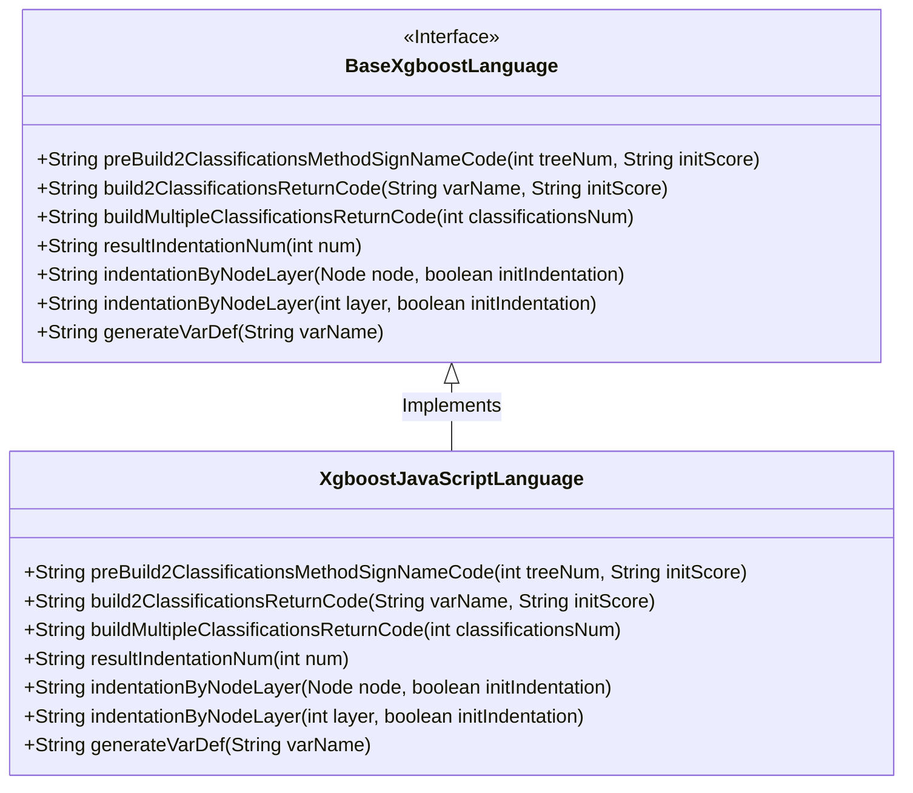
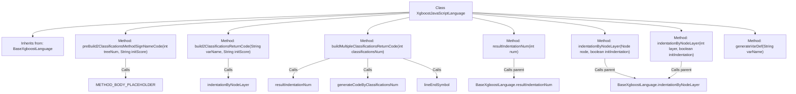

# Basic Information

|      |      |
|------|------|
| Name | XgboostJavaScriptLanguage |
| Language | .java |
| Code Path | WeFe/board/board-service/src/main/java/com/welab/wefe/board/service/service/modelexport/XgboostJavaScriptLanguage.java |
| Package Name | com.welab.wefe.board.service.service.modelexport |
| Dependencies | [] |
| Brief Description | The XgboostJavaScriptLanguage class inherits from BaseXgboostLanguage and implements JavaScript code generation, including functionalities such as constructing classification method signatures, return code, and variable definitions. |

# Description

The code defines a class named `XgboostJavaScriptLanguage`, which inherits from `BaseXgboostLanguage`. Its primary functionalities include constructing JavaScript scoring functions and handling binary and multi-class classification return results. Key methods include `preBuild2ClassificationsMethodSignNameCode` for generating function frameworks, `build2ClassificationsReturnCode` for constructing binary classification return arrays, and `buildMultipleClassificationsReturnCode` for processing multi-class classification return arrays. It also includes helper methods such as `indentationByNodeLayer` for indentation control and `generateVarDef` for variable definition. All methods override the parent class implementations, focusing specifically on JavaScript code generation.

# Class Summary

| Name   | Type  | Description |
|-------|------|-------------|
| XgboostJavaScriptLanguage | class | The `XgboostJavaScriptLanguage` class inherits from `BaseXgboostLanguage` and overrides multiple methods to generate JavaScript code, including classification method signatures, return statements, and variable definitions. |

## Class XgboostJavaScriptLanguage

|      |      |
|------|------|
| Access Modifier | public |
| Type | class |
| Name | XgboostJavaScriptLanguage |
| Description | The `XgboostJavaScriptLanguage` class inherits from `BaseXgboostLanguage` and overrides multiple methods to generate JavaScript code, including classification method signatures, return statements, and variable definitions. |

### UML Class Diagram

This code demonstrates an XgboostJavaScriptLanguage class inheriting from the BaseXgboostLanguage interface, primarily used for generating JavaScript code implementations of XGBoost models. The class overrides multiple methods including building binary and multi-class classification return codes, generating variable definitions, and handling code indentation. These methods construct JavaScript code strings via StringBuilder, where preBuild2ClassificationsMethodSignNameCode creates function signatures, build2ClassificationsReturnCode generates binary classification probability arrays, and buildMultipleClassificationsReturnCode handles multi-class outputs. The class diagram clearly illustrates the relationship between the interface and its implementation class, along with the signatures of all public methods.

### Internal Method Call Graph

This flowchart illustrates the structure of the XgboostJavaScriptLanguage class and its method invocation relationships. The class inherits from BaseXgboostLanguage and primarily implements JavaScript-specific XGBoost model code generation functionalities, including core methods for constructing classification method signatures, return codes, and variable definitions. The methods exhibit hierarchical calling relationships, with some directly invoking parent class implementations, demonstrating object-oriented inheritance and polymorphism characteristics.

### Field List

| Name  | Type  | Description |
|-------|-------|------|

### Method List

| Name  | Type  | Description |
|-------|-------|------|
| indentationByNodeLayer | String | Override the parent class method to return an indentation string based on the node level, with the initial indentation parameter fixed as false. |
| preBuild2ClassificationsMethodSignNameCode | String | This method generates a scoring function framework, including input parameters and placeholders, to be filled with specific logic later. The returned string is formatted as a JavaScript function. |
| build2ClassificationsReturnCode | String | The method generates a binary classification code in the format "[1 - variable name, variable name]". |
| resultIndentationNum | String | Rewrite the method to fix the return value as the parent class call result, with an indentation level of 1. |
| buildMultipleClassificationsReturnCode | String | This method generates multi-class return codes by concatenating indentation, class quantity codes, and termination symbols, then returns the string result. |
| indentationByNodeLayer | String | Rewrite the method `indentationByNodeLayer`, call the parent class method and fix the `initIndentation` parameter to `false`. |
| generateVarDef | String | This is a Java method used to generate a variable definition string in the format "var variableName;". |

