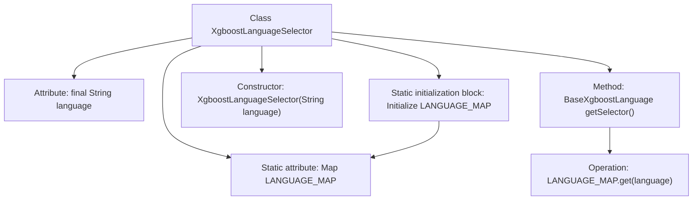

# Basic Information

|      |      |
|------|------|
| Name | XgboostLanguageSelector |
| Language | .java |
| Code Path | WeFe/board/board-service/src/main/java/com/welab/wefe/board/service/service/modelexport/XgboostLanguageSelector.java |
| Package Name | com.welab.wefe.board.service.service.modelexport |
| Dependencies | ['com.welab.wefe.common.wefe.enums.ModelExportLanguage', 'java.util.HashMap', 'java.util.Map'] |
| Brief Description | The XgboostLanguageSelector class stores Xgboost implementations for different languages through a static mapping and returns corresponding instances based on the input language. It supports 14 languages including C, C#, Dart, etc. |

# Description

The XgboostLanguageSelector is a class designed for selecting Xgboost model implementations in different programming languages. It contains a static mapping called LANGUAGE_MAP, which stores Xgboost implementation classes corresponding to 14 languages, including C, C#, Dart, Go, Haskell, Java, JavaScript, PHP, PowerShell, Python, R, Ruby, VisualBasic, and PMML. The constructor accepts a language parameter, and the getSelector method returns an instance of the corresponding language implementation class based on the parameter.

# Class Summary

| Name   | Type  | Description |
|-------|------|-------------|
| XgboostLanguageSelector | class | The XgboostLanguageSelector class stores Xgboost implementations for different languages through a static mapping and returns the corresponding instance based on the input language. |


## Class XgboostLanguageSelector

|      |      |
|------|------|
| Access Modifier | public |
| Type | class |
| Name | XgboostLanguageSelector |
| Description | The XgboostLanguageSelector class stores Xgboost implementations for different languages through a static mapping and returns the corresponding instance based on the input language. |


### UML Class Diagram

```mermaid
classDiagram
    class XgboostLanguageSelector {
        -String language
        -static Map~String, BaseXgboostLanguage~ LANGUAGE_MAP
        +XgboostLanguageSelector(String language)
        +BaseXgboostLanguage getSelector()
    }

    class BaseXgboostLanguage {
        <<Interface>>
    }

    class XgboostCLanguage {
        +...()
    }
    // Other concrete language implementation classes show only inheritance relationships
    class XgboostCSharpLanguage
    class XgboostDartLanguage
    class XgboostGoLanguage
    class XgboostHaskellLanguage
    class XgboostJavaLanguage
    class XgboostJavaScriptLanguage
    class XgboostPhpLanguage
    class XgboostPowerShellLanguage
    class XgboostPythonLanguage
    class XgboostRLanguage
    class XgboostRubyLanguage
    class XgboostVisualBasicLanguage
    class XgboostPmmlLanguage

    BaseXgboostLanguage <|-- XgboostCLanguage
    BaseXgboostLanguage <|-- XgboostCSharpLanguage
    BaseXgboostLanguage <|-- XgboostDartLanguage
    BaseXgboostLanguage <|-- XgboostGoLanguage
    BaseXgboostLanguage <|-- XgboostHaskellLanguage
    BaseXgboostLanguage <|-- XgboostJavaLanguage
    BaseXgboostLanguage <|-- XgboostJavaScriptLanguage
    BaseXgboostLanguage <|-- XgboostPhpLanguage
    BaseXgboostLanguage <|-- XgboostPowerShellLanguage
    BaseXgboostLanguage <|-- XgboostPythonLanguage
    BaseXgboostLanguage <|-- XgboostRLanguage
    BaseXgboostLanguage <|-- XgboostRubyLanguage
    BaseXgboostLanguage <|-- XgboostVisualBasicLanguage
    BaseXgboostLanguage <|-- XgboostPmmlLanguage

    XgboostLanguageSelector --> BaseXgboostLanguage : Depends via Map
```

Class diagram description: XgboostLanguageSelector is a factory class that caches Xgboost implementations for 14 different languages (e.g., XgboostCLanguage) through a static Map. All implementation classes inherit from the BaseXgboostLanguage interface. Its core functionality is to return corresponding implementation class instances based on input language identifiers via the getSelector() method, achieving decoupling and dynamic selection for multilingual support.


### Internal Method Call Graph



This code describes an Xgboost language selector class that preloads Xgboost implementation classes for 14 different programming languages into a mapping table via a static initialization block. The class contains a final language identifier field, injects the target language through the constructor, and the getSelector() method retrieves the corresponding language implementation class from the mapping table based on the language identifier. This design enables fast lookup and extensibility for multilingual support, with static initialization ensuring the mapping table is constructed during class loading.

### Field List

| Name  | Type  | Description |
|-------|-------|------|
| language | String | Private immutable string variable language. |
| LANGUAGE_MAP = new HashMap<>(16) | Map<String, BaseXgboostLanguage> | Define a static constant LANGUAGE_MAP of type Map<String, BaseXgboostLanguage> with an initial capacity of 16. |

### Method List

| Name  | Type  | Description |
|-------|-------|------|
| getSelector | BaseXgboostLanguage | Get the BaseXgboostLanguage instance for the specified language. |


