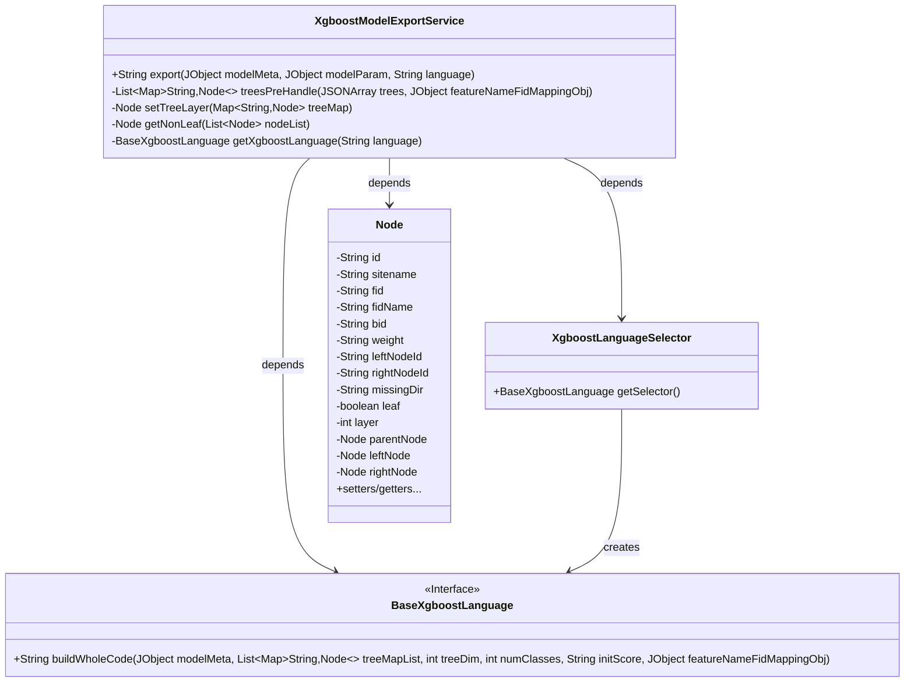
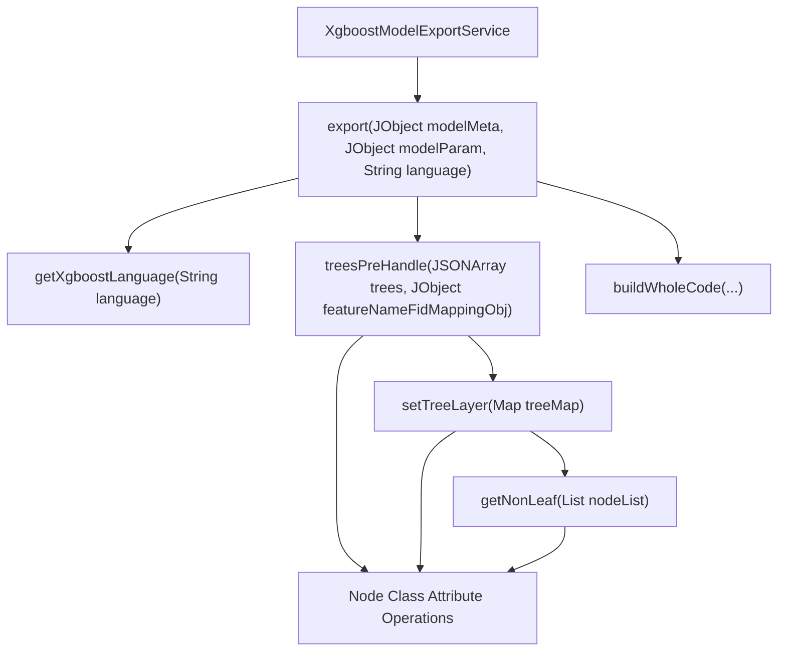
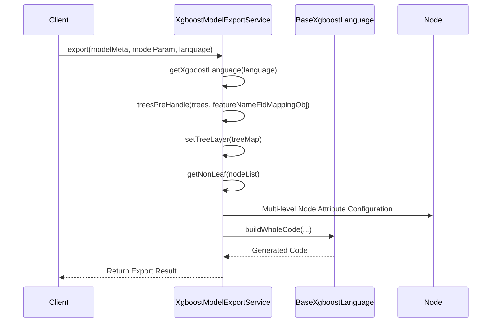

# Basic Information

|      |      |
|------|------|
| Name | XgboostModelExportService |
| Language | .java |
| Code Path | WeFe/board/board-service/src/main/java/com/welab/wefe/board/service/service/modelexport/XgboostModelExportService.java |
| Package Name | com.welab.wefe.board.service.service.modelexport |
| Dependencies | ['com.alibaba.fastjson.JSONArray', 'com.welab.wefe.common.util.JObject', 'com.welab.wefe.common.util.StringUtil', 'org.springframework.stereotype.Service', 'java.util.ArrayList', 'java.util.HashMap', 'java.util.List', 'java.util.Map'] |
| Brief Description | XgboostModelExportService exports XGBoost models, processes tree-structured data, and generates target language code. It includes feature name mapping, tree preprocessing, node layering, and language selector functionality. |

# Description

XgboostModelExportService is a service class designed for exporting XGBoost models. Its primary functionalities include generating model code in specified languages, processing model parameters such as feature name mapping, tree data preprocessing, tree dimensions, category count, and initial scores. The treesPreHandle method preprocesses tree data, constructs node mappings, and sets node hierarchies. The setTreeLayer method calculates node heights layer by layer starting from the root node. The getNonLeaf method retrieves non-leaf nodes. The getXgboostLanguage method selects the corresponding interpreter based on the language. Finally, the buildWholeCode method generates the complete code.

# Class Summary

| Name   | Type  | Description |
|-------|------|-------------|
| XgboostModelExportService | class | The XgboostModelExportService provides model export functionality, processing tree-structured data and generating target language code. Key steps include feature name mapping, tree data preprocessing (node information extraction, hierarchy configuration), initial score processing, and ultimately invoking the language interpreter to produce complete code. It supports multi-language output. |

## Class XgboostModelExportService

|      |      |
|------|------|
| Access Modifier | @Service;public |
| Type | class |
| Name | XgboostModelExportService |
| Description | The XgboostModelExportService provides model export functionality, processing tree-structured data and generating target language code. Key steps include feature name mapping, tree data preprocessing (node information extraction, hierarchy configuration), initial score processing, and ultimately invoking the language interpreter to produce complete code. It supports multi-language output. |

### UML Class Diagram

Class Diagram Description: The diagram illustrates the core structure of the XGBoost model export service. XgboostModelExportService acts as the main service class, which retrieves language-specific interpreters (BaseXgboostLanguage interface) via XgboostLanguageSelector and processes tree structures (Node class). The service contains four key methods: export handles overall export logic, treesPreHandle preprocesses tree data, setTreeLayer sets node hierarchy levels, and getNonLeaf retrieves non-leaf nodes. The Node class fully encapsulates tree node attributes and relationships, including parent-child node pointers and hierarchical information.

### Internal Method Call Graph

This flowchart illustrates the core processing logic of the Xgboost model export service. Starting from the export method entry point, it sequentially executes language interpreter retrieval, tree data preprocessing (including node mapping and layer configuration), and finally invokes the specific language generator to construct complete code. The sequence diagram details the invocation order between components, particularly the recursive processing of node trees, ultimately returning the processed results to the client. The entire process involves complex tree structure operations and cross-language code generation capabilities.

### Field List

| Name  | Type  | Description |
|-------|-------|------|

### Method List

| Name  | Type  | Description |
|-------|-------|------|
| treesPreHandle | List<Map<String, Node>> | This method processes JSON tree data, converts each tree into a node mapping table, sets node attributes, calculates tree height, and finally returns a list of trees. |
| getXgboostLanguage | BaseXgboostLanguage | The method creates and returns a corresponding Xgboost language selector instance based on the input language parameter. |
| export | String | This method exports XGBoost model code based on input parameters. First, it retrieves the interpreter for the specified language, processes feature name mapping and tree data, extracts tree dimensions, number of classes, and initial scores, and finally invokes the interpreter to generate complete code. |
| getNonLeaf | Node | Traverse the node list and return the first non-leaf node where both left and right child nodes are null. If none exists, return null. |
| setTreeLayer | Node | Recursively set tree node levels, starting from the root node, and assign levels and parent-child relationships layer by layer to left and right child nodes until all non-leaf nodes are processed. |

