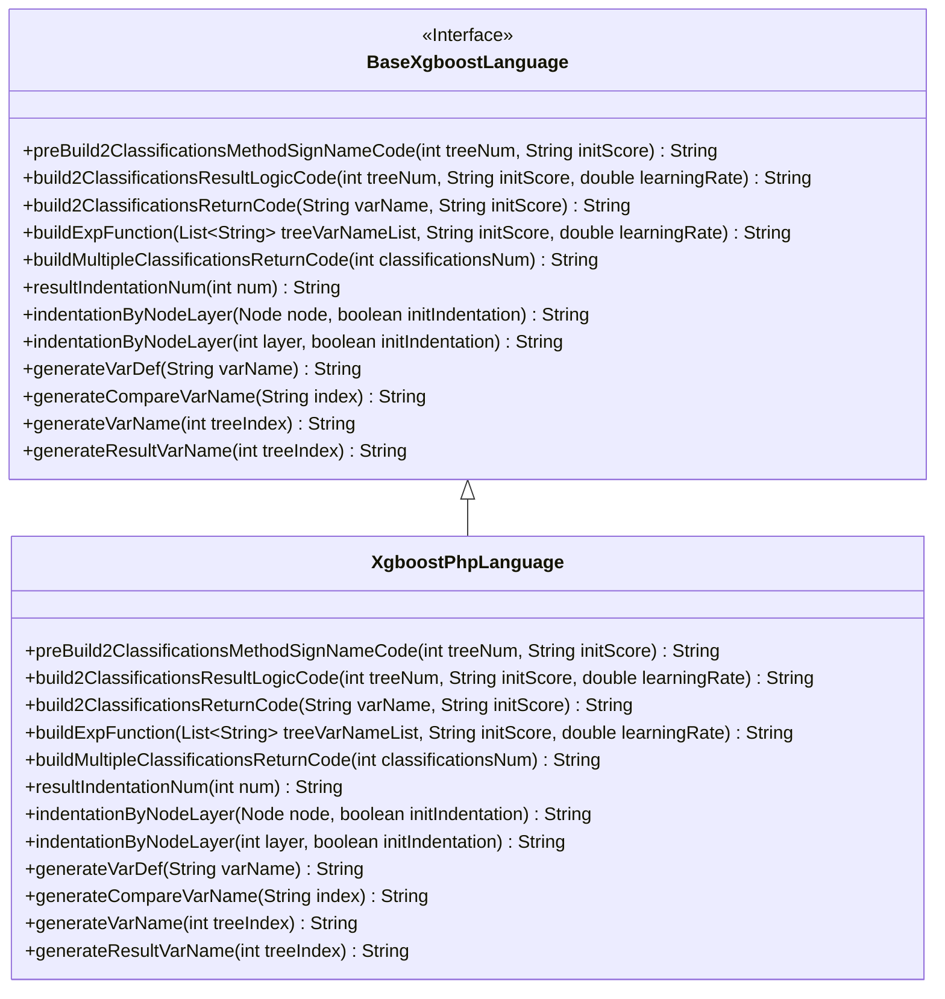

# Basic Information

|      |      |
|------|------|
| Name | XgboostPhpLanguage |
| Language | .java |
| Code Path | WeFe/board/board-service/src/main/java/com/welab/wefe/board/service/service/modelexport/XgboostPhpLanguage.java |
| Package Name | com.welab.wefe.board.service.service.modelexport |
| Dependencies | ['java.util.List'] |
| Brief Description | The XgboostPhpLanguage class inherits from BaseXgboostLanguage and implements PHP code generation logic, including core functionalities such as binary classification and multi-class model scoring function construction, variable naming, and indentation control. |

# Description

The code defines a class named `XgboostPhpLanguage`, which inherits from `BaseXgboostLanguage` and is specifically designed to generate XGBoost model scoring code in PHP. Its primary functionality includes constructing scoring logic for binary and multi-class classification models, encompassing core methods such as preprocessing method signatures, result computation logic, and return statement generation. The code dynamically generates PHP functions through string concatenation, handling input data, calculating probability scores, and returning classification results. The class implements helper methods for variable naming, comparison expression generation, and indentation control, supporting customizable code logic generation via parameters like tree indices and initial scores. All methods adhere to PHP syntax standards, ultimately outputting PHP code snippets that comply with XGBoost scoring requirements.

# Class Summary

| Name   | Type  | Description |
|-------|------|-------------|
| XgboostPhpLanguage | class | The XgboostPhpLanguage class inherits from BaseXgboostLanguage and implements PHP code generation logic, including functionalities such as constructing classification methods, result computation, return logic, and variable naming. |

## Class XgboostPhpLanguage

|      |      |
|------|------|
| Access Modifier | public |
| Type | class |
| Name | XgboostPhpLanguage |
| Description | The XgboostPhpLanguage class inherits from BaseXgboostLanguage and implements PHP code generation logic, including functionalities such as constructing classification methods, result computation, return logic, and variable naming. |

### UML Class Diagram

This code demonstrates an XgboostPhpLanguage class that inherits from the BaseXgboostLanguage interface. The class is primarily used to generate XGBoost model scoring code in PHP format, including constructing classification method signatures, result logic code, return code, and auxiliary functions such as variable generation and indentation handling. By overriding parent class methods, it implements PHP-specific code generation logic, covering customized implementations for constructing return results in binary and multi-class classification scenarios, as well as tailored variable naming and comparison logic.

### Internal Method Call Graph

```mermaid
graph TD
    A["Class XgboostPhpLanguage"]
    B["Inheritance: BaseXgboostLanguage"]
    C["Method: preBuild2ClassificationsMethodSignNameCode"]
    D["Method: build2ClassificationsResultLogicCode"]
    E["Method: build2ClassificationsReturnCode"]
    F["Method: buildExpFunction"]
    G["Method: buildMultipleClassificationsReturnCode"]
    H["Method: resultIndentationNum"]
    I["Method: indentationByNodeLayer"]
    J["Method: generateVarDef"]
    K["Method: generateCompareVarName"]
    L["Method: generateVarName"]
    M["Method: generateResultVarName"]

    A --> B
    A --> C
    A --> D
    A --> E
    A --> F
    A --> G
    A --> H
    A --> I
    A --> J
    A --> K
    A --> L
    A --> M
```

This code defines a class named XgboostPhpLanguage that inherits from BaseXgboostLanguage, primarily used for generating XGBoost model scoring code in PHP format. The class contains multiple methods for constructing PHP function signatures, result calculation logic, return statements, and variable naming. These methods work together to ultimately produce executable PHP code for performing classification predictions on input data. The code structure is clear, with well-defined method responsibilities, demonstrating sound object-oriented design principles.

### Field List

| Name  | Type  | Description |
|-------|-------|------|

### Method List

| Name  | Type  | Description |
|-------|-------|------|
| preBuild2ClassificationsMethodSignNameCode | String | Generate a PHP function framework, including input parameters and placeholder method body, returning a string-formatted code template. |
| generateVarDef | String | Method override, generate variable declaration statements in the format "variableName = null;". |
| resultIndentationNum | String | Rewrite the method `resultIndentationNum` to consistently return the result of the parent class method call, ignoring the parameter `num` and always passing in `1`. |
| build2ClassificationsReturnCode | String | Generate a PHP array code that returns two types of classifications, formatted as "return array(1 - $variableName, $variableName)". |
| buildExpFunction | String | Java Method: Generate an exponential function expression with parameters including a variable list, initial fraction, and learning rate, returning a string in the form of "exp(0 - (summation result))". |
| build2ClassificationsResultLogicCode | String | This method generates binary classification logic code, calculating the s1 variable as 1/(1+exp(-(tree summation result))), and returns the classification result. The core steps include variable definition, sigmoid calculation, and return processing. |
| generateCompareVarName | String | This method generates comparison variable names in the format "$input[index]", where index is the passed parameter. |
| generateVarName | String | Method for generating variable names: Returns a string of "$var" plus the index value based on the tree index. |
| generateResultVarName | String | The method generates result variable names in the format of "$s" followed by the tree index value. |
| buildMultipleClassificationsReturnCode | String | Generate multi-class return codes by method, concatenate array-formatted results, including a specified number of classification codes. |
| indentationByNodeLayer | String | Rewrite the method `indentationByNodeLayer`, call the parent class method and fix the `initIndentation` parameter to `false`. |
| indentationByNodeLayer | String | Rewrite the method, calling the parent class method to handle node hierarchy indentation, ignoring the initial indentation parameter. |

