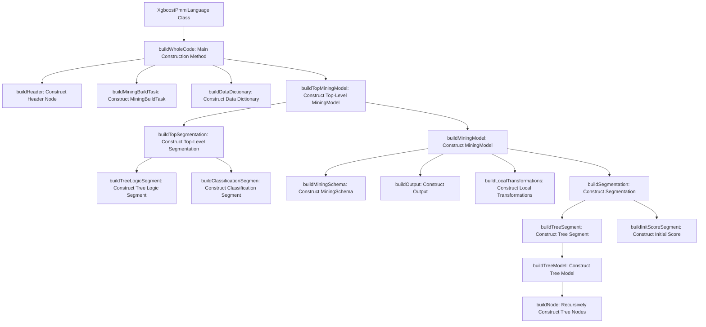

# Basic Information

|      |      |
|------|------|
| Name | XgboostPmmlLanguage |
| Language | .java |
| Code Path | WeFe/board/board-service/src/main/java/com/welab/wefe/board/service/service/modelexport/XgboostPmmlLanguage.java |
| Package Name | com.welab.wefe.board.service.service.modelexport |
| Dependencies | ['com.welab.wefe.common.util.JObject', 'org.dmg.pmml', 'org.dmg.pmml.mining.MiningModel', 'org.dmg.pmml.mining.Segment', 'org.dmg.pmml.mining.Segmentation', 'org.dmg.pmml.regression.NumericPredictor', 'org.dmg.pmml.regression.RegressionModel', 'org.dmg.pmml.regression.RegressionTable', 'org.dmg.pmml.tree.TreeModel', 'org.jpmml.model.PMMLUtil', 'org.slf4j.Logger', 'org.slf4j.LoggerFactory', 'java.io.ByteArrayOutputStream', 'java.util.HashSet', 'java.util.List', 'java.util.Map', 'java.util.Set'] |
| Brief Description | The XgboostPmmlLanguage class inherits from BaseXgboostLanguage and implements the functionality of converting XGBoost models into PMML format. This includes constructing header information, data dictionaries, mining models, and segmentation structures, supporting both classification and regression tasks, and ultimately outputting the PMML string. |

# Description

The code defines a class named `XgboostPmmlLanguage` for converting XGBoost models into PMML format. Its primary functionalities include constructing the PMML document structure, processing feature mappings, generating tree model logic, and classification outputs. The class contains multiple private methods responsible for building components such as PMML header information, data dictionaries, mining models, and segmentation structures. Tree nodes are processed recursively to ultimately generate XML-formatted output compliant with the PMML 4.3 standard. An exception handling mechanism ensures that errors during conversion are logged and an empty string is returned.

# Class Summary

| Name   | Type  | Description |
|-------|------|-------------|
| XgboostPmmlLanguage | class | The XgboostPmmlLanguage class implements the functionality of converting XGBoost models to PMML format, including constructing header information, data dictionaries, tree model structures, and classification logic. It supports both regression and classification tasks, handling feature mapping and initial scores. |

## Class XgboostPmmlLanguage

|      |      |
|------|------|
| Access Modifier | public |
| Type | class |
| Name | XgboostPmmlLanguage |
| Description | The XgboostPmmlLanguage class implements the functionality of converting XGBoost models to PMML format, including constructing header information, data dictionaries, tree model structures, and classification logic. It supports both regression and classification tasks, handling feature mapping and initial scores. |

### UML Class Diagram

```mermaid
classDiagram
    class XgboostPmmlLanguage {
        -Logger LOG
        +String buildWholeCode(JObject modelMeta, List~Map~String,Node~~ treeMapList, int treeDim, int numClasses, String initScore, JObject featureNameFidMappingObj)
        -Header buildHeader()
        -MiningBuildTask buildMiningBuildTask()
        -DataDictionary buildDataDictionary(JObject featureNameFidMappingObj)
        -MiningModel buildTopMiningModel(List~Map~String,Node~~ treeMapList, JObject featureNameFidMappingObj, String initScore, double learningRate)
        -Segmentation buildTopSegmentation(List~Map~String,Node~~ treeMapList, JObject featureNameFidMappingObj, String initScore, double learningRate)
        -Segment buildTreeLogicSegment(List~Map~String,Node~~ treeMapList, JObject featureNameFidMappingObj, String initScore, double learningRate)
        -Segment buildClassificationSegmen()
        -MiningModel buildMiningModel(List~Map~String,Node~~ treeMapList, JObject featureNameFidMappingObj, String initScore, double learningRate)
        -MiningSchema buildMiningSchema(JObject featureNameFidMappingObj)
        -Output buildOutput()
        -LocalTransformations buildLocalTransformations(JObject featureNameFidMappingObj)
        -Segmentation buildSegmentation(List~Map~String,Node~~ treeMapList, String initScore, double learningRate)
        -Segment buildTreeSegment(Map~String,Node~ treeMap, int treeIndex, double learningRate)
        -Segment buildInitScoreSegment(String initScore)
        -TreeModel buildTreeModel(Map~String,Node~ treeMap, double learningRate)
        -MiningSchema buildTreeModelMiningSchema(Map~String,Node~ treeMap)
        -void buildNode(Node treeNode, org.dmg.pmml.tree.Node parentPmmlNode, double learningRate)
    }

    class BaseXgboostLanguage {
        <<Abstract>>
    }

    class PMML {
        +setVersion(String version)
        +setHeader(Header header)
        +setMiningBuildTask(MiningBuildTask miningBuildTask)
        +setDataDictionary(DataDictionary dataDictionary)
        +addModels(Model model)
    }

    class Header {
        +setApplication(Application application)
        +setTimestamp(Timestamp timestamp)
    }

    class MiningBuildTask {
        // Empty implementation
    }

    class DataDictionary {
        +addDataFields(DataField dataField)
    }

    class MiningModel {
        +setMiningFunction(MiningFunction miningFunction)
        +setAlgorithmName(String algorithmName)
        +setMathContext(MathContext mathContext)
        +setMiningSchema(MiningSchema miningSchema)
        +setSegmentation(Segmentation segmentation)
        +setOutput(Output output)
        +setLocalTransformations(LocalTransformations localTransformations)
    }

    class Segmentation {
        +setMultipleModelMethod(MultipleModelMethod method)
        +addSegments(Segment segment)
    }

    class Segment {
        +setId(String id)
        +setPredicate(Predicate predicate)
        +setModel(Model model)
    }

    class RegressionModel {
        +setMiningFunction(MiningFunction miningFunction)
        +setNormalizationMethod(NormalizationMethod method)
        +setMathContext(MathContext mathContext)
        +setMiningSchema(MiningSchema miningSchema)
        +setOutput(Output output)
        +addRegressionTables(RegressionTable regressionTable)
    }

    XgboostPmmlLanguage --|> BaseXgboostLanguage : Extends
    XgboostPmmlLanguage --> PMML : Generates
    XgboostPmmlLanguage --> Header : Builds
    XgboostPmmlLanguage --> MiningBuildTask : Builds
    XgboostPmmlLanguage --> DataDictionary : Builds
    XgboostPmmlLanguage --> MiningModel : Builds
    XgboostPmmlLanguage --> Segmentation : Builds
    XgboostPmmlLanguage --> Segment : Builds
    XgboostPmmlLanguage --> RegressionModel : Builds
```

This code implements an XGBoost model to PMML format converter, with core functionalities including constructing PMML document structure, data dictionary, mining models, and segmentation logic. The class diagram illustrates XgboostPmmlLanguage as the central class, inheriting from BaseXgboostLanguage, and interacting with multiple PMML-related classes (e.g., Header, MiningModel) through builder methods to generate a complete PMML document. The design adopts a layered architecture, separating construction logic for different PMML components to ensure the generated PMML adheres to the structure and feature requirements of XGBoost models.

### Internal Method Call Graph

This code is the core implementation for converting an XGBoost model to PMML format. The main process starts with the buildWholeCode method, sequentially constructing each component of the PMML document. It first creates the PMML infrastructure (Header, MiningBuildTask, DataDictionary), then builds the top-level MiningModel and its Segmentation structure, which includes tree logic segments and classification segments. For each tree, it recursively constructs the tree model node structure, ultimately assembling all components into a complete PMML document and serializing it into an XML string via the marshal method. The entire process strictly adheres to the PMML 4.3 specification, supporting the export of classification task models, including the conversion of XGBoost-specific parameters such as feature mapping, initial scores, and learning rates.

### Field List

| Name  | Type  | Description |
|-------|-------|------|
| LOG = LoggerFactory.getLogger(this.getClass()) | Logger | Declare a protected final logger object for logging in the current class. |

### Method List

| Name  | Type  | Description |
|-------|-------|------|
| buildTopSegmentation | Segmentation | Build a segmentation model, set up a multi-model chain approach, add tree logic segmentation and classification segmentation, and return the complete segmentation object. |
| buildSegmentation | Segmentation | Construct a Segmentation object, set the multi-model method to SUM, add the initial score segment, iterate through the treeMapList to build tree segments for each element and add them, and finally return the segmentation. |
| buildMiningSchema | MiningSchema | This method constructs a MiningSchema based on the input JSON object, iterates through the key-value pairs in the object, creates a MiningField for each value and adds it to the MiningSchema, and finally returns the constructed MiningSchema. |
| buildTreeLogicSegment | Segment | Building Tree Logic Segment: Create a Segment object, set the ID to 1, the predicate to True, and the model is generated by the buildMiningModel method with parameters including a tree mapping list, feature name mapping, initial score, and learning rate. |
| buildDataDictionary | DataDictionary | Method for constructing a data dictionary: Create a DataDictionary object, add a categorical field named "flag" of INTEGER type (with values 0 and 1), then iterate through featureNameFidMappingObj to add DOUBLE fields of CONTINUOUS type. |
| buildWholeCode | String | The method constructs PMML format code, including version, header information, data dictionary, and model, handles exceptions, and returns the result string. |
| buildMiningModel | MiningModel | Build a regression mining model, configure functions, mathematical context, patterns, outputs, local transformations, and segmentation. |
| buildClassificationSegmen | Segment | Building the classification model segment, setting up the logistic regression model with the target field as 'flag', the prediction field as 'xgbValue', outputting probabilities for 0 and 1, including the regression table and intercept. |
| buildHeader | Header | Construct a Header object containing the application name "Xgboost Regression Model", version "1.0", and the current timestamp. |
| buildMiningBuildTask | MiningBuildTask | A private method that creates and returns an instance of MiningBuildTask. |
| buildLocalTransformations | LocalTransformations | Construct a local transformation object, iterate through the feature name mappings, create a continuous double-precision derived field for each value, reference the original field, and add it to the transformation object before returning. |
| buildTopMiningModel | MiningModel | Building an XGBoost classification model, setting the target field as 'flag' and feature fields, including tree structure and learning rate parameters. |
| buildOutput | Output | This method creates and configures an Output object containing a continuous double-type output field named xgbValue, marked as a non-final result. |
| buildTreeSegment | Segment | Method for constructing a tree segment: Create a Segment object, set the predicate to True, assign the ID as a treeIndex string, generate the model using buildTreeModel, and return the segment. |
| buildInitScoreSegment | Segment | Construct the initial score segments, set up the regression model, default strategy, and initial scores. |
| buildTreeModel | TreeModel | Building Tree Model Method: Retrieve the root node from the treeMap, create a PMML node and set the initial score and predicate, recursively construct child nodes, and finally configure the regression tree model parameters before returning. |
| buildTreeModelMiningSchema | MiningSchema | Building Tree Model Mining Patterns: Traverse non-leaf nodes, collect feature names and create corresponding mining fields, then return a mining pattern containing these fields. |
| buildNode | void | The method recursively constructs PMML tree nodes, handling both leaf nodes and non-leaf nodes. Leaf nodes are assigned weights and learning rates, while non-leaf nodes generate left and right child nodes along with conditions, and recursively process the child nodes. |

