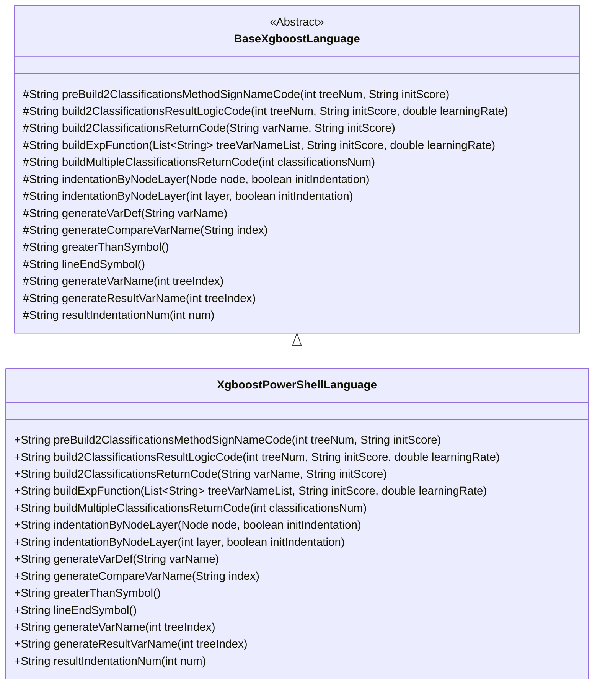

# Basic Information

|      |      |
|------|------|
| Name | XgboostPowerShellLanguage |
| Language | .java |
| Code Path | WeFe/board/board-service/src/main/java/com/welab/wefe/board/service/service/modelexport/XgboostPowerShellLanguage.java |
| Package Name | com.welab.wefe.board.service.service.modelexport |
| Dependencies | ['java.util.List'] |
| Brief Description | The XgboostPowerShellLanguage class inherits from BaseXgboostLanguage and implements the code generation logic for XGBoost models in PowerShell, including core functionalities such as classification scoring, result computation, and return operations. |

# Description

The `XgboostPowerShellLanguage` class inherits from `BaseXgboostLanguage` and is specifically designed to implement XGBoost model prediction logic for the PowerShell language. Its primary functionalities include generating code structures for binary and multiclass scoring functions. For binary classification, it transforms the tree model output through a Sigmoid function and returns probability values, while multiclass classification applies Softmax normalization. The class defines PowerShell-specific syntax elements, such as variable definition formats, array index access methods, comparison operators like `-gt`, and end-of-line symbol handling. It also provides foundational methods for controlling node-level indentation, temporary variable naming conventions, and result return formats, ensuring the generated code adheres to PowerShell syntax standards.

# Class Summary

| Name   | Type  | Description |
|-------|------|-------------|
| XgboostPowerShellLanguage | class | The `XgboostPowerShellLanguage` class inherits from `BaseXgboostLanguage` and implements code generation for XGBoost models in PowerShell, including functionalities such as classification method construction, return logic, and variable definition. |

## Class XgboostPowerShellLanguage

|      |      |
|------|------|
| Access Modifier | public |
| Type | class |
| Name | XgboostPowerShellLanguage |
| Description | The `XgboostPowerShellLanguage` class inherits from `BaseXgboostLanguage` and implements code generation for XGBoost models in PowerShell, including functionalities such as classification method construction, return logic, and variable definition. |

### UML Class Diagram

This class diagram illustrates the complete structure where XgboostPowerShellLanguage inherits from the abstract base class BaseXgboostLanguage. XgboostPowerShellLanguage implements all inherited abstract methods, with primary functionalities including: generating PowerShell-formatted XGBoost classification method signatures, constructing binary classification result logic code, building return statements, and implementing exponential calculation functions. This class is specifically tailored for PowerShell scripting language features, such as using "$" prefix variables, "-gt" comparison operators, and other syntactic characteristics, demonstrating the concrete implementation strategy for converting XGBoost models into executable PowerShell code.

### Internal Method Call Graph

```mermaid
graph TD
    A["Class XgboostPowerShellLanguage"]
    B["Method: preBuild2ClassificationsMethodSignNameCode"]
    C["Method: build2ClassificationsResultLogicCode"]
    D["Method: build2ClassificationsReturnCode"]
    E["Method: buildExpFunction"]
    F["Method: buildMultipleClassificationsReturnCode"]
    G["Method: indentationByNodeLayer"]
    H["Method: generateVarDef"]
    I["Method: generateCompareVarName"]
    J["Method: greaterThanSymbol"]
    K["Method: lineEndSymbol"]
    L["Method: generateVarName"]
    M["Method: generateResultVarName"]
    N["Method: resultIndentationNum"]

    A --> B
    A --> C
    A --> D
    A --> E
    A --> F
    A --> G
    A --> H
    A --> I
    A --> J
    A --> K
    A --> L
    A --> M
    A --> N
```

This code represents a subclass of XGBoost PowerShell language implementation, primarily used for generating classification model code in PowerShell script format. It inherits from the BaseXgboostLanguage base class and overrides several key methods, including building classification method signatures (preBuild2ClassificationsMethodSignNameCode), generating classification result logic (build2ClassificationsResultLogicCode), constructing return code (build2ClassificationsReturnCode), etc. Notably, it includes specialized handling for PowerShell syntax, such as using "-gt" as comparison operators and generating PowerShell-specific variable definition syntax. These methods work together to ultimately produce executable PowerShell classification model code.

### Field List

| Name  | Type  | Description |
|-------|-------|------|

### Method List

| Name  | Type  | Description |
|-------|-------|------|
| buildMultipleClassificationsReturnCode | String | This method generates multi-class return codes, concatenates the classification result variable names with the sum calculation, separates each classification with commas, and finally returns a formatted string. |
| greaterThanSymbol | String | Rewrite the greaterThanSymbol method to return the string "-gt". |
| generateVarName | String | Method for generating variable names, returning the format as "$var" followed by an index value. |
| indentationByNodeLayer | String | Rewrite the method indentationByNodeLayer, call the parent class method and fix the initIndentation parameter to false. |
| preBuild2ClassificationsMethodSignNameCode | String | Generate a method code framework to construct a scoring function template containing input vectors and placeholders. |
| build2ClassificationsReturnCode | String | This method generates a code string that returns two classification results, constructing the return expression using variable names and initial scores in the format of a tuple returning 1 minus the variable value and the variable value itself. |
| indentationByNodeLayer | String | Rewrite the method, calling the parent class method to handle node hierarchy indentation, ignoring the initial indentation parameter. |
| build2ClassificationsResultLogicCode | String | This method generates binary logistic regression code, calculates probability values, and returns the results. It uses the s1 variable to store intermediate values, converts the tree model output into probabilities through mathematical formulas, and finally returns the classification results. |
| resultIndentationNum | String | Rewrite the method `resultIndentationNum` to always return the result of the parent class call, ignoring the parameter `num` and passing `1` consistently. |
| lineEndSymbol | String | Method override, returning an empty string as the line terminator. |
| generateResultVarName | String | Generate method returns variable name, formatted as $s followed by tree index. |
| buildExpFunction | String | This method generates a mathematical expression string, calls generateTreeSum to calculate the sum, then takes the negative exponent, and uses the result for the Exp function computation. |
| generateVarDef | String | Method override, generate variable definition string in the format "[double] variableName = 0". |
| generateCompareVarName | String | Generate a method to compare variable names, returning the format `$InputVector[index]`. |

