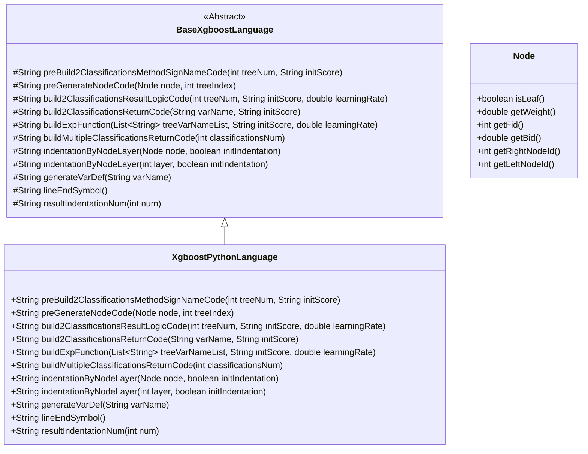
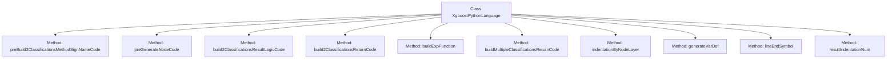

# Basic Information

|      |      |
|------|------|
| Name | XgboostPythonLanguage |
| Language | .java |
| Code Path | WeFe/board/board-service/src/main/java/com/welab/wefe/board/service/service/modelexport/XgboostPythonLanguage.java |
| Package Name | com.welab.wefe.board.service.service.modelexport |
| Dependencies | ['java.util.List'] |
| Brief Description | The XgboostPythonLanguage class inherits from BaseXgboostLanguage and implements Python code generation logic, including node condition judgment, classification result calculation, and return logic, supporting both binary and multi-class classification tasks. |

# Description

The code defines a class named `XgboostPythonLanguage`, which inherits from `BaseXgboostLanguage` and is specifically designed to generate XGBoost model code in Python. Its primary functionalities include constructing scoring methods for binary and multi-class classification models, generating node code, and handling result logic. By overriding parent class methods, it implements Python-specific syntax structures, such as importing the `math` library, defining `score` functions, generating conditional judgments, and assigning leaf node values. The code also handles probability calculations and output formatting for the model, including sigmoid function transformations and returning binary classification probabilities. The overall structure is clear, generating Python-compliant code snippets through string concatenation.

# Class Summary

| Name   | Type  | Description |
|-------|------|-------------|
| XgboostPythonLanguage | class | The XgboostPythonLanguage class inherits from BaseXgboostLanguage and implements Python code generation logic, including node processing, classification result calculation, and return logic. |

## Class XgboostPythonLanguage

|      |      |
|------|------|
| Access Modifier | public |
| Type | class |
| Name | XgboostPythonLanguage |
| Description | The XgboostPythonLanguage class inherits from BaseXgboostLanguage and implements Python code generation logic, including node processing, classification result calculation, and return logic. |

### UML Class Diagram

Class Diagram Description:
This diagram illustrates the implementation structure for exporting XGBoost models to Python code. XgboostPythonLanguage inherits from the abstract base class BaseXgboostLanguage, implementing core methods to convert decision trees into Python code. It includes key operations such as generating method signatures, node condition judgments, and classification result calculations, with the Node class providing tree node information. The implementation focuses on code generation logic for binary and multi-class classification scenarios, ensuring code structure uniformity through the template method pattern while supporting syntax detail processing like custom indentation and variable definitions.

### Internal Method Call Graph

This flowchart illustrates the main method structure and inheritance relationships of the XgboostPythonLanguage class. As a Python code generator for XGBoost models, this class focuses on constructing decision tree scoring logic, encompassing core functionalities such as preprocessing method signatures, node code generation, and classification result computation. Methods collaborate through string concatenation to ultimately produce executable Python code for model inference. The flowchart clearly presents the complete call chain from basic code generation to complex classification logic construction.

### Field List

| Name  | Type  | Description |
|-------|-------|------|

### Method List

| Name  | Type  | Description |
|-------|-------|------|
| preGenerateNodeCode | String | This method generates code for decision tree nodes: leaf nodes output variable names and weights, while non-leaf nodes generate conditional branching code containing placeholders for left and right child nodes. |
| indentationByNodeLayer | String | Rewrite the method, call the parent class implementation, fix initIndentation as false, and return a hierarchical indentation string. |
| build2ClassificationsReturnCode | String | The method generates a return code string in the format "return [(1) - (variable name), variable name]", including indentation and line terminators. |
| generateVarDef | String | This is a Java method used to generate a variable definition string, which concatenates the variable name with the initial value "0.0" and returns the result. |
| buildExpFunction | String | This method generates a mathematical expression string to compute the value of an exponential function, with parameters including a list of tree variables, an initial score, and a learning rate. |
| preBuild2ClassificationsMethodSignNameCode | String | Generate a Python scoring function template, including importing the math library, defining the score function, and reserving a placeholder for the method body. |
| indentationByNodeLayer | String | Override the parent class method to return an indentation string based on the node level, with no indentation initialized by default. |
| buildMultipleClassificationsReturnCode | String | This method generates multi-class return codes by specifying the number of classifications to construct a string containing an array structure, formatted as "return [classification code]". |
| build2ClassificationsResultLogicCode | String | This method generates binary logistic regression code, calculates the s1 variable as the output of the sigmoid function, and returns the classification result. |
| lineEndSymbol | String | Java method override, returning an empty string as the line terminator. |
| resultIndentationNum | String | Rewrite the method with a fixed indentation level of 1, implementing it by calling the parent class method. |

