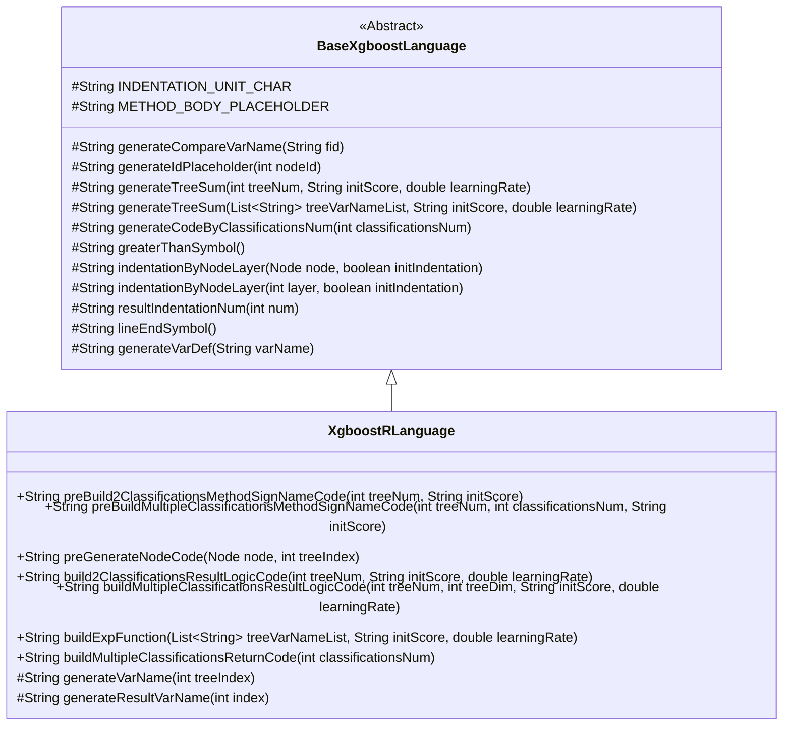

# Basic Information

|      |      |
|------|------|
| Name | XgboostRLanguage |
| Language | .java |
| Code Path | WeFe/board/board-service/src/main/java/com/welab/wefe/board/service/service/modelexport/XgboostRLanguage.java |
| Package Name | com.welab.wefe.board.service.service.modelexport |
| Dependencies | ['java.util.List', 'java.util.Map'] |
| Brief Description | The XgboostRLanguage class inherits from BaseXgboostLanguage and implements XGBoost model code generation for the R language, including binary and multi-class classification logic, node code generation, and formatting methods. |

# Description

The `XgboostRLanguage` class inherits from `BaseXgboostLanguage` and implements the code generation logic for XGBoost models in the R language. Its primary functionalities include: generating a prediction function framework for binary classification tasks, incorporating sigmoid transformation and probability calculation; constructing a prediction function framework for multi-class classification tasks with support for multi-dimensional output; recursively generating decision tree node code to handle branch conditions and leaf node weights; building the computation logic for binary and multi-class results, including tree model weighted summation, softmax transformation, and result return; and providing basic utility methods such as variable definition, code indentation, and line-ending symbol handling. Through method overriding, it achieves the generation of R language-specific syntactic structures.

# Class Summary

| Name   | Type  | Description |
|-------|------|-------------|
| XgboostRLanguage | class | The XgboostRLanguage class inherits from BaseXgboostLanguage, implements R language code generation, supports binary and multi-class classification tasks, and includes functionalities such as node code generation, logic computation, and result return. |

## Class XgboostRLanguage

|      |      |
|------|------|
| Access Modifier | public |
| Type | class |
| Name | XgboostRLanguage |
| Description | The XgboostRLanguage class inherits from BaseXgboostLanguage, implements R language code generation, supports binary and multi-class classification tasks, and includes functionalities such as node code generation, logic computation, and result return. |

### UML Class Diagram

Class Diagram Description:
This diagram illustrates the hierarchical relationship where the XgboostRLanguage class inherits from the abstract base class BaseXgboostLanguage. XgboostRLanguage implements code generation functionality for XGBoost models in the R language, including core methods such as generating method signatures for binary and multi-class classification, node code generation, and result logic construction. The base class provides common code generation utility methods, including indentation control, variable name generation, tree summation, and other foundational functions. The subclass implements R language-specific code generation logic by overriding abstract methods, demonstrating the application of the Template Method design pattern.

### Internal Method Call Graph

```mermaid
graph TD
    A["Class XgboostRLanguage"]
    B["Inherits from: BaseXgboostLanguage"]
    C["Method: preBuild2ClassificationsMethodSignNameCode"]
    D["Method: preBuildMultipleClassificationsMethodSignNameCode"]
    E["Method: preGenerateNodeCode"]
    F["Method: build2ClassificationsResultLogicCode"]
    G["Method: buildMultipleClassificationsResultLogicCode"]
    H["Method: buildExpFunction"]
    I["Method: buildMultipleClassificationsReturnCode"]
    J["Method: indentationByNodeLayer"]
    K["Method: generateVarDef"]
    L["Method: lineEndSymbol"]
    M["Method: resultIndentationNum"]

    A --> B
    A --> C
    A --> D
    A --> E
    A --> F
    A --> G
    A --> H
    A --> I
    A --> J
    A --> K
    A --> L
    A --> M
```

This code implements the XgboostRLanguage class, which inherits from the BaseXgboostLanguage base class and is primarily used to generate XGBoost model scoring code in R. Its core functionalities include: constructing binary and multiclass scoring function templates (preBuild methods), generating decision tree node code (preGenerateNodeCode), building result calculation logic (buildResultLogicCode), and auxiliary methods such as indentation control (indentationByNodeLayer) and variable definition (generateVarDef). The class implements R-specific code generation logic through method overrides, focusing on mathematical computations and conditional branching for classification models, ultimately producing prediction functions that comply with R syntax.

### Field List

| Name  | Type  | Description |
|-------|-------|------|

### Method List

| Name  | Type  | Description |
|-------|-------|------|
| buildMultipleClassificationsResultLogicCode | String | This method generates multiclass logistic regression result code, traverses the classification tree mapping, creates variable definitions and calculation logic for each category, and ultimately returns the concatenated code string. |
| indentationByNodeLayer | String | Rewrite the method, call the parent class implementation, and fix initIndentation to false. |
| buildExpFunction | String | This method generates an exponential function expression, including a list of tree variables, initial score, and learning rate parameters, and returns a string in the form of "exp(0 - (computed value))". |
| preBuildMultipleClassificationsMethodSignNameCode | String | This method generates an R language function code framework, which includes the main function `score` and the subroutine `subroutine`. The main function calls the subroutine and returns the result, while the subroutine body is represented by the placeholder `METHOD_BODY_PLACEHOLDER`. |
| preBuild2ClassificationsMethodSignNameCode | String | This method generates an R function code that includes sigmoid calculation and the logic for returning binary classification probabilities. The code structure consists of a main function `score` and a subroutine `subroutine`, where the main function calls the subroutine and returns the probability values for both classes. |
| build2ClassificationsResultLogicCode | String | This method generates the classification result logic code, concatenates the tree model summation expression, and returns a string. |
| preGenerateNodeCode | String | Method overriding, generating code based on node type: leaf nodes return variable names and weights, while non-leaf nodes generate conditional judgments and branch placeholders. |
| indentationByNodeLayer | String | Rewrite the method, calling the parent class method to generate the indentation string while ignoring the initial indentation parameter. |
| buildMultipleClassificationsReturnCode | String | This method generates multi-class return codes by specifying the number of categories through parameters, concatenates strings, and returns formatted code. |
| generateVarDef | String | Method override, generate variable definition strings in the format of "variable_name <- 0.0" followed by a line terminator. |
| lineEndSymbol | String | Rewrite the method `lineEndSymbol` to return an empty string indicating no line terminator. |
| resultIndentationNum | String | Rewrite the method, fixing the indentation level to 1, and call the parent class implementation. |

