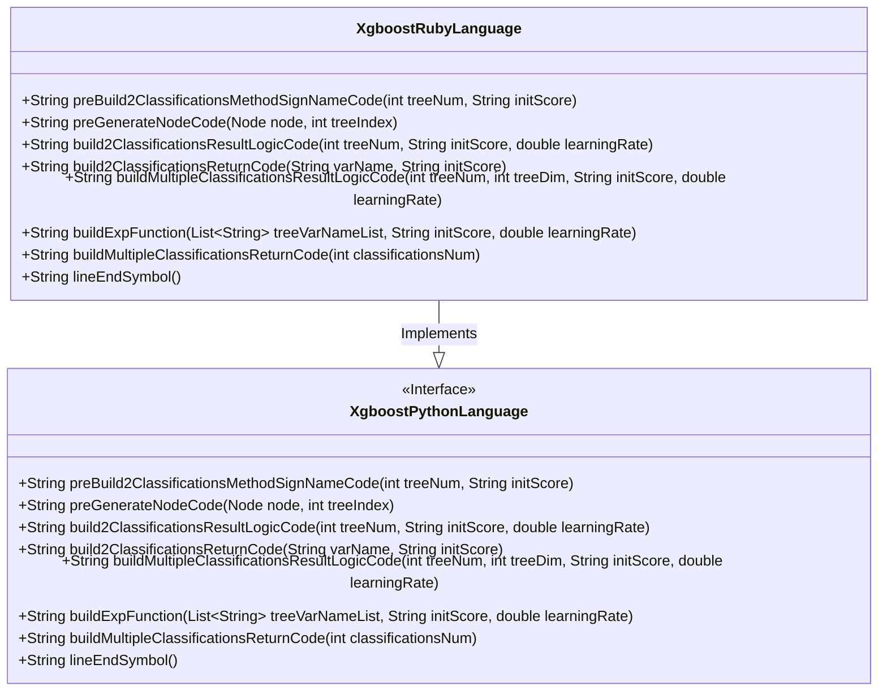
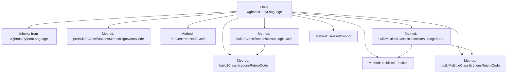
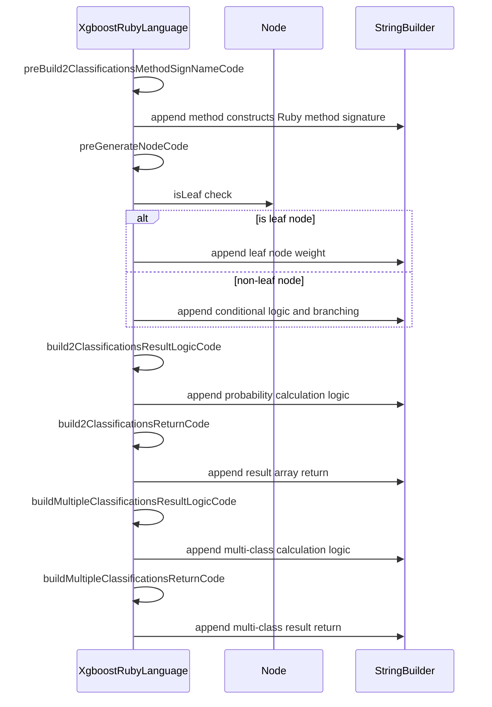

# Basic Information

|      |      |
|------|------|
| Name | XgboostRubyLanguage |
| Language | .java |
| Code Path | WeFe/board/board-service/src/main/java/com/welab/wefe/board/service/service/modelexport/XgboostRubyLanguage.java |
| Package Name | com.welab.wefe.board.service.service.modelexport |
| Dependencies | ['java.util.List', 'java.util.Map'] |
| Brief Description | The `XgboostRubyLanguage` class inherits from `XgboostPythonLanguage` and overrides multiple methods to generate Ruby code, including constructing method signatures for classification, node condition judgments, binary and multi-class result logic, and return code. |

# Description

The `XgboostRubyLanguage` class inherits from `XgboostPythonLanguage` and is specifically designed to generate XGBoost model scoring code in the Ruby language. It overrides multiple methods to adapt to Ruby syntax, including the construction of binary and multi-class classification logic. Key functionalities include generating node evaluation code, mathematical expressions for calculating classification probabilities (e.g., Sigmoid function), and returning the array structure of classification results. The methods handle leaf node weights, feature comparison conditions, tree node traversal logic, and ensure the generated code complies with Ruby syntax conventions (e.g., method definitions using `def`/`end`, conditional statements using `if`/`else`/`end`). In multi-class scenarios, variables are dynamically generated to compute probabilities for each class, ultimately returning a probability array. All methods avoid hardcoding by leveraging abstract methods for flexible adaptation of syntax symbols.

# Class Summary

| Name   | Type  | Description |
|-------|------|-------------|
| XgboostRubyLanguage | class | The `XgboostRubyLanguage` class inherits from `XgboostPythonLanguage` and overrides multiple methods to generate Ruby code, including constructing method signatures for classification, node code, binary and multi-class result logic, and return code. |

## Class XgboostRubyLanguage

|      |      |
|------|------|
| Access Modifier | public |
| Type | class |
| Name | XgboostRubyLanguage |
| Description | The `XgboostRubyLanguage` class inherits from `XgboostPythonLanguage` and overrides multiple methods to generate Ruby code, including constructing method signatures for classification, node code, binary and multi-class result logic, and return code. |

### UML Class Diagram

This class diagram illustrates the inheritance relationship where the XgboostRubyLanguage class implements the XgboostPythonLanguage interface. XgboostPythonLanguage defines multiple abstract methods, including core functionalities such as preprocessing classification method signatures, generating node code, and constructing classification result logic. As a concrete implementation class, XgboostRubyLanguage overrides all parent interface methods to provide specific implementations tailored to Ruby language features, such as Ruby syntax for method definitions, conditional judgments, and array returns. The class diagram clearly reflects this inheritance relationship and the implementation details of method overriding, demonstrating the polymorphic characteristics of object-oriented programming.

### Internal Method Call Graph

This code represents the implementation class of XGBoost model in Ruby language, inheriting from the Python base class. Key functionalities include: constructing binary classification method signatures, generating decision tree node code, implementing binary classification result calculation logic, building multi-class result calculation logic, and related helper methods. The flowchart illustrates class inheritance and method call hierarchy, while the sequence diagram details the invocation sequence and data flow between core methods. The implementation dynamically generates Ruby code via StringBuilder, supporting decision tree condition checks, leaf node processing, and probability calculation result returns.

### Field List

| Name  | Type  | Description |
|-------|-------|------|

### Method List

| Name  | Type  | Description |
|-------|-------|------|
| preBuild2ClassificationsMethodSignNameCode | String | Generate a Python method framework, define the score function, reserve a placeholder for the method body, and end with 'end'. |
| preGenerateNodeCode | String | The method generates code based on node types: leaf nodes return variable assignments, while non-leaf nodes generate conditional branch code containing placeholders for left/right child nodes and termination markers. |
| build2ClassificationsReturnCode | String | This method generates a code string that returns two classifications, containing variable names and initial scores, formatted with indentation and line breaks. |
| build2ClassificationsResultLogicCode | String | This method generates binary logistic regression code, calculates the s1 variable as the result of the sigmoid function, and returns the classification result. Key steps include variable definition, sigmoid calculation, and return logic. |
| buildMultipleClassificationsResultLogicCode | String | This method generates computational code for multiclass logistic regression, traverses the classification tree mapping to produce variable definitions and logical computations, and ultimately returns the classification result code. |
| buildExpFunction | String | Java Method: Generate a mathematical expression string that calculates the natural exponential result of subtracting the sum of a tree variable list from zero. |
| buildMultipleClassificationsReturnCode | String | This method generates a string containing multiple classification return codes, using indentation and square brackets to enclose the classification count, and finally appends a line break before returning. |
| lineEndSymbol | String | Java method override, returning an empty string as the line terminator. |

