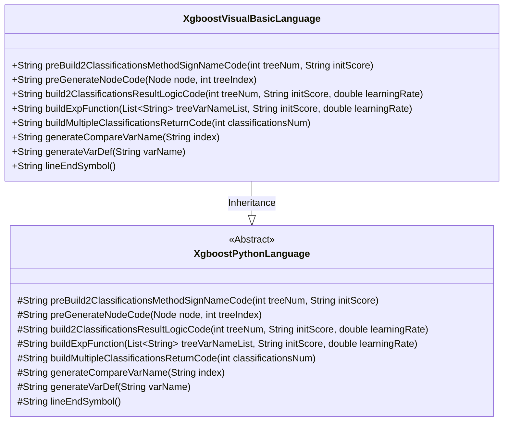
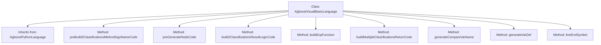

# Basic Information

|      |      |
|------|------|
| Name | XgboostVisualBasicLanguage |
| Language | .java |
| Code Path | WeFe/board/board-service/src/main/java/com/welab/wefe/board/service/service/modelexport/XgboostVisualBasicLanguage.java |
| Package Name | com.welab.wefe.board.service.service.modelexport |
| Dependencies | ['java.util.List'] |
| Brief Description | The `XgboostVisualBasicLanguage` class inherits from `XgboostPythonLanguage` and overrides methods to generate VB code, including classification method signatures, node condition judgments, result logic calculations, and variable definitions. |

# Description

The code defines an `XgboostVisualBasicLanguage` class, inheriting from the `XgboostPythonLanguage` class, which is used to convert an XGBoost model into Visual Basic code. Its primary functionalities include: generating the VB module and scoring function framework, processing conditional judgments for decision tree nodes and weight assignments for leaf nodes, constructing binary classification result logic computation code, implementing exponential functions and multi-class return logic, as well as helper methods such as variable definitions and comparison variable generation. All methods adhere to VB syntax specifications, dynamically generating code through string concatenation without including specific implementation details.

# Class Summary

| Name   | Type  | Description |
|-------|------|-------------|
| XgboostVisualBasicLanguage | class | The XgboostVisualBasicLanguage class inherits from XgboostPythonLanguage and overrides methods to generate VB code, including classification method signatures, node logic, result computation, and variable definitions. |

## Class XgboostVisualBasicLanguage

|      |      |
|------|------|
| Access Modifier | public |
| Type | class |
| Name | XgboostVisualBasicLanguage |
| Description | The XgboostVisualBasicLanguage class inherits from XgboostPythonLanguage and overrides methods to generate VB code, including classification method signatures, node logic, result computation, and variable definitions. |

### UML Class Diagram

This class diagram illustrates that the XgboostVisualBasicLanguage class inherits from the abstract class XgboostPythonLanguage and implements all its abstract methods. The subclass is specifically designed for generating Visual Basic code for XGBoost models, encompassing functionalities such as decision tree node generation, classification result calculation, and mathematical expression construction. The method names clearly reflect their purposes, such as preGenerateNodeCode handling node code generation and buildExpFunction building exponential function expressions. The class structure embodies the Template Method pattern, where the parent class defines the algorithmic skeleton while the child class implements language-specific details.

### Internal Method Call Graph

This code demonstrates an implementation class for converting XGBoost models to Visual Basic language, inheriting from the base Python language generation class. Core functionalities include: generating VB module declarations (preBuild2ClassificationsMethodSignNameCode), recursively constructing decision tree node code (preGenerateNodeCode), binary classification result logic computation (build2ClassificationsResultLogicCode), multi-classification result return logic (buildMultipleClassificationsReturnCode), etc. All methods focus on converting XGBoost model parameters into valid VB code strings, with special attention to handling VB syntax details such as node condition judgments, variable definitions, and mathematical calculation expressions, ultimately outputting scoring module code that complies with VB syntax.

### Field List

| Name  | Type  | Description |
|-------|-------|------|

### Method List

| Name  | Type  | Description |
|-------|-------|------|
| buildExpFunction | String | This method generates an exponential function expression, calculates the negative sum of tree variables, and then takes the exponential value, which is used for machine learning scoring. |
| preBuild2ClassificationsMethodSignNameCode | String | Method generation module code, including the Score function framework, returns a double array, with method body placeholders reserved. |
| build2ClassificationsResultLogicCode | String | Generate binary classification result logic code, calculate variables s1 and s2, where s1 is the sigmoid function result, and s2 is an array of 1-s1 and s1, ultimately returning s2 as the score. |
| buildMultipleClassificationsReturnCode | String | This method generates multi-class return codes, creates variables, and calculates the score proportion for each class, ultimately aggregating the total score. |
| preGenerateNodeCode | String | This method generates code based on node types: leaf nodes return variable assignments, while non-leaf nodes produce conditional judgment structures containing placeholders and indentation. |
| generateCompareVarName | String | The generation method returns the input vector name with an index, formatted as "inputVector(index)". |
| generateVarDef | String | This is a Java method used to generate VB code that defines a Double type variable, with the return format being "Dim variableName As Double". |
| lineEndSymbol | String | Method override, returning an empty string as the line terminator. |

