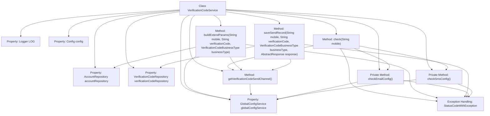

# Basic Information

|      |      |
|------|------|
| Name | VerificationCodeService |
| Language | .java |
| Code Path | WeFe/board/board-service/src/main/java/com/welab/wefe/board/service/service/verificationcode/VerificationCodeService.java |
| Package Name | com.welab.wefe.board.service.service.verificationcode |
| Dependencies | ['com.welab.wefe.board.service.constant.Config', 'com.welab.wefe.board.service.database.entity.AccountMysqlModel', 'com.welab.wefe.board.service.database.entity.VerificationCodeMysqlModel', 'com.welab.wefe.board.service.database.repository.AccountRepository', 'com.welab.wefe.board.service.database.repository.VerificationCodeRepository', 'com.welab.wefe.board.service.service.globalconfig.GlobalConfigService', 'com.welab.wefe.common.StatusCode', 'com.welab.wefe.common.exception.StatusCodeWithException', 'com.welab.wefe.common.util.StringUtil', 'com.welab.wefe.common.verification.code.AbstractResponse', 'com.welab.wefe.common.verification.code.common.CaptchaSendChannel', 'com.welab.wefe.common.verification.code.common.VerificationCodeBusinessType', 'com.welab.wefe.common.verification.code.email.EmailClient', 'com.welab.wefe.common.verification.code.service.AbstractVerificationCodeService', 'com.welab.wefe.common.verification.code.sms.AliyunSmsClient', 'com.welab.wefe.common.web.util.DatabaseEncryptUtil', 'com.welab.wefe.common.wefe.dto.global_config.AlertConfigModel', 'com.welab.wefe.common.wefe.dto.global_config.AliyunSmsChannelConfigModel', 'com.welab.wefe.common.wefe.dto.global_config.MailServerModel', 'org.slf4j.Logger', 'org.slf4j.LoggerFactory', 'org.springframework.beans.factory.annotation.Autowired', 'org.springframework.stereotype.Service', 'java.util.Map', 'java.util.UUID'] |
| Brief Description | The VerificationCodeService class provides verification code services, including phone number validation, email/SMS configuration checks, verification code sending record storage, and parameter construction functionality. |

# Description

The `VerificationCodeService` is a Spring service class that extends `AbstractVerificationCodeService` and provides verification code-related functionalities. Its primary features include: validating phone number effectiveness, user status, and configurations; constructing extended parameters based on the sending channel (email or Alibaba Cloud SMS); saving verification code sending records; and retrieving the current verification code sending channel. The service relies on multiple repositories and configuration services, incorporating detailed parameter validation logic to ensure complete email server and SMS channel configurations. In exceptional cases, it throws `StatusCodeWithException` with status codes and error messages.

# Class Summary

| Name   | Type  | Description |
|-------|------|-------------|
| VerificationCodeService | class | Verification code service class, providing mobile number verification, verification code sending channel configuration checks, email or SMS verification code parameter construction, and sending record storage functionality. |

## Class VerificationCodeService

|      |      |
|------|------|
| Access Modifier | @Service;public |
| Type | class |
| Name | VerificationCodeService |
| Description | Verification code service class, providing mobile number verification, verification code sending channel configuration checks, email or SMS verification code parameter construction, and sending record storage functionality. |

### UML Class Diagram

```mermaid
classDiagram
    class VerificationCodeService {
        -Logger LOG
        -AccountRepository accountRepository
        -GlobalConfigService globalConfigService
        -VerificationCodeRepository verificationCodeRepository
        -Config config
        +check(String mobile) void
        +buildExtendParams(String mobile, String verificationCode, VerificationCodeBusinessType businessType) Map~String,Object~
        +saveSendRecord(String mobile, String verificationCode, VerificationCodeBusinessType businessType, AbstractResponse response) void
        +getVerificationCodeSendChannel() CaptchaSendChannel
        -checkEmailConfig() void
        -checkSmsConfig() void
    }

    class AbstractVerificationCodeService {
        <<Abstract>>
    }

    class AccountRepository {
        <<Interface>>
    }

    class GlobalConfigService {
        <<Interface>>
    }

    class VerificationCodeRepository {
        <<Interface>>
    }

    class Config {
        <<Interface>>
    }

    class StatusCodeWithException {
        <<Exception>>
    }

    class AccountMysqlModel {
        +String phoneNumber
        +boolean enable
        +String email
    }

    class MailServerModel {
        +String mailHost
        +Integer mailPort
        +String mailUsername
        +String mailPassword
    }

    class AliyunSmsChannelConfigModel {
        +String accessKeyId
        +String accessKeySecret
        +String signName
        +String retrievePasswordTemplateCode
    }

    class VerificationCodeMysqlModel {
        +String bizId
        +String mobile
        +String code
        +String success
        +CaptchaSendChannel sendChannel
        +VerificationCodeBusinessType businessType
        +String respContent
    }

    class AlertConfigModel {
        +CaptchaSendChannel retrievePasswordCaptchaChannel
    }

    VerificationCodeService --|> AbstractVerificationCodeService : Inheritance
    VerificationCodeService --> AccountRepository : Dependency
    VerificationCodeService --> GlobalConfigService : Dependency
    VerificationCodeService --> VerificationCodeRepository : Dependency
    VerificationCodeService --> Config : Dependency
    VerificationCodeService ..> StatusCodeWithException : Throws
    VerificationCodeService ..> AccountMysqlModel : Uses
    VerificationCodeService ..> MailServerModel : Uses
    VerificationCodeService ..> AliyunSmsChannelConfigModel : Uses
    VerificationCodeService ..> VerificationCodeMysqlModel : Uses
    VerificationCodeService ..> AlertConfigModel : Uses
```

This code demonstrates a verification code service class `VerificationCodeService`, which inherits from the abstract class `AbstractVerificationCodeService` and implements functionalities such as verification code checking, building extended parameters, and saving sending records. The class depends on multiple repository interfaces and configuration services, including `AccountRepository`, `GlobalConfigService`, etc., while utilizing various model classes like `AccountMysqlModel`, `MailServerModel`, etc., to handle business logic. The code includes detailed parameter validation and exception handling to ensure the security and reliability of verification code sending.

### Internal Method Call Graph

This flowchart illustrates the structure of the VerificationCodeService class and its key method invocation relationships. The class inherits from AbstractVerificationCodeService and contains multiple auto-wired properties and core methods. Main methods include check (validates phone number and configurations), buildExtendParams (constructs extended parameters), saveSendRecord (saves sending records), etc., all of which may throw StatusCodeWithException. The diagram clearly shows method invocation chains, particularly how the check method calls either checkEmailConfig or checkSmsConfig based on the sending channel, while getVerificationCodeSendChannel is invoked by multiple methods to obtain channel configuration.

### Field List

| Name  | Type  | Description |
|-------|-------|------|
| LOG = LoggerFactory.getLogger(VerificationCodeService.class) | Logger | Define a protected final log object LOG for logging in the VerificationCodeService class. |
| accountRepository | AccountRepository | Use @Autowired to automatically inject an instance of AccountRepository. |
| verificationCodeRepository | VerificationCodeRepository | Automatically inject CAPTCHA repository instance. |
| globalConfigService | GlobalConfigService | Use @Autowired to automatically inject an instance of GlobalConfigService. |
| config | Config | Automatically inject Config configuration instances. |

### Method List

| Name  | Type  | Description |
|-------|-------|------|
| getVerificationCodeSendChannel | CaptchaSendChannel | Method override, returns the password recovery verification code sending channel set in the global configuration. |
| check | void | Check mobile number validity: non-empty, correct format, user exists and is not disabled, verify email or SMS configuration based on the verification code delivery channel. |
| buildExtendParams | Map<String, Object> | The method constructs verification code parameters based on the sending channel: the email method uses mail service configuration to send verification codes; the Alibaba Cloud SMS method uses SMS configuration to send verification codes. |
| saveSendRecord | void | The method saves the verification code sending record, including the phone number, verification code, business type, response result, and other information, into the database. |
| checkEmailConfig | void | Check the email configuration to verify if the server address, port, username, and password are set; if not, throw an exception. |
| checkSmsConfig | void | Check the Alibaba Cloud SMS configuration to verify whether the AccessKeyId, AccessKeySecret, signature, and template code are set. If any of them is not set, throw an exception. |

