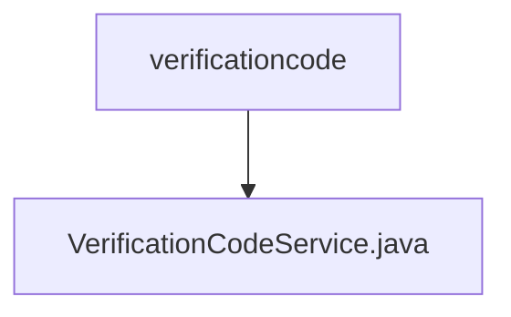

# Basic Information

|      |      |
|------|------|
| Name | verificationcode |
| Language | .java |
| Code Path | WeFe/board/board-service/src/main/java/com/welab/wefe/board/service/service/verificationcode |
| Package Name | docs.board.board-service.src.main.java.com.welab.wefe.board.service.service.verificationcode |
| Brief Description | The VerificationCodeService class provides verification code services, including phone number validation, email/SMS configuration checks, verification code sending record storage, and parameter construction functionality. |

# Description

The `VerificationCodeService` is a Spring service class that extends `AbstractVerificationCodeService` and provides verification code-related functionalities. Key features include: validating phone number effectiveness, user status, and configurations; constructing extended parameters based on the sending channel (email or Alibaba Cloud SMS); saving verification code sending records; and retrieving the current verification code sending channel. The service relies on multiple repositories and configuration services, incorporating detailed parameter validation logic to ensure complete email server and SMS channel configurations. In exceptional cases, it throws `StatusCodeWithException` with status codes and error messages.

### Package Internal Structure View

This flowchart illustrates the file structure relationship of the verification code service in the WeFe project. The top-level node is the verificationcode directory, which contains only one subordinate file: the service implementation file VerificationCodeService.java. This concise hierarchical structure suggests that the functional module may be in the early stages of development or has relatively simple functionality, currently comprising only the core service class file.

# File List

| Name   | Type  | Description |
|-------|------|-------------|
| [VerificationCodeService.java](VerificationCodeService.md) | file | The VerificationCodeService class provides verification code services, including phone number validation, email/SMS configuration checks, verification code sending record storage, and parameter construction functionality. |

