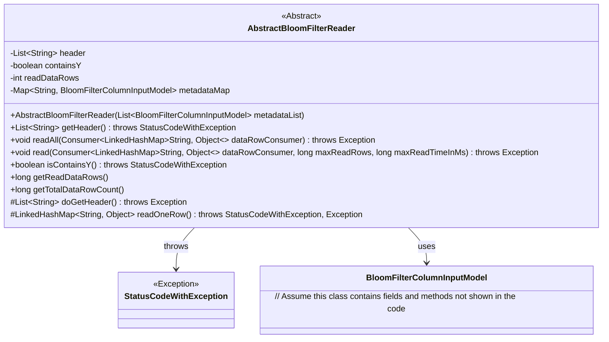

# Basic Information

|      |      |
|------|------|
| Name | AbstractBloomFilterReader |
| Language | .java |
| Code Path | WeFe/board/board-service/src/main/java/com/welab/wefe/board/service/util/AbstractBloomFilterReader.java |
| Package Name | com.welab.wefe.board.service.util |
| Dependencies | ['com.welab.wefe.board.service.dto.fusion.BloomFilterColumnInputModel', 'com.welab.wefe.common.StatusCode', 'com.welab.wefe.common.exception.StatusCodeWithException', 'java.io.Closeable', 'java.util.LinkedHashMap', 'java.util.List', 'java.util.Map', 'java.util.function.Consumer', 'java.util.stream.Collectors'] |
| Brief Description | The abstract class `AbstractBloomFilterReader` implements the `Closeable` interface, providing functionality for reading Bloom filter data. It includes methods such as retrieving table headers, reading data rows, and counting rows, while supporting row count and time limit constraints during reading. |

# Description

AbstractBloomFilterReader is an abstract class that implements the Closeable interface, designed for reading Bloom filter data. It includes a header list, a containsY flag, the count of read rows (readDataRows), and a metadataMap for metadata. The constructor accepts a list of BloomFilterColumnInputModel and converts it into a map. The getHeader method retrieves and processes header data, involving deduplication, trimming column names, and converting Y to y. The readAll and read methods are used to read data rows, supporting maximum row limits and read time constraints. isContainsY checks for the presence of a y column, while getReadDataRows returns the count of rows read. The abstract methods doGetHeader, getTotalDataRowCount, and readOneRow must be implemented by subclasses to handle header retrieval, total row count, and single-row data reading, respectively.

# Class Summary

| Name   | Type  | Description |
|-------|------|-------------|
| AbstractBloomFilterReader | class | The abstract class AbstractBloomFilterReader implements the Closeable interface and is used for reading BloomFilter data. It includes functionalities such as retrieving headers, reading data rows, and counting rows, supporting row count and time-limited reading. Key fields: header, containsY, readDataRows. |

## Class AbstractBloomFilterReader

|      |      |
|------|------|
| Access Modifier | public abstract |
| Type | class |
| Name | AbstractBloomFilterReader |
| Description | The abstract class AbstractBloomFilterReader implements the Closeable interface and is used for reading BloomFilter data. It includes functionalities such as retrieving headers, reading data rows, and counting rows, supporting row count and time-limited reading. Key fields: header, containsY, readDataRows. |

### UML Class Diagram

This class diagram illustrates an abstract class `AbstractBloomFilterReader` that implements the `Closeable` interface for reading Bloom filter data. Key methods include `getHeader()` for retrieving data headers, `readAll()` and `read()` for reading data rows, with abstract methods `doGetHeader()` and `readOneRow()` enforcing concrete logic implementation in subclasses. The class handles exceptions via `StatusCodeWithException` and uses `BloomFilterColumnInputModel` to store metadata. The design follows the Template Method pattern, deferring variable logic to subclass implementations.

### Internal Method Call Graph

```mermaid
graph TD
    A["Abstract Class AbstractBloomFilterReader"]
    B["Property: List<String> header"]
    C["Property: boolean containsY"]
    D["Property: int readDataRows"]
    E["Property: Map<String, BloomFilterColumnInputModel> metadataMap"]
    F["Constructor: AbstractBloomFilterReader(List<BloomFilterColumnInputModel>)"]
    G["Method: List<String> getHeader()"]
    H["Method: void readAll(Consumer<LinkedHashMap<String, Object>>)"]
    I["Method: void read(Consumer<LinkedHashMap<String, Object>>, long, long)"]
    J["Method: boolean isContainsY()"]
    K["Method: long getReadDataRows()"]
    L["Abstract Method: List<String> doGetHeader()"]
    M["Abstract Method: long getTotalDataRowCount()"]
    N["Abstract Method: LinkedHashMap<String, Object> readOneRow()"]
    O["Internal Process: Header uniqueness validation"]
    P["Internal Process: 'Y' to 'y' conversion"]
    Q["Internal Process: Row count/time limit check"]

    A --> B
    A --> C
    A --> D
    A --> E
    A --> F
    A --> G
    A --> H
    A --> I
    A --> J
    A --> K
    A --> L
    A --> M
    A --> N
    G --> O
    G --> P
    I --> Q
```

This flowchart illustrates the core structure and functionality of the abstract class AbstractBloomFilterReader. The class contains 4 member variables and 9 methods, including 3 abstract methods. Key features include: initializing metadata mapping through the constructor; getHeader() method handling header retrieval, validation, and formatting; read() method implementing row reading with constraints; isContainsY() checking special field existence. The abstract methods doGetHeader(), readOneRow(), and getTotalDataRowCount() require subclass implementation, demonstrating the Template Method design pattern. The process highlights header validation logic and row count/time limit control points during read operations.

### Field List

| Name  | Type  | Description |
|-------|-------|------|
| metadataMap | Map<String, BloomFilterColumnInputModel> | Mapping string keys to Bloom filter column input models. |
| readDataRows = 0 | int | The variable `readDataRows` is used to track the number of data rows that have been read, with an initial value of 0. |
| header | List<String> | Declare a protected string list variable named header. |
| containsY | boolean | Boolean variable indicating whether Y is included. |

### Method List

| Name  | Type  | Description |
|-------|-------|------|
| getReadDataRows | long | Get the number of data rows read. |
| isContainsY | boolean | Check if the Y attribute is included. If the header is empty, retrieve the header first, then return the boolean value `containsY`. |
| read | void | The method reads data line by line, passing each line to the consumer for processing. It supports limiting the number of lines read or the processing time, stopping immediately when the limit is exceeded. |
| getHeader | List<String> | Retrieve the data table header information. If the header is empty, call doGetHeader to obtain and process it: remove spaces, check for duplicate fields, convert Y to y. Throw StatusCodeWithException in case of exceptions. |
| readAll | void | The Java method `readAll` processes data rows through `dataRowConsumer`, calls the `read` method to fetch all data without pagination parameters, and may throw exceptions. |
| doGetHeader | List<String> | Abstract method, returns a list of strings, may throw an exception. |
| getTotalDataRowCount | long | Abstract method for obtaining the total number of data rows. |
| readOneRow | LinkedHashMap<String, Object> | Abstract method readOneRow, returns LinkedHashMap<String, Object>, may throw StatusCodeWithException or Exception. |

