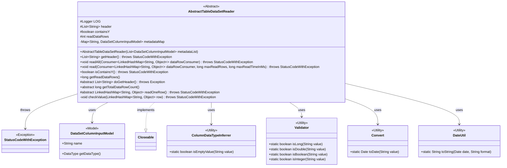
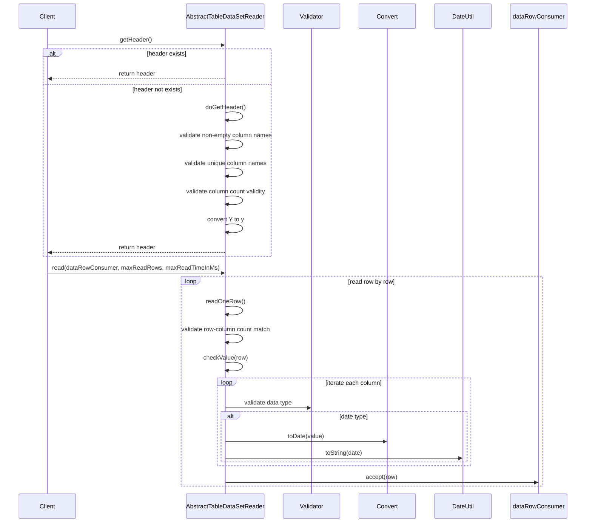

# Basic Information

|      |      |
|------|------|
| Name | AbstractTableDataSetReader |
| Language | .java |
| Code Path | WeFe/board/board-service/src/main/java/com/welab/wefe/board/service/util/AbstractTableDataSetReader.java |
| Package Name | com.welab.wefe.board.service.util |
| Dependencies | ['com.welab.wefe.board.service.dto.entity.data_set.DataSetColumnInputModel', 'com.welab.wefe.common.Convert', 'com.welab.wefe.common.StatusCode', 'com.welab.wefe.common.Validator', 'com.welab.wefe.common.exception.StatusCodeWithException', 'com.welab.wefe.common.util.DateUtil', 'com.welab.wefe.common.util.StringUtil', 'com.welab.wefe.common.wefe.ColumnDataTypeInferrer', 'org.slf4j.Logger', 'org.slf4j.LoggerFactory', 'java.io.Closeable', 'java.util.Date', 'java.util.LinkedHashMap', 'java.util.List', 'java.util.Map', 'java.util.function.Consumer', 'java.util.stream.Collectors'] |
| Brief Description | The abstract class AbstractTableDataSetReader implements the Closeable interface, providing functionality for reading tabular datasets. It includes methods such as retrieving headers, reading data rows, and validating data types, while supporting row count limits and time-limited reads. |

# Description

AbstractTableDataSetReader is an abstract class that implements the Closeable interface, designed for reading tabular datasets. It includes fields such as a logger, table header information, a flag indicating whether the dataset contains a Y column, a count of read rows, and a metadata map. The constructor accepts a metadata list and converts it into a map. It provides a method to retrieve the table header, which performs validation checks such as non-null column names and uniqueness, and automatically converts uppercase Y to lowercase. It supports reading all data rows or reading with row and time limits, performing column count matching checks for each row. The class includes data value type validation logic, supporting validation for types such as Long, Double, Boolean, Integer, and DateTime, with standardized date formatting. Methods are provided to determine whether the dataset contains a Y column and to retrieve the count of read rows. Three abstract methods are defined: implementing table header retrieval, obtaining the total row count, and reading a single row of data.

# Class Summary

| Name   | Type  | Description |
|-------|------|-------------|
| AbstractTableDataSetReader | class | The abstract class AbstractTableDataSetReader implements the Closeable interface, providing functionality for reading tabular datasets, including operations such as retrieving headers, reading data rows, and validating data types, with support for row count limits and time constraints. |

## Class AbstractTableDataSetReader

|      |      |
|------|------|
| Access Modifier | public abstract |
| Type | class |
| Name | AbstractTableDataSetReader |
| Description | The abstract class AbstractTableDataSetReader implements the Closeable interface, providing functionality for reading tabular datasets, including operations such as retrieving headers, reading data rows, and validating data types, with support for row count limits and time constraints. |

### UML Class Diagram

This code defines an abstract class `AbstractTableDataSetReader` for reading tabular datasets. The class provides functionalities for retrieving headers, reading data rows, and validating data types, while requiring subclasses to implement specific header retrieval and row reading logic through abstract methods. The class diagram illustrates its relationships with exception classes, data model classes, and various utility classes. Primarily handling tabular data reading and validation—including column name checks, data type validation, and row reading limits—this serves as a typical base implementation for data readers.

### Internal Method Call Graph

```mermaid
graph TD
    A["Abstract Class AbstractTableDataSetReader"]
    B["Attribute: Logger LOG"]
    C["Attribute: List<String> header"]
    D["Attribute: boolean containsY"]
    E["Attribute: int readDataRows"]
    F["Attribute: Map<String, DataSetColumnInputModel> metadataMap"]
    G["Constructor: AbstractTableDataSetReader(List<DataSetColumnInputModel>)"]
    H["Method: getHeader()"]
    I["Method: readAll(Consumer<LinkedHashMap<String, Object>>)"]
    J["Method: read(Consumer<LinkedHashMap<String, Object>>, long, long)"]
    K["Method: checkValue(LinkedHashMap<String, Object>)"]
    L["Method: isContainsY()"]
    M["Method: getReadDataRows()"]
    N["Abstract Method: doGetHeader()"]
    O["Abstract Method: getTotalDataRowCount()"]
    P["Abstract Method: readOneRow()"]

    A --> B
    A --> C
    A --> D
    A --> E
    A --> F
    A --> G
    A --> H
    A --> I
    A --> J
    J --> K
    A --> L
    A --> M
    A -.-> N
    A -.-> O
    A -.-> P
    H --> N
    J --> P
```

This code defines an abstract class AbstractTableDataSetReader, primarily used for reading tabular datasets. It includes logic for header retrieval and validation, as well as functionality for reading and validating data rows. The flowchart illustrates the class's structural relationships, while the sequence diagram details the specific workflows of two main operations: retrieving headers (readHeader) and reading data rows (read). The class delegates concrete implementations to subclasses through abstract methods while providing comprehensive data validation mechanisms—including non-empty column checks, duplicate column checks, and data type matching—to ensure reliable data reading.

### Field List

| Name  | Type  | Description |
|-------|-------|------|
| readDataRows = 0 | int | The variable `readDataRows` is used to track the number of data rows that have been read, with an initial value of 0. |
| header | List<String> | Declare a protected string list variable named header. |
| containsY | boolean | Boolean variable indicating whether Y is included. |
| LOG = LoggerFactory.getLogger(this.getClass()) | Logger | A protected final log object LOG is defined in the class for recording log information of the current class. |
| metadataMap | Map<String, DataSetColumnInputModel> | Private mapping with string keys and dataset column input model values. |

### Method List

| Name  | Type  | Description |
|-------|-------|------|
| getTotalDataRowCount | long | Abstract method, returns a long integer value representing the total number of data rows. |
| checkValue | void | Check if the row data value types match the metadata definitions. Skip null values, validate types such as Long, Double, Boolean, Integer, DateTime, and throw an exception if they do not match. Standardize date formats to yyyy-MM-dd HH:mm:ss. |
| doGetHeader | List<String> | Abstract method, returns a list of strings, may throw an exception. |
| readAll | void | The method `readAll` processes `LinkedHashMap` data via a `Consumer`, performing unbounded reads and may throw a `StatusCodeWithException` exception. |
| isContainsY | boolean | Check if the Y attribute is included. If the header is empty, retrieve the header first, then return the boolean value containsY. |
| read | void | The method reads data line by line, checks if the number of columns in each row matches the header, validates the data values, and then passes them to the consumer. It supports limiting the number of rows read and the processing time, terminating the read operation if the limits are exceeded. |
| getReadDataRows | long | Get the number of data rows read. |
| getHeader | List<String> | Retrieve dataset header information, check that column names are non-empty, unique, and contain at least two columns, process Y as y and mark whether y is included. Throw corresponding errors if exceptions occur. |
| readOneRow | LinkedHashMap<String, Object> | Abstract method readOneRow, returns ordered key-value pairs, may throw status code exceptions. |

