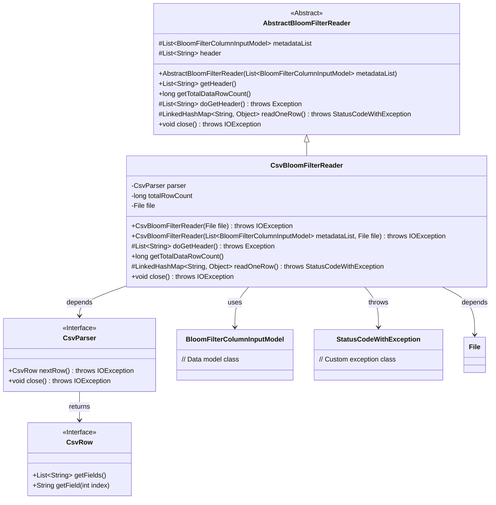
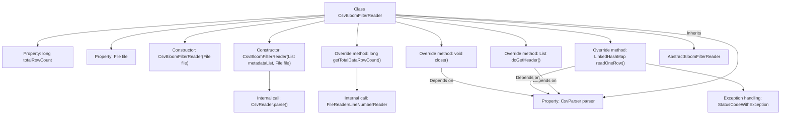

# Basic Information

|      |      |
|------|------|
| Name | CsvBloomFilterReader |
| Language | .java |
| Code Path | WeFe/board/board-service/src/main/java/com/welab/wefe/board/service/util/CsvBloomFilterReader.java |
| Package Name | com.welab.wefe.board.service.util |
| Dependencies | ['com.welab.wefe.board.service.dto.fusion.BloomFilterColumnInputModel', 'com.welab.wefe.common.StatusCode', 'com.welab.wefe.common.exception.StatusCodeWithException', 'de.siegmar.fastcsv.reader.CsvParser', 'de.siegmar.fastcsv.reader.CsvReader', 'de.siegmar.fastcsv.reader.CsvRow', 'java.io.File', 'java.io.FileReader', 'java.io.IOException', 'java.io.LineNumberReader', 'java.nio.charset.StandardCharsets', 'java.util.LinkedHashMap', 'java.util.List'] |
| Brief Description | The `CsvBloomFilterReader` class extends `AbstractBloomFilterReader` and is designed to read CSV files while processing data rows. It supports headless mode, skips empty lines, counts total rows, reads data row by row into a `LinkedHashMap`, and finally closes the parser. |

# Description

CsvBloomFilterReader is a class that inherits from AbstractBloomFilterReader, designed to read CSV files and process Bloom filter data. It includes a CSV parser, a file object, and functionality for counting total rows. The constructor supports passing a metadata list and a file object, configuring the CSV reader to skip empty lines and headers during initialization. The class provides methods to retrieve headers, calculate the total row count, read data row by row, and close resources. The total row count is determined by tracking file line numbers, with each row's content mapped into a LinkedHashMap during data reading. Exception handling covers file reading errors and system errors.

# Class Summary

| Name   | Type  | Description |
|-------|------|-------------|
| CsvBloomFilterReader | class | The CsvBloomFilterReader class inherits from AbstractBloomFilterReader and is used to read data from CSV files. It supports headless mode, skips empty lines, counts the total number of rows, reads data line by line into a LinkedHashMap, and finally closes the parser. |

## Class CsvBloomFilterReader

|      |      |
|------|------|
| Access Modifier | public |
| Type | class |
| Name | CsvBloomFilterReader |
| Description | The CsvBloomFilterReader class inherits from AbstractBloomFilterReader and is used to read data from CSV files. It supports headless mode, skips empty lines, counts the total number of rows, reads data line by line into a LinkedHashMap, and finally closes the parser. |

### UML Class Diagram

This code demonstrates a CSV file reader implementation specifically designed for Bloom filters. The CsvBloomFilterReader inherits from the abstract class AbstractBloomFilterReader, utilizes CsvParser to process CSV file content, and supports operations like retrieving headers, calculating total row counts, and reading data row by row. The class diagram clearly illustrates inheritance relationships, interface implementations, and key dependencies including file handling, CSV parsing, and exception handling components. The implementation emphasizes resource management and error handling, ensuring proper parser closure through the close() method and employing the custom exception StatusCodeWithException to convey system error messages.

### Internal Method Call Graph

The flowchart illustrates the structure and key method invocation relationships of the CsvBloomFilterReader class. This class inherits from AbstractBloomFilterReader and provides CSV file parsing and row counting functionality. Core methods include initializing the CSV parser during construction, reading headers, counting file rows, reading data row-by-row, and closing resources. The getTotalDataRowCount() method leverages LineNumberReader for efficient row counting, while readOneRow() transforms CSV rows into ordered maps with built-in exception handling. All methods interact closely with the CsvParser instance, demonstrating unified management of file resources.

### Field List

| Name  | Type  | Description |
|-------|-------|------|
| totalRowCount | long | Private long integer variable, recording the total number of rows. |
| parser | CsvParser | Private immutable CSV parser instance. |
| file | File | Private immutable file object. |

### Method List

| Name  | Type  | Description |
|-------|-------|------|
| doGetHeader | List<String> | Rewrite the doGetHeader method to parse the next line of the CSV and return a list of fields. |
| getTotalDataRowCount | long | The method getTotalDataRowCount returns the file's line count minus one. If totalRowCount is greater than 0, it returns directly; otherwise, it reads the file to calculate the line count and caches the result, returning 0 in case of an exception. |
| readOneRow | LinkedHashMap<String, Object> | The method `readOneRow` reads a single row of data from a CSV file and converts it into a `LinkedHashMap`, where the keys are the headers and the values are the corresponding fields. If the read operation fails, an exception is thrown; if there is no data, it returns `null`. |
| close | void | Java method override, closes the parser and may throw IOException. |

