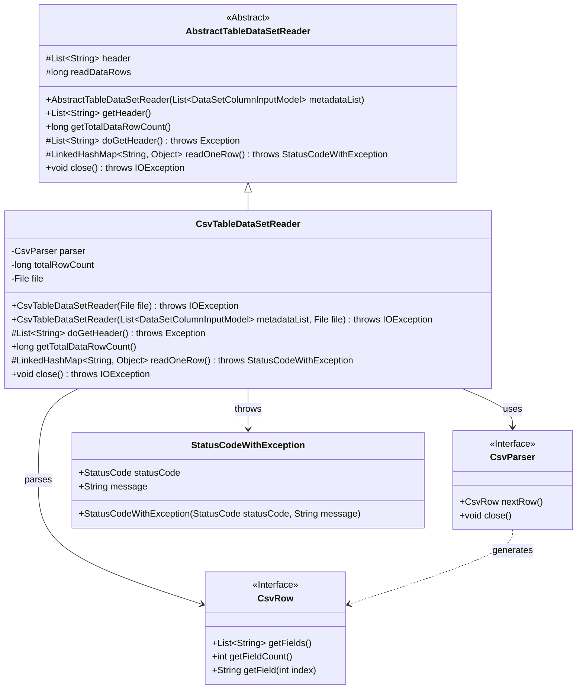
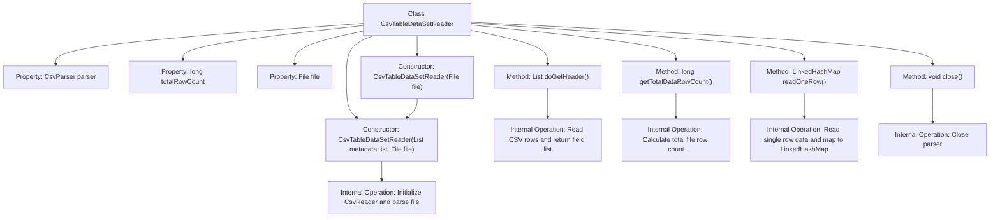

# Basic Information

|      |      |
|------|------|
| Name | CsvTableDataSetReader |
| Language | .java |
| Code Path | WeFe/board/board-service/src/main/java/com/welab/wefe/board/service/util/CsvTableDataSetReader.java |
| Package Name | com.welab.wefe.board.service.util |
| Dependencies | ['com.welab.wefe.board.service.dto.entity.data_set.DataSetColumnInputModel', 'com.welab.wefe.common.StatusCode', 'com.welab.wefe.common.exception.StatusCodeWithException', 'de.siegmar.fastcsv.reader.CsvParser', 'de.siegmar.fastcsv.reader.CsvReader', 'de.siegmar.fastcsv.reader.CsvRow', 'java.io.File', 'java.io.FileReader', 'java.io.IOException', 'java.io.LineNumberReader', 'java.nio.charset.StandardCharsets', 'java.util.LinkedHashMap', 'java.util.List'] |
| Brief Description | The CsvTableDataSetReader class inherits from AbstractTableDataSetReader and is used to read data from CSV files. It includes functionalities for retrieving table headers, calculating the total number of rows, reading data row by row, and closing the parser. It supports custom metadata and UTF-8 encoding. |

# Description

The CsvTableDataSetReader is a class that inherits from AbstractTableDataSetReader and is used to read data from CSV files. It contains a CsvParser, a file object, and a row counter. The constructor supports passing in a file path and a metadata list, configuring the CSV reader to skip empty lines and headers during initialization. Methods include retrieving headers, calculating the total row count, reading data row by row into a LinkedHashMap, and closing the parser. The total row count is determined by file line numbers, and exceptions are thrown if reading fails.

# Class Summary

| Name   | Type  | Description |
|-------|------|-------------|
| CsvTableDataSetReader | class | The CsvTableDataSetReader class inherits from AbstractTableDataSetReader and is used to read data from CSV files. The constructor initializes the CSV parser and supports headerless mode. Methods include retrieving headers, calculating the total number of rows, reading data row by row into a LinkedHashMap, and closing the parser. Exception handling is robust. |

## Class CsvTableDataSetReader

|      |      |
|------|------|
| Access Modifier | public |
| Type | class |
| Name | CsvTableDataSetReader |
| Description | The CsvTableDataSetReader class inherits from AbstractTableDataSetReader and is used to read data from CSV files. The constructor initializes the CSV parser and supports headerless mode. Methods include retrieving headers, calculating the total number of rows, reading data row by row into a LinkedHashMap, and closing the parser. Exception handling is robust. |

### UML Class Diagram

This code implements a CSV table data reader that inherits from an abstract table reader. Its main functionalities include parsing CSV file headers, calculating total row counts, reading data row by row, and handling potential exceptions. The class diagram illustrates inheritance relationships, interface implementations, and key dependencies, where CsvParser and CsvRow are interfaces, and StatusCodeWithException is a custom exception class. The reader utilizes a CSV parser through composition while implementing four core methods defined by the abstract class.

### Internal Method Call Graph

This flowchart illustrates the complete structure of the CsvTableDataSetReader class, including 4 main methods and 2 constructors. Core functionalities include CSV file parsing, header retrieval, row count statistics, data row reading, and resource release. The constructors initialize the CSV parser, doGetHeader() reads the first line as headers, getTotalDataRowCount() calculates total rows via line numbers, readOneRow() maps each row to an ordered dictionary, and close() releases parser resources.

### Field List

| Name  | Type  | Description |
|-------|-------|------|
| parser | CsvParser | A private immutable CSV parser instance. |
| totalRowCount | long | Private long integer variable, recording the total number of rows. |
| file | File | Private immutable file object. |

### Method List

| Name  | Type  | Description |
|-------|-------|------|
| doGetHeader | List<String> | Rewrite the doGetHeader method to parse the next line of the CSV and return a list of fields. |
| getTotalDataRowCount | long | The method getTotalDataRowCount returns the total number of rows in the file. If totalRowCount is cached, it returns the value directly; otherwise, it reads the file to calculate the row count and caches the result. Returns 0 in case of an exception. |
| readOneRow | LinkedHashMap<String, Object> | The method `readOneRow` reads a single row of CSV data and converts it into a `LinkedHashMap`. If the row is empty, it returns `null`; otherwise, it maps the field values according to the header. If an error occurs, it throws an exception indicating the row number and error message. |
| close | void | Java method override, closes the parser and may throw an IO exception. |

