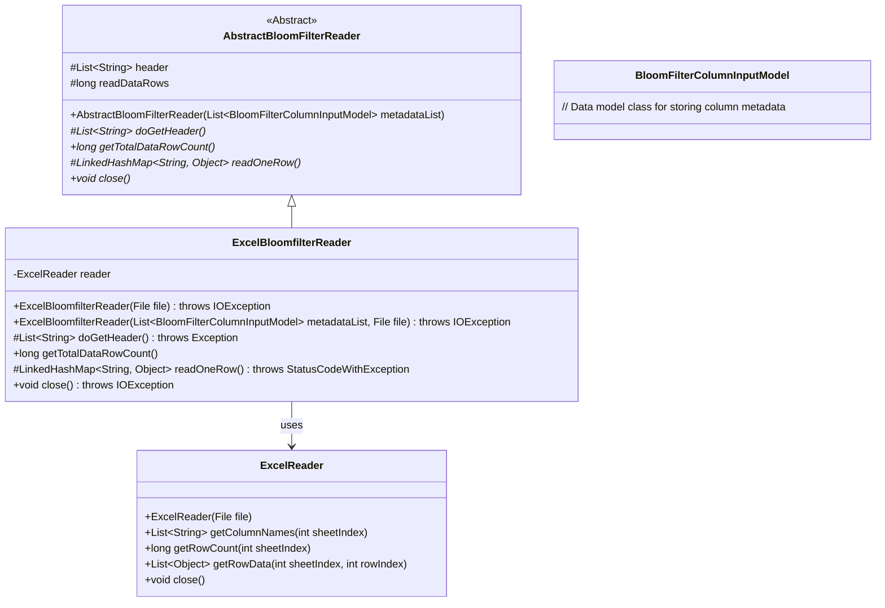
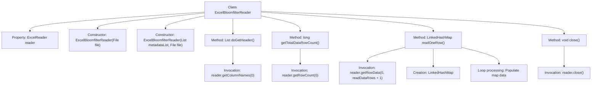

# Basic Information

|      |      |
|------|------|
| Name | ExcelBloomfilterReader |
| Language | .java |
| Code Path | WeFe/board/board-service/src/main/java/com/welab/wefe/board/service/util/ExcelBloomfilterReader.java |
| Package Name | com.welab.wefe.board.service.util |
| Dependencies | ['com.welab.wefe.board.service.dto.fusion.BloomFilterColumnInputModel', 'com.welab.wefe.common.exception.StatusCodeWithException', 'com.welab.wefe.common.io.excel.ExcelReader', 'java.io.File', 'java.io.IOException', 'java.util.LinkedHashMap', 'java.util.List'] |
| Brief Description | The `ExcelBloomfilterReader` class extends `AbstractBloomFilterReader` and reads Excel file data via `ExcelReader`, supporting operations such as fetching headers, obtaining total row counts, and reading data row by row. It automatically closes after reading. |

# Description

ExcelBloomfilterReader is a class that inherits from AbstractBloomFilterReader, designed for reading Excel files and processing Bloom filter-related data. It operates on files through an ExcelReader instance, supporting initialization from a specified file or in combination with a metadata list. Key functionalities include retrieving header information, calculating the total number of data rows, reading data row by row (automatically filling missing values with null), and closing file resources. During reading, it maintains column order to ensure data aligns with headers and properly releases resources upon completion.

# Class Summary

| Name   | Type  | Description |
|-------|------|-------------|
| ExcelBloomfilterReader | class | The ExcelBloomfilterReader class inherits from AbstractBloomFilterReader and reads Excel file data through ExcelReader. It supports retrieving headers, total row counts, and row-by-row data reading. Resources must be closed after reading is completed. |

## Class ExcelBloomfilterReader

|      |      |
|------|------|
| Access Modifier | public |
| Type | class |
| Name | ExcelBloomfilterReader |
| Description | The ExcelBloomfilterReader class inherits from AbstractBloomFilterReader and reads Excel file data through ExcelReader. It supports retrieving headers, total row counts, and row-by-row data reading. Resources must be closed after reading is completed. |

### UML Class Diagram

This code demonstrates an implementation of an Excel Bloom filter reader. The ExcelBloomfilterReader inherits from the abstract class AbstractBloomFilterReader and utilizes the ExcelReader through composition to read Excel file contents. Key functionalities include retrieving headers, calculating total row counts, and reading data row by row. The class diagram clearly illustrates the inheritance relationship, composition relationship, and core method definitions, showcasing the process of reading Excel data and converting it into the format required by a Bloom filter.

### Internal Method Call Graph

This flowchart illustrates the complete structure of the ExcelBloomfilterReader class, which inherits from AbstractBloomFilterReader. Its primary functionality includes reading Excel file data through ExcelReader, implementing operations such as retrieving headers, calculating total row counts, reading data row by row, and closing resources. The core logic is concentrated in the readOneRow method, which reads specified row data and converts it into a LinkedHashMap structure while handling default value population for insufficient columns. The entire process strictly adheres to resource management standards, ensuring proper file handle release through the close method.

### Field List

| Name  | Type  | Description |
|-------|-------|------|
| reader | ExcelReader | A private immutable Excel reader instance. |

### Method List

| Name  | Type  | Description |
|-------|-------|------|
| close | void | Java method overriding, closing reader resources, may throw IOException. |
| doGetHeader | List<String> | This method overrides the parent class method, calls the reader to obtain the list of column names from column 0, and returns it. |
| getTotalDataRowCount | long | This method returns the total number of data rows, calculated as the number of rows obtained by the reader minus 1. |
| readOneRow | LinkedHashMap<String, Object> | This method reads a line of data and converts it into a key-value pair mapping. If the data line is empty, it returns null; otherwise, it fills the data line with the corresponding table headers, padding any missing parts with null, and finally returns the mapping result. |

