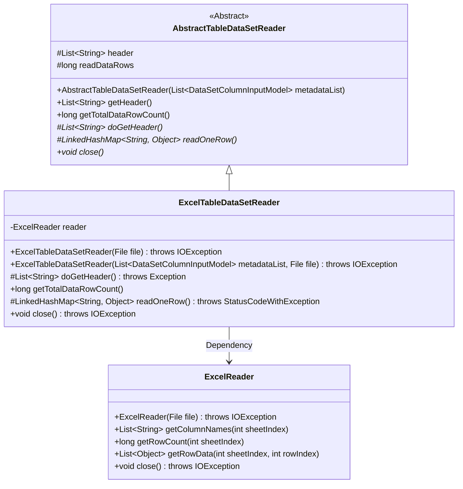
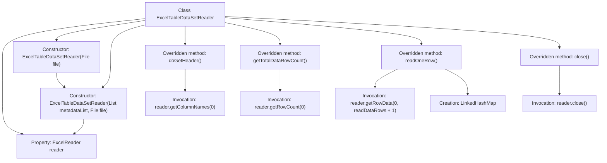

# Basic Information

|      |      |
|------|------|
| Name | ExcelTableDataSetReader |
| Language | .java |
| Code Path | WeFe/board/board-service/src/main/java/com/welab/wefe/board/service/util/ExcelTableDataSetReader.java |
| Package Name | com.welab.wefe.board.service.util |
| Dependencies | ['com.welab.wefe.board.service.dto.entity.data_set.DataSetColumnInputModel', 'com.welab.wefe.common.exception.StatusCodeWithException', 'com.welab.wefe.common.io.excel.ExcelReader', 'java.io.File', 'java.io.IOException', 'java.util.LinkedHashMap', 'java.util.List'] |
| Brief Description | The `ExcelTableDataSetReader` class inherits from `AbstractTableDataSetReader`, reads Excel file data via `ExcelReader`, provides functionalities for retrieving headers, row counts, and row-by-row data reading, and finally closes the resources. |

# Description

ExcelTableDataSetReader is a class that inherits from AbstractTableDataSetReader, designed for reading Excel spreadsheet data. It processes file input through ExcelReader, supporting data retrieval from specified files with an optional column metadata list. Key functionalities include obtaining header information, calculating row counts, reading data row by row and converting it into key-value mappings, and finally closing file resources. During reading, it automatically handles insufficient column counts by padding missing data with null values.

# Class Summary

| Name   | Type  | Description |
|-------|------|-------------|
| ExcelTableDataSetReader | class | The `ExcelTableDataSetReader` class inherits from `AbstractTableDataSetReader`, reads Excel file data via `ExcelReader`, provides functionalities for retrieving headers, total row count, and row-by-row data reading, and finally closes the resources. |

## Class ExcelTableDataSetReader

|      |      |
|------|------|
| Access Modifier | public |
| Type | class |
| Name | ExcelTableDataSetReader |
| Description | The `ExcelTableDataSetReader` class inherits from `AbstractTableDataSetReader`, reads Excel file data via `ExcelReader`, provides functionalities for retrieving headers, total row count, and row-by-row data reading, and finally closes the resources. |

### UML Class Diagram

Class Diagram Description: This diagram illustrates that ExcelTableDataSetReader inherits from the abstract class AbstractTableDataSetReader and depends on ExcelReader. AbstractTableDataSetReader defines core abstract methods for reading tabular data, which are implemented by ExcelTableDataSetReader to specifically operate on Excel files via ExcelReader. ExcelReader encapsulates low-level read/write operations for Excel files, including functionalities like retrieving column names, row counts, and row data. The overall structure demonstrates the application of the Template Method pattern.

### Internal Method Call Graph

This code represents an implementation class for Excel table data reader, inheriting from an abstract table data reader. The flowchart illustrates the class structure, constructor chaining, and the specific logic of four core overridden methods. Key operations include retrieving column names, row counts, and row data through ExcelReader, as well as using LinkedHashMap to store parsed data rows. The close method ensures resource release, with all operations centered around Excel file reading.

### Field List

| Name  | Type  | Description |
|-------|-------|------|
| reader | ExcelReader | A private immutable Excel reader instance. |

### Method List

| Name  | Type  | Description |
|-------|-------|------|
| readOneRow | LinkedHashMap<String, Object> | Method override, read a line of data and convert it into a LinkedHashMap. If the line is empty, return null; otherwise, map the line data to the table headers, padding with null for missing values. Return the key-value mapping. |
| getTotalDataRowCount | long | The method getTotalDataRowCount returns the row count of row 0 in the reader minus 1. |
| close | void | Override the close method, call reader.close() and may throw IOException. |
| doGetHeader | List<String> | Override Java method to return the list of column names in the first row of the table. |

