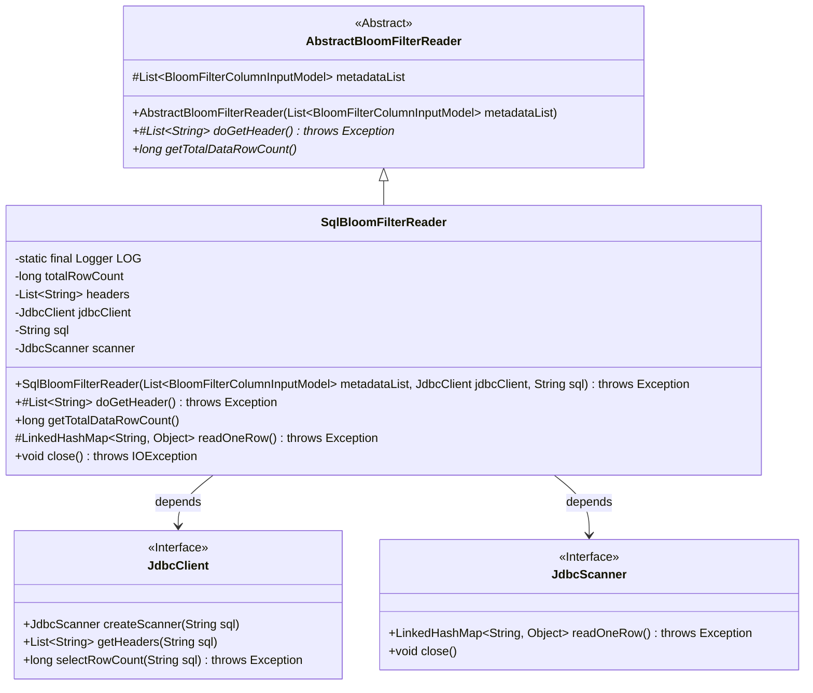
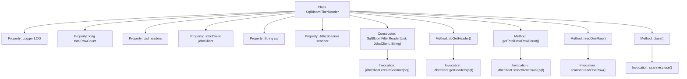

# Basic Information

|      |      |
|------|------|
| Name | SqlBloomFilterReader |
| Language | .java |
| Code Path | WeFe/board/board-service/src/main/java/com/welab/wefe/board/service/util/SqlBloomFilterReader.java |
| Package Name | com.welab.wefe.board.service.util |
| Dependencies | ['com.welab.wefe.board.service.dto.fusion.BloomFilterColumnInputModel', 'com.welab.wefe.common.jdbc.JdbcClient', 'com.welab.wefe.common.jdbc.base.JdbcScanner', 'org.apache.commons.collections4.CollectionUtils', 'org.slf4j.Logger', 'org.slf4j.LoggerFactory', 'java.io.IOException', 'java.util.LinkedHashMap', 'java.util.List'] |
| Brief Description | The SqlBloomFilterReader class extends AbstractBloomFilterReader, executes SQL queries via a JDBC client, reads data rows and table headers, and supports retrieving the total row count and closing the scanner. |

# Description

SqlBloomFilterReader is a class that inherits from AbstractBloomFilterReader, designed to read data from JDBC data sources and generate Bloom filters. It includes the following key functionalities: executing SQL queries and retrieving results via JdbcClient, caching table header information and total row count, providing methods to read single rows of data, and supporting resource release. Key member variables consist of jdbcClient, SQL query statements, scanner, headers (table headers), and totalRowCount (total row count). Core methods encompass fetching table headers, calculating total row count, reading single rows of data, and closing resources.

# Class Summary

| Name   | Type  | Description |
|-------|------|-------------|
| SqlBloomFilterReader | class | The SqlBloomFilterReader class extends AbstractBloomFilterReader, executes SQL queries via a JDBC client, reads data rows and table headers, and supports obtaining the total row count and closing the scanner. |

## Class SqlBloomFilterReader

|      |      |
|------|------|
| Access Modifier | public |
| Type | class |
| Name | SqlBloomFilterReader |
| Description | The SqlBloomFilterReader class extends AbstractBloomFilterReader, executes SQL queries via a JDBC client, reads data rows and table headers, and supports obtaining the total row count and closing the scanner. |

### UML Class Diagram

This class diagram illustrates that SqlBloomFilterReader inherits from the abstract class AbstractBloomFilterReader and implements database reading functionality. SqlBloomFilterReader executes SQL queries through the JdbcClient interface and reads data row by row using the JdbcScanner interface. Key features include retrieving header information, counting total rows, reading data sequentially, and resource cleanup. The class structure demonstrates encapsulation of JDBC operations, achieving loose coupling through interface dependencies while retaining the parent class's Bloom filter metadata processing capabilities.

### Internal Method Call Graph

This flowchart illustrates the structure and key method invocation relationships of the SqlBloomFilterReader class. Inheriting from AbstractBloomFilterReader, it contains 6 properties and 5 core methods. The constructor initializes jdbcClient and sql while creating a JdbcScanner instance. doGetHeader() retrieves table headers, getTotalDataRowCount() queries total row count, readOneRow() reads single-row data, and close() terminates the scanner. All database operations are performed through jdbcClient and scanner, demonstrating clear responsibility division and encapsulation.

### Field List

| Name  | Type  | Description |
|-------|-------|------|
| sql | String | Private immutable string variable sql |
| totalRowCount = -1 | long | Declare a private long variable totalRowCount with an initial value of -1. |
| scanner | JdbcScanner | Private JdbcScanner instance. |
| jdbcClient | JdbcClient | Declare an immutable JdbcClient instance variable. |
| LOG = LoggerFactory.getLogger(SqlBloomFilterReader.class) | Logger | Declare a protected static constant logger for logging output of the SqlBloomFilterReader class. |
| headers | List<String> | Declare a private string list variable headers. |

### Method List

| Name  | Type  | Description |
|-------|-------|------|
| readOneRow | LinkedHashMap<String, Object> | The method `readOneRow` calls `scanner.readOneRow()` to read a single row of data, returning a `LinkedHashMap<String, Object>`, and may throw an exception. |
| getTotalDataRowCount | long | This method is used to retrieve the total number of data rows. If cached, it returns the result directly; otherwise, it queries via JDBC and caches the result, throwing a runtime exception if an error occurs. |
| doGetHeader | List<String> | Override the method doGetHeader to check if headers is empty. If empty, retrieve and return headers via jdbcClient; otherwise, directly return the existing headers. |
| close | void | The method overrides close(), checks if the scanner is non-null before closing it, and may throw an IOException. |

