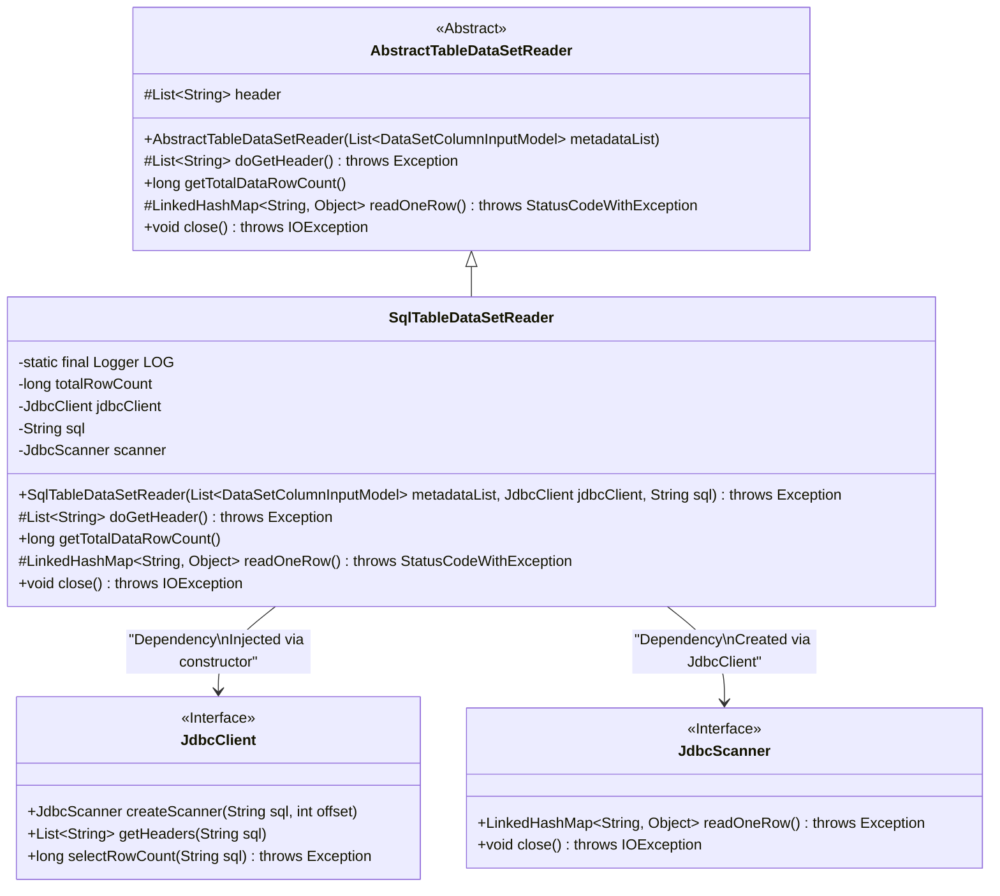
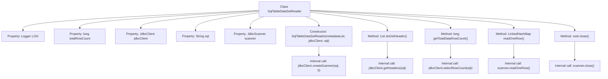

# Basic Information

|      |      |
|------|------|
| Name | SqlTableDataSetReader |
| Language | .java |
| Code Path | WeFe/board/board-service/src/main/java/com/welab/wefe/board/service/util/SqlTableDataSetReader.java |
| Package Name | com.welab.wefe.board.service.util |
| Dependencies | ['com.welab.wefe.board.service.dto.entity.data_set.DataSetColumnInputModel', 'com.welab.wefe.common.StatusCode', 'com.welab.wefe.common.exception.StatusCodeWithException', 'com.welab.wefe.common.jdbc.JdbcClient', 'com.welab.wefe.common.jdbc.base.JdbcScanner', 'org.apache.commons.collections4.CollectionUtils', 'org.slf4j.Logger', 'org.slf4j.LoggerFactory', 'java.io.IOException', 'java.util.LinkedHashMap', 'java.util.List'] |
| Brief Description | The SqlTableDataSetReader class inherits from AbstractTableDataSetReader, executes SQL queries via JdbcClient, supports fetching table headers, total row counts, and reading data row by row, and finally closes the scanner. |

# Description

SqlTableDataSetReader is a class that inherits from AbstractTableDataSetReader, designed to read data from SQL query results. It contains a JdbcClient instance and an SQL query string, executing the query via JdbcScanner and reading the results row by row. The class provides methods for retrieving table header information, total row count, and single-row data, while releasing resources upon closure. Exception handling includes catching SQL errors and throwing StatusCodeWithException.

# Class Summary

| Name   | Type  | Description |
|-------|------|-------------|
| SqlTableDataSetReader | class | The SqlTableDataSetReader class inherits from AbstractTableDataSetReader, executes SQL queries via JdbcClient, supports fetching table headers, total row counts, and reading data row by row. The scanner must be closed after use. |

## Class SqlTableDataSetReader

|      |      |
|------|------|
| Access Modifier | public |
| Type | class |
| Name | SqlTableDataSetReader |
| Description | The SqlTableDataSetReader class inherits from AbstractTableDataSetReader, executes SQL queries via JdbcClient, supports fetching table headers, total row counts, and reading data row by row. The scanner must be closed after use. |

### UML Class Diagram

This code demonstrates the implementation of an SQL table data reader `SqlTableDataSetReader`, which inherits from the abstract class `AbstractTableDataSetReader`. The class executes SQL queries through `JdbcClient` and retrieves results, using `JdbcScanner` to read data row by row. Key functionalities include fetching header information, calculating total row count, reading data row by row, and closing resources. The class diagram clearly illustrates inheritance relationships, interface implementations, and dependency injection design patterns, showcasing how flexible data reading capabilities are achieved through abstract base classes and interfaces.

### Internal Method Call Graph

This code demonstrates an SQL table data reader class that inherits from an abstract table data reader. Its primary functionalities include: executing SQL queries via JDBC client, retrieving table headers, calculating total row count, reading data row by row, and closing the scanner. The flowchart clearly presents class properties, constructor, core methods and their internal call relationships, particularly highlighting interactions with JDBC components. Exception handling logic is reflected in the readOneRow method, which throws SQL error status codes upon read failures.

### Field List

| Name  | Type  | Description |
|-------|-------|------|
| scanner | JdbcScanner | Private JdbcScanner scanner instance. |
| sql | String | Private immutable string variable sql. |
| totalRowCount = -1 | long | The private long integer variable totalRowCount has an initial value of -1. |
| jdbcClient | JdbcClient | A private immutable JDBC client instance. |
| LOG = LoggerFactory.getLogger(SqlTableDataSetReader.class) | Logger | Declare a protected static constant log object for logging in the SqlTableDataSetReader class. |

### Method List

| Name  | Type  | Description |
|-------|-------|------|
| getTotalDataRowCount | long | The method `getTotalDataRowCount` returns the total number of data rows. If cached, it directly returns the result; otherwise, it queries via `jdbcClient` and caches the result, throwing an exception if an error occurs. |
| close | void | Rewrite the close method to ensure the scanner's close method is called when it is not null, which may throw an IOException. |
| doGetHeader | List<String> | Override the method doGetHeader to check if the header is empty. If it is empty, retrieve and return it via jdbcClient. |
| readOneRow | LinkedHashMap<String, Object> | The method `readOneRow` invokes the scanner to read a row of data, throwing an SQL error status code and exception message in case of an exception. |

