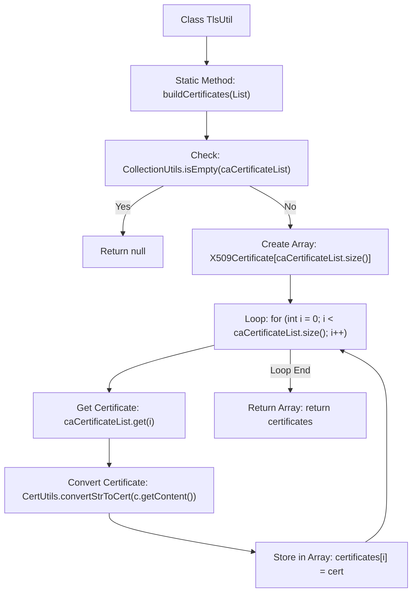

# Basic Information

|      |      |
|------|------|
| Name | TlsUtil |
| Language | .java |
| Code Path | WeFe/board/board-service/src/main/java/com/welab/wefe/board/service/util/TlsUtil.java |
| Package Name | com.welab.wefe.board.service.util |
| Dependencies | ['com.webank.cert.toolkit.utils.CertUtils', 'com.welab.wefe.board.service.cache.CaCertificateCache', 'org.apache.commons.collections4.CollectionUtils', 'java.security.cert.X509Certificate', 'java.util.List'] |
| Brief Description | The TlsUtil class provides the buildCertificates method, which converts a CaCertificate list into an X509Certificate array and returns null if the list is empty. |

# Description

The TlsUtil class contains a static method `buildCertificates`, which is used to convert a list of `CaCertificateCache.CaCertificate` into an array of `X509Certificate`. The method first checks if the input list is empty; if so, it returns null. Otherwise, it creates an `X509Certificate` array with the same size as the input list. It then iterates through each `CaCertificate` object in the list, using the `CertUtils.convertStrToCert` method to convert its content string into an `X509Certificate` object and stores it in the array. Finally, it returns the populated `X509Certificate` array.

# Class Summary

| Name   | Type  | Description |
|-------|------|-------------|
| TlsUtil | class | The TlsUtil class provides the buildCertificates method, which converts a CaCertificate list into an X509Certificate array and returns null if the list is empty. |


## Class TlsUtil

|      |      |
|------|------|
| Access Modifier | public |
| Type | class |
| Name | TlsUtil |
| Description | The TlsUtil class provides the buildCertificates method, which converts a CaCertificate list into an X509Certificate array and returns null if the list is empty. |


### UML Class Diagram

```mermaid
classDiagram
    class TlsUtil {
        +buildCertificates(List~CaCertificateCache.CaCertificate~ caCertificateList) X509Certificate[]
    }

    class CaCertificateCache {
        <<Inner>>
        class CaCertificate {
            -String content
            +String getContent()
        }
    }

    class CertUtils {
        <<Utility>>
        +convertStrToCert(String certStr) X509Certificate
    }

    TlsUtil --> CertUtils : Calls conversion method
    TlsUtil --> CaCertificateCache.CaCertificate : Reads certificate content
```

This code illustrates the process where the TlsUtil utility class converts a list of CaCertificate objects into an X509Certificate array via the buildCertificates method. It relies on CertUtils for string-to-certificate conversion and operates on the CaCertificate inner class objects within CaCertificateCache to retrieve certificate content. The class diagram clearly depicts the collaborative relationships between the utility class and helper classes, as well as the hierarchical structure of the inner class.


### Internal Method Call Graph



This flowchart illustrates the complete logical flow of the `buildCertificates` method in the `TlsUtil` class. The method first checks if the input list is empty, returning `null` if true; otherwise, it creates an `X509Certificate` array, iterates through each CA certificate string to convert it into an `X509Certificate` object and stores it in the array, finally returning the populated array. The process includes key steps such as null check, array initialization, loop processing, and type conversion.

### Field List

| Name  | Type  | Description |
|-------|-------|------|

### Method List

| Name  | Type  | Description |
|-------|-------|------|
| buildCertificates | X509Certificate[] | Convert the CA certificate list into an array of X509 certificates, returning null for an empty list. |


