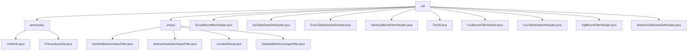

# Basic Information

|      |      |
|------|------|
| Name | util |
| Language | .java |
| Code Path | WeFe/board/board-service/src/main/java/com/welab/wefe/board/service/util |
| Package Name | docs.board.board-service.src.main.java.com.welab.wefe.board.service.util |
| Brief Description | Module 1 manages field metadata and generates primary keys, including the FieldInfo and PrimaryKeyUtils classes, with support for hash processing. Module 2 provides dataset deduplication functionality, featuring two strategies: Bloom filter and in-memory HashSet. Multiple Reader classes (Excel, CSV, SQL) inherit from an abstract class to read data, supporting header processing, row counting, and resource release. The TlsUtil class converts certificate formats. |

# Description

## Overview  
The core responsibilities of this module are divided into two main areas: data primary key management and dataset deduplication. Primary key management encapsulates field attributes through FieldInfo, with PrimaryKeyUtils providing hash/concatenation processing, similar to an ETL data pipeline. The deduplication function employs either a Bloom filter or an in-memory HashSet strategy, akin to a cache penetration protection mechanism. Unified interface specifications include FieldInfo's column parsing methods, PrimaryKeyUtils' primary key generation methods, and AbstractDataSetUniqueFilter's contains enumeration detection. Key data structures encompass FieldInfo's field attributes, Bloom filters (100 million width/0.01 false-positive rate), and in-memory HashSets. External dependencies are limited to Java's core libraries and Guava. For example, the primary key module performs SHA1 hashing on name + ID card combinations, while the deduplication module uses Bloom filters to handle massive datasets.

## Key Business Scenarios  
Typical workflows exhibit a dual-mode pattern: the primary key generation chain (configure fields → select hash algorithm) and the deduplication detection chain (input string → return In/NotIn/MaybeIn). The interaction mode is uniformly implemented as utility class method calls, such as PrimaryKeyUtils.create() or AbstractDataSetUniqueFilter.contains(). Full functionality covers a closed loop from data preprocessing (Excel/CSV/SQL reading) to core processing (primary key generation, deduplication validation), such as SqlTableDataSetReader reading data followed by Bloom filter deduplication. API integration examples include JObject column value concatenation and JDBC result set processing, supporting the extension of new strategies. Multi-source data adapters (Excel/CSV/SQL) all inherit from abstract readers, mandating the implementation of specifications like header parsing and row counting.

### Package Internal Structure View

This flowchart illustrates the hierarchical structure of the util package under the board-service module in the WeFe project. The util directory serves as the root, containing two subdirectories (primarykey and unique) along with multiple utility class files. The primarykey directory includes utility classes related to primary keys, while the unique directory contains utility classes for data deduplication. The remaining files are various data readers and utility classes.

# File List

| Name   | Type  | Description |
|-------|------|-------------|
| [ExcelBloomfilterReader.java](ExcelBloomfilterReader.md) | file | The `ExcelBloomfilterReader` class extends `AbstractBloomFilterReader` and reads data from Excel files via `ExcelReader`. It supports retrieving headers, total row counts, and reading data row by row, automatically closing after reading. |
| [SqlTableDataSetReader.java](SqlTableDataSetReader.md) | file | The SqlTableDataSetReader class inherits from AbstractTableDataSetReader, executes SQL queries via JdbcClient, supports fetching table headers, total row counts, and reading data row by row, and finally closes the scanner. |
| [ExcelTableDataSetReader.java](ExcelTableDataSetReader.md) | file | The ExcelTableDataSetReader class inherits from AbstractTableDataSetReader, reads Excel file data through ExcelReader, provides functions for retrieving headers, row counts, and row-by-row data reading, and finally closes the resources. |
| [AbstractBloomFilterReader.java](AbstractBloomFilterReader.md) | file | The abstract class `AbstractBloomFilterReader` implements the `Closeable` interface, providing functionality for reading Bloom filter data. It includes methods such as retrieving table headers, reading data rows, and counting rows, while supporting row count and time-limited reading. |
| [TlsUtil.java](TlsUtil.md) | file | The TlsUtil class provides the buildCertificates method, which converts a CaCertificate list into an X509Certificate array and returns null if the list is empty. |
| [CsvBloomFilterReader.java](CsvBloomFilterReader.md) | file | The `CsvBloomFilterReader` class extends `AbstractBloomFilterReader` and is used to read CSV files and process data rows. It supports headless mode, skips empty lines, counts the total number of rows, reads data row by row into a `LinkedHashMap`, and finally closes the parser. |
| [CsvTableDataSetReader.java](CsvTableDataSetReader.md) | file | The CsvTableDataSetReader class inherits from AbstractTableDataSetReader and is used to read data from CSV files. It includes functionalities for retrieving headers, calculating total row count, reading data row by row, and closing the parser. It supports custom metadata and UTF-8 encoding. |
| [SqlBloomFilterReader.java](SqlBloomFilterReader.md) | file | The SqlBloomFilterReader class inherits from AbstractBloomFilterReader, executes SQL queries via a JDBC client, reads data rows and table headers, and supports retrieving the total row count and closing the scanner. |
| [AbstractTableDataSetReader.java](AbstractTableDataSetReader.md) | file | The abstract class `AbstractTableDataSetReader` implements the `Closeable` interface, providing functionality for reading tabular datasets. It includes methods such as retrieving headers, reading data rows, and validating data types, while supporting row count limits and time-limited reads. |
| [unique](unique/_module.md) | package | The DataSetBloomUniqueFilter efficiently deduplicates based on a Bloom filter and inherits from AbstractDataSetUniqueFilter, with a default false positive rate of 0.01. AbstractDataSetUniqueFilter is an abstract class that defines the contains method to check element existence. The ContainResult enum represents the existence state. The DataSetMemoryUniqueFilter inherits from AbstractDataSetUniqueFilter and uses a HashSet to quickly determine element uniqueness. |
| [primarykey](primarykey/_module.md) | package | The FieldInfo class manages field information, including attributes such as column names, options, indexes, and corresponding methods. The PrimaryKeyUtils class provides primary key generation functionality, supporting three processing methods: MD5, SHA1, and NONE, which process data and concatenate results based on configuration. |

