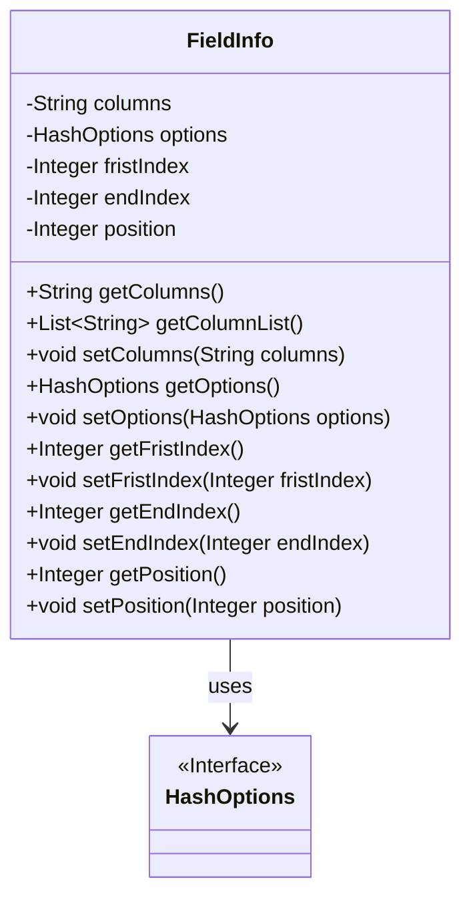

# Basic Information

|      |      |
|------|------|
| Name | FieldInfo |
| Language | .java |
| Code Path | WeFe/board/board-service/src/main/java/com/welab/wefe/board/service/util/primarykey/FieldInfo.java |
| Package Name | com.welab.wefe.board.service.util.primarykey |
| Dependencies | ['com.welab.wefe.common.wefe.enums.HashOptions', 'java.util.Arrays', 'java.util.List'] |
| Brief Description | The FieldInfo class includes fields such as columns, options, firstIndex, endIndex, and position, providing get/set methods and a getColumnList method to split columns into a list. |

# Description

The `FieldInfo` class is a Java class containing field information, with private attributes `columns`, `options`, `firstIndex`, `endIndex`, and `position`. It provides corresponding getter and setter methods, where the `getColumnList` method splits `columns` by commas into a string list. This class is used to manage column names, hash options, start index, end index, and position information of fields.

# Class Summary

| Name   | Type  | Description |
|-------|------|-------------|
| FieldInfo | class | The FieldInfo class contains fields columns, options, firstIndex, endIndex, and position, providing get/set methods and the getColumnList method to split columns into a list. |

## Class FieldInfo

|      |      |
|------|------|
| Access Modifier | public |
| Type | class |
| Name | FieldInfo |
| Description | The FieldInfo class contains fields columns, options, firstIndex, endIndex, and position, providing get/set methods and the getColumnList method to split columns into a list. |

### UML Class Diagram

This code defines a FieldInfo class for storing field information, including attributes such as column names, hash options, start index, end index, and position. The class provides getter and setter methods for these attributes, as well as a method to convert column name strings into a list. The FieldInfo class depends on the HashOptions interface, which likely defines hash processing-related options. The overall design embodies the principles of data encapsulation and basic operation encapsulation.

### Internal Method Call Graph

```mermaid
graph TD
    A["Class FieldInfo"]
    B["Property: String columns"]
    C["Property: HashOptions options"]
    D["Property: Integer fristIndex"]
    E["Property: Integer endIndex"]
    F["Property: Integer position"]
    G["Method: String getColumns()"]
    H["Method: List<String> getColumnList()"]
    I["Method: void setColumns(String columns)"]
    J["Method: HashOptions getOptions()"]
    K["Method: void setOptions(HashOptions options)"]
    L["Method: Integer getFristIndex()"]
    M["Method: void setFristIndex(Integer fristIndex)"]
    N["Method: Integer getEndIndex()"]
    O["Method: void setEndIndex(Integer endIndex)"]
    P["Method: Integer getPosition()"]
    Q["Method: void setPosition(Integer position)"]

    A --> B
    A --> C
    A --> D
    A --> E
    A --> F
    A --> G
    A --> H
    A --> I
    A --> J
    A --> K
    A --> L
    A --> M
    A --> N
    A --> O
    A --> P
    A --> Q
```

This code defines a class named FieldInfo containing 5 private properties and corresponding getter/setter methods. The columns property stores a string, with the getColumnList() method splitting it into a list by commas; the options property is of HashOptions type; fristIndex, endIndex and position are integer wrapper classes. All methods are standard accessors for property read-write control, reflecting the Java Bean design pattern.

### Field List

| Name  | Type  | Description |
|-------|-------|------|
| options | HashOptions | Private hash configuration items. |
| endIndex | Integer | Private integer variable indicating the end index. |
| columns | String | Private string variable columns. |
| position | Integer | Private integer variable position. |
| fristIndex | Integer | Declare a private integer variable firstIndex. |

### Method List

| Name  | Type  | Description |
|-------|-------|------|
| getOptions | HashOptions | The method getOptions returns the HashOptions object options. |
| getColumnList | List<String> | This method splits the string `columns` by commas and returns it as a list. |
| getColumns | String | This is a Java method that returns a string variable named columns. |
| setColumns | void | The method `setColumns` is used to set the value of the `columns` property of type string. |
| getEndIndex | Integer | Get the integer value of the end index. |
| getFristIndex | Integer | Public method to obtain the fristIndex value, returns an Integer type. |
| setFristIndex | void | This is a Java method used to set the value of the class's `fristIndex` property. The method takes an Integer parameter and assigns it to the class's member variable `fristIndex`. |
| setEndIndex | void | The method to set the end index assigns the input parameter to the `endIndex` property of the class. |
| setOptions | void | The method to set hash options, assigning the input parameters to the options property of the current object. |
| getPosition | Integer | Methods to obtain position values, returning an integer-type position variable. |
| setPosition | void | Set the position property of the object, with the parameter being an integer value. |

