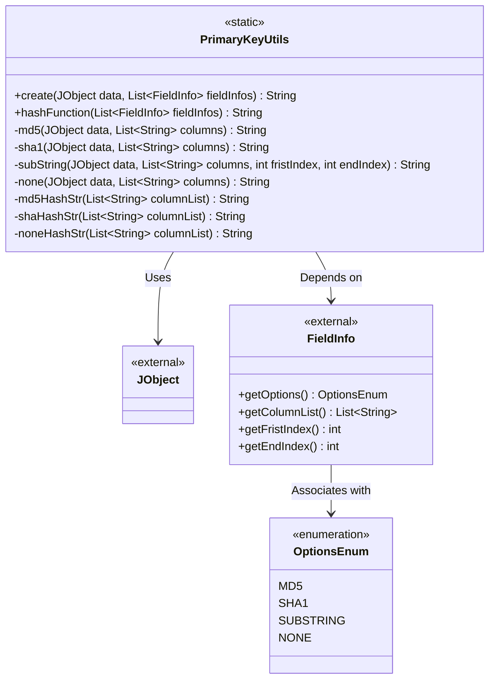
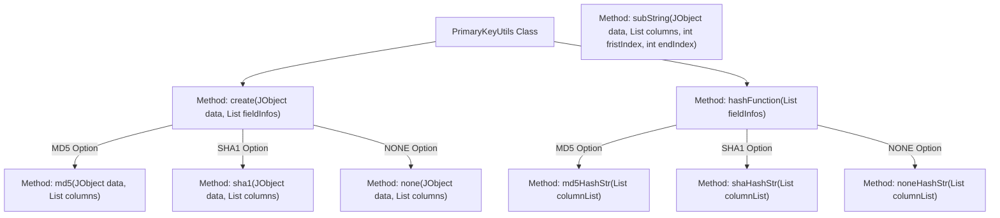
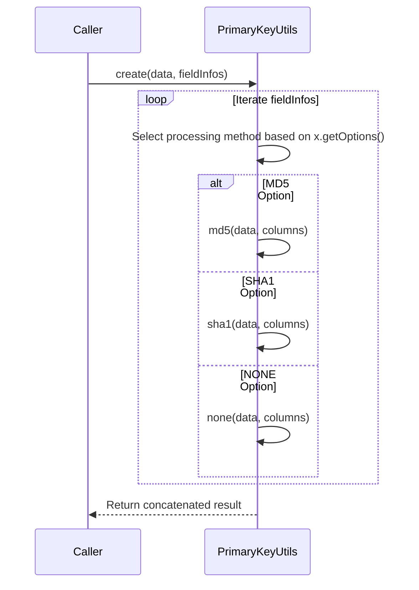

# Basic Information

|      |      |
|------|------|
| Name | PrimaryKeyUtils |
| Language | .java |
| Code Path | WeFe/board/board-service/src/main/java/com/welab/wefe/board/service/util/primarykey/PrimaryKeyUtils.java |
| Package Name | com.welab.wefe.board.service.util.primarykey |
| Dependencies | ['com.welab.wefe.common.util.JObject', 'com.welab.wefe.common.util.Md5', 'com.welab.wefe.common.util.Sha1', 'com.welab.wefe.common.wefe.enums.HashOptions', 'java.util.ArrayList', 'java.util.List'] |
| Brief Description | The PrimaryKeyUtils class provides primary key generation functionality, supporting processing methods such as MD5, SHA1, and NONE. It generates primary keys by concatenating or encrypting data according to field rules. |

# Description

The `PrimaryKeyUtils` class provides primary key generation functionality, supporting three processing methods: MD5, SHA1, and NONE. The `create` method processes specified columns in `JObject` data according to `FieldInfo` configuration and concatenates the results. The MD5 and SHA1 methods perform hash calculations on concatenated column values, while the NONE method directly concatenates the column values. The `hashFunction` method generates a descriptive string for field processing rules, formatted as the hash type plus a list of column names. The class includes private methods to implement specific processing logic, such as string concatenation and hash computation.

# Class Summary

| Name   | Type  | Description |
|-------|------|-------------|
| PrimaryKeyUtils | class | The PrimaryKeyUtils class provides primary key generation functionality, supporting processing methods such as MD5, SHA1, and NONE. It concatenates or encrypts data based on field rules to generate primary keys. |

## Class PrimaryKeyUtils

|      |      |
|------|------|
| Access Modifier | public |
| Type | class |
| Name | PrimaryKeyUtils |
| Description | The PrimaryKeyUtils class provides primary key generation functionality, supporting processing methods such as MD5, SHA1, and NONE. It concatenates or encrypts data based on field rules to generate primary keys. |

### UML Class Diagram

Class diagram description:
PrimaryKeyUtils is a utility class providing static methods for generating primary keys and hash strings. It depends on JObject as the data source and uses the FieldInfo class to obtain field configuration information. FieldInfo defines processing options through the OptionsEnum enumeration. The class contains various private encryption processing methods (MD5/SHA1) and string handling logic. Public methods create() and hashFunction() implement primary key generation and hash string construction respectively. All methods are static and do not maintain instance states.

### Internal Method Call Graph

This code implements a primary key generation utility class that provides multiple key generation strategies (MD5, SHA1, NONE, etc.). The flowchart illustrates the class structure and method invocation relationships, while the sequence diagram depicts the execution flow of the create method. The code processes each field by selecting the corresponding encryption or handling method based on configuration options in the field information list, ultimately concatenating the results to generate the primary key string. The hashFunction method generates descriptive hash function strings.

### Field List

| Name  | Type  | Description |
|-------|-------|------|

### Method List

| Name  | Type  | Description |
|-------|-------|------|
| md5 | String | This method takes a JSON object and a list of column names, concatenates the values of the specified columns, and returns an MD5 hash of the result. |
| hashFunction | String | The static method `hashFunction` performs MD5, SHA1, or no hashing on the column list based on field options, concatenates the results, and returns the string with the trailing plus sign removed. |
| md5HashStr | String | This method concatenates a list of strings into a plus-sign-separated string and adds an MD5 prefix. For example, input [A, B] returns MD5(A+B). |
| shaHashStr | String | This method concatenates the list of strings with plus signs and prefixes the result with "SHA()". |
| create | String | Static methods process data based on field options: MD5 encryption, SHA1 hashing, or no processing (NONE), then concatenate the results and return a string. |
| none | String | The static method `none` takes a JObject and a list of strings, iterates through the list to concatenate the values corresponding to the keys in the JObject, and returns the concatenated string. |
| sha1 | String | This method generates a string by concatenating the values of specified columns in a JObject and returns its SHA1 hash value. The input consists of a JObject and a list of column names, and the output is the hash string. |
| noneHashStr | String | The static method `noneHashStr` takes a list of strings, concatenates all elements with "+", and returns the resulting string. |
| subString | String | This method extracts specified column data from a JObject, concatenates it into a string, and returns a substring within the specified index range. |

