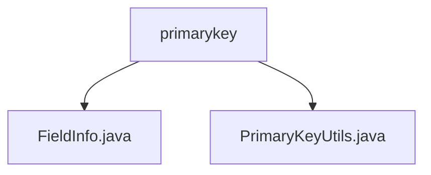

# Basic Information

|      |      |
|------|------|
| Name | primarykey |
| Language | .java |
| Code Path | WeFe/board/board-service/src/main/java/com/welab/wefe/board/service/util/primarykey |
| Package Name | docs.board.board-service.src.main.java.com.welab.wefe.board.service.util.primarykey |
| Brief Description | The FieldInfo class manages field information, including attributes such as column names, options, indexes, and corresponding methods. The PrimaryKeyUtils class provides primary key generation functionality, supporting three processing methods: MD5, SHA1, and NONE, which process data and concatenate results based on configuration. |

# Description

## Overview  
The core responsibility of this module is to manage field metadata and generate primary keys. It encapsulates field attributes through the FieldInfo class and provides hashing and concatenation capabilities via the PrimaryKeyUtils class. The interface specifications include the column name splitting method (getColumnList) of FieldInfo and the primary key generation methods (create/hashFunction) of PrimaryKeyUtils. The key data structure is FieldInfo, which contains field attributes such as columns and options. External dependencies are limited to the Java standard library. For example, FieldInfo parses "name,age" into a list, while PrimaryKeyUtils performs MD5 hashing on the values of two columns.  

## Primary Business Scenarios  
The typical workflow involves configuring FieldInfo to define the field scope (e.g., fristIndex-endIndex) and selecting a hashing method (MD5/SHA1/NONE) through PrimaryKeyUtils to generate the primary key. The interaction model resembles an ETL data pipeline, where fields are first extracted and then transformed. The complete functionality covers a closed loop from field management to primary key generation, such as performing SHA1 hashing on the name and ID card columns of a user table. The API type includes utility class methods, and integration examples can be seen in the concatenation and hashing of column values in JObject data.

### Package Internal Structure View

This flowchart illustrates the file structure of the primarykey utility class in the board-service module of the WeFe project. The primarykey directory contains two Java files: FieldInfo.java and PrimaryKeyUtils.java, which together implement the primary key utility class. FieldInfo.java is likely used for storing field information, while PrimaryKeyUtils.java provides utility methods related to primary keys.

# File List

| Name   | Type  | Description |
|-------|------|-------------|
| [FieldInfo.java](FieldInfo.md) | file | The FieldInfo class includes fields columns, options, firstIndex, endIndex, and position, providing get/set methods and the getColumnList method to split columns into a list. |
| [PrimaryKeyUtils.java](PrimaryKeyUtils.md) | file | The PrimaryKeyUtils class provides primary key generation functionality, supporting processing methods such as MD5, SHA1, and NONE, which concatenate or encrypt data according to field rules to generate primary keys. |

