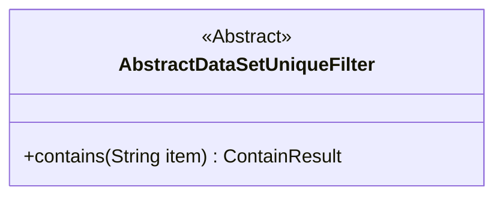
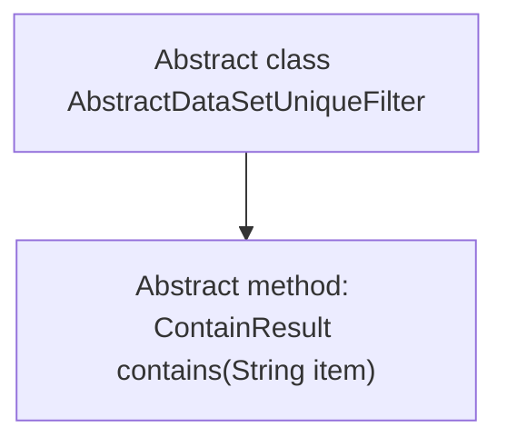

# Basic Information

|      |      |
|------|------|
| Name | AbstractDataSetUniqueFilter |
| Language | .java |
| Code Path | WeFe/board/board-service/src/main/java/com/welab/wefe/board/service/util/unique/AbstractDataSetUniqueFilter.java |
| Package Name | com.welab.wefe.board.service.util.unique |
| Dependencies | [] |
| Brief Description | The abstract class `AbstractDataSetUniqueFilter` defines an abstract method `contains` to determine whether an element exists, with a parameter `item` of type string, returning a result of type `ContainResult`. |

# Description

This is an abstract class named AbstractDataSetUniqueFilter, which defines an abstract method for determining the existence of an element. The class includes an abstract method called contains, which takes a string parameter item and returns a result of type ContainResult. This method is used to determine whether the filter contains the specified element. The overall class structure is concise, focusing on the core functionality of element existence checking.

# Class Summary

| Name   | Type  | Description |
|-------|------|-------------|
| AbstractDataSetUniqueFilter | class | The abstract class AbstractDataSetUniqueFilter defines an abstract method called contains, which is used to determine whether a specified element is included. |

## Class AbstractDataSetUniqueFilter

|      |      |
|------|------|
| Access Modifier | public abstract |
| Type | class |
| Name | AbstractDataSetUniqueFilter |
| Description | The abstract class AbstractDataSetUniqueFilter defines an abstract method called contains, which is used to determine whether a specified element is included. |

### UML Class Diagram

This class diagram describes an abstract class named AbstractDataSetUniqueFilter, which defines an abstract method `contains` used to determine whether the filter includes a specified element. The method takes a parameter `item` of type String and returns a result of type ContainResult. The class is marked as abstract (`<<Abstract>>`), indicating it cannot be directly instantiated and requires subclasses to implement the specific logic of the `contains` method. This design provides a foundational framework for dataset uniqueness filtering, allowing different implementations to handle element existence checks.

### Internal Method Call Graph

This code defines an abstract class named AbstractDataSetUniqueFilter, which contains an abstract method contains(String item) to determine whether the filter includes the specified element. Serving as a base class, it requires subclasses to implement specific filtering logic. The flowchart clearly illustrates the hierarchical relationship between the class and its method, with the abstract class pointing to its sole abstract method, embodying the core principle of "defining specifications while deferring implementation" in object-oriented design.

### Field List

| Name  | Type  | Description |
|-------|-------|------|

### Method List

| Name  | Type  | Description |
|-------|-------|------|
| contains | ContainResult | Abstract method to check if it contains the specified item, returning a result of type ContainResult. |

