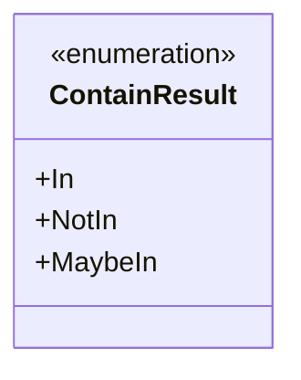
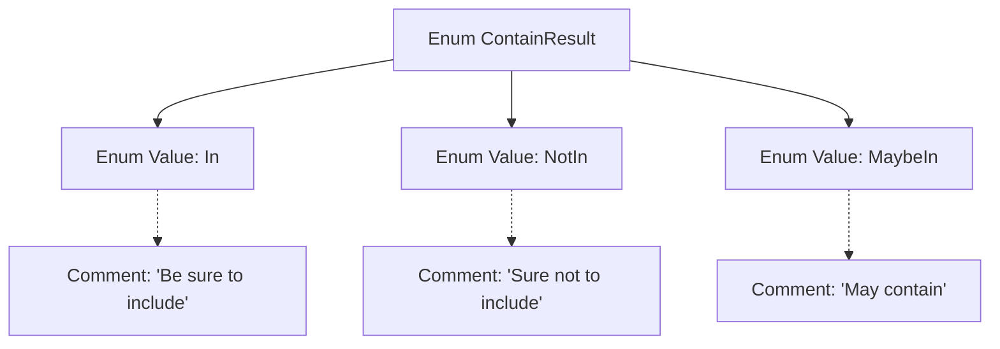

# Basic Information

|      |      |
|------|------|
| Name | ContainResult |
| Language | .java |
| Code Path | WeFe/board/board-service/src/main/java/com/welab/wefe/board/service/util/unique/ContainResult.java |
| Package Name | com.welab.wefe.board.service.util.unique |
| Dependencies | [] |
| Brief Description | The enumeration ContainResult defines three states: In indicates inclusion, NotIn indicates exclusion, and MaybeIn indicates possible inclusion. |

# Description

The content defines an enumeration type named ContainResult, which includes three enumeration values: In indicates definite inclusion, NotIn indicates definite exclusion, and MaybeIn indicates possible inclusion. Each enumeration value is accompanied by a comment explaining its meaning.

# Class Summary

| Name   | Type  | Description |
|-------|------|-------------|
| ContainResult | enum | The enumeration ContainResult defines three states: In indicates definite inclusion, NotIn indicates definite exclusion, and MaybeIn indicates possible inclusion. |

## Class ContainResult

|      |      |
|------|------|
| Access Modifier | public |
| Type | enum |
| Name | ContainResult |
| Description | The enumeration ContainResult defines three states: In indicates definite inclusion, NotIn indicates definite exclusion, and MaybeIn indicates possible inclusion. |

### UML Class Diagram

This enumeration class defines three possible states: In indicates definite inclusion, NotIn indicates definite exclusion, and MaybeIn indicates possible inclusion. It is a classic three-state enumeration design pattern, commonly used in scenarios requiring clear differentiation between deterministic and non-deterministic outcomes. The Javadoc annotations for the enumeration values explicitly specify the concrete meaning of each state, enhancing code readability and self-documentation.

### Internal Method Call Graph

This flowchart illustrates the structure of the ContainResult enum, which includes three enum values (In, NotIn, MaybeIn) along with their corresponding comments. In indicates definite inclusion, NotIn indicates definite exclusion, and MaybeIn indicates potential inclusion. Each enum value is connected via a dashed line to its respective comment text, clearly conveying the semantic meaning of each enum value. The overall structure is concise and straightforward, facilitating an understanding of the enum's design intent and usage scenarios.

### Field List

| Name  | Type  | Description |
|-------|-------|------|

### Method List

| Name  | Type  | Description |
|-------|-------|------|

