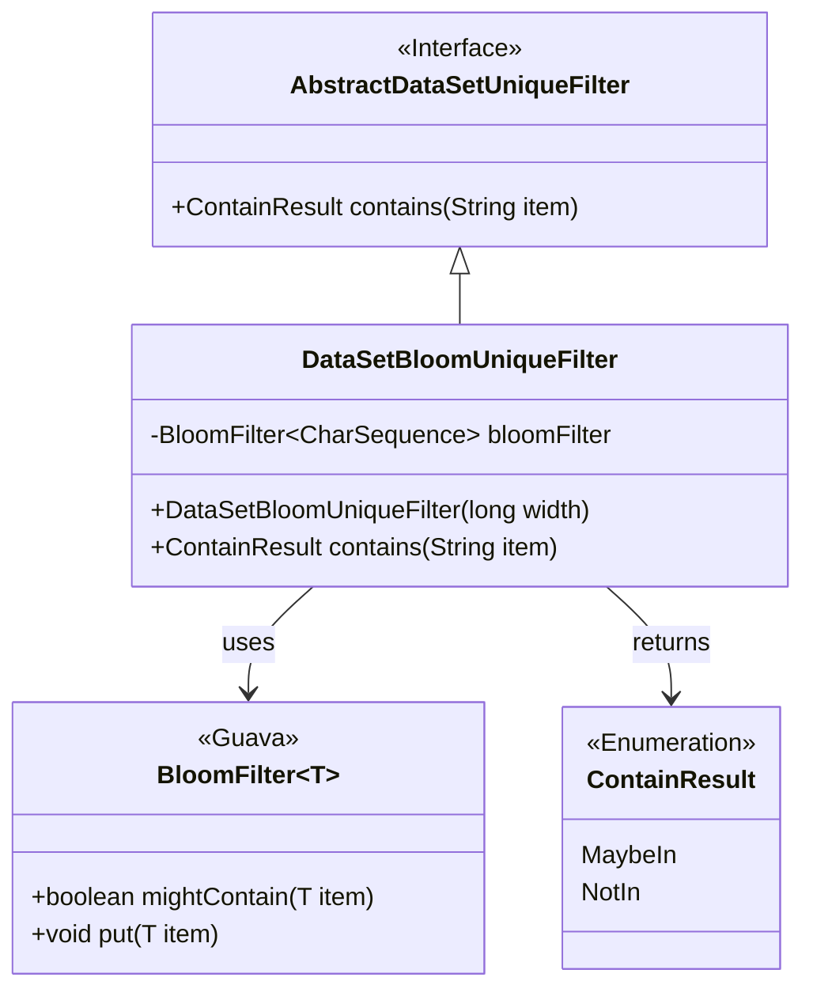
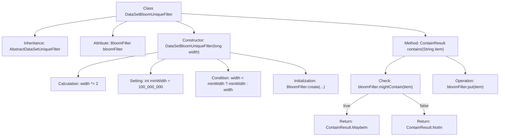

# Basic Information

|      |      |
|------|------|
| Name | DataSetBloomUniqueFilter |
| Language | .java |
| Code Path | WeFe/board/board-service/src/main/java/com/welab/wefe/board/service/util/unique/DataSetBloomUniqueFilter.java |
| Package Name | com.welab.wefe.board.service.util.unique |
| Dependencies | ['com.google.common.base.Charsets', 'com.google.common.hash.BloomFilter', 'com.google.common.hash.Funnels'] |
| Brief Description | The `DataSetBloomUniqueFilter` class uses a Bloom filter to determine whether a string exists. The constructor sets the initial capacity and creates the filter. The `contains` method checks and adds elements, returning results indicating possible existence or non-existence. |

# Description

DataSetBloomUniqueFilter is a dataset deduplication filter class based on Bloom Filter, inherited from AbstractDataSetUniqueFilter. It utilizes a Bloom Filter to efficiently determine whether a string may be duplicated. The constructor accepts an initial width parameter, which will automatically be doubled with a minimum width set to 100 million. The Bloom Filter employs a UTF-8 string funnel with a default false-positive probability of 0.01. The contains method checks whether a string may exist—returning MaybeIn if potentially present, otherwise NotIn—while always adding the string to the filter.

# Class Summary

| Name   | Type  | Description |
|-------|------|-------------|
| DataSetBloomUniqueFilter | class | The `DataSetBloomUniqueFilter` class uses a Bloom filter to check string uniqueness, with a minimum width of 100 million when insufficient and a false positive rate of 1%. The `contains` method returns either `MaybeIn` or `NotIn`. |

## Class DataSetBloomUniqueFilter

|      |      |
|------|------|
| Access Modifier | public |
| Type | class |
| Name | DataSetBloomUniqueFilter |
| Description | The `DataSetBloomUniqueFilter` class uses a Bloom filter to check string uniqueness, with a minimum width of 100 million when insufficient and a false positive rate of 1%. The `contains` method returns either `MaybeIn` or `NotIn`. |

### UML Class Diagram

This code implements a Bloom filter-based deduplication filter for datasets. DataSetBloomUniqueFilter inherits from the abstract class AbstractDataSetUniqueFilter and internally utilizes Guava's BloomFilter for efficient element existence checking. The constructor dynamically adjusts the Bloom filter capacity based on the input width, with a minimum guaranteed capacity of 100 million. The contains() method implements deduplication logic through mightContain() and put() operations, returning an enumeration result indicating whether an element may exist or definitely does not exist. The Bloom filter uses a UTF-8 string funnel to handle character sequences, with a default false positive rate of 1%.

### Internal Method Call Graph

This flowchart illustrates the structure and main logic flow of the DataSetBloomUniqueFilter class. The class inherits from AbstractDataSetUniqueFilter, contains a BloomFilter attribute, and has two primary methods: a constructor for initializing the Bloom filter with adjusted parameters, and a contains method for checking element existence while updating the filter. The constructor adjusts the width parameter with a minimum value guarantee before creating the Bloom filter instance. The contains method first checks for possible element presence, adds the element, then returns different enum values based on the check result.

### Field List

| Name  | Type  | Description |
|-------|-------|------|
| bloomFilter | BloomFilter<CharSequence> | A private immutable Bloom filter with a generic type of character sequence. |

### Method List

| Name  | Type  | Description |
|-------|-------|------|
| contains | ContainResult | The method checks whether a Bloom filter might contain a certain element. If possible, it returns `MaybeIn`; otherwise, it returns `NotIn` and adds the element. |

