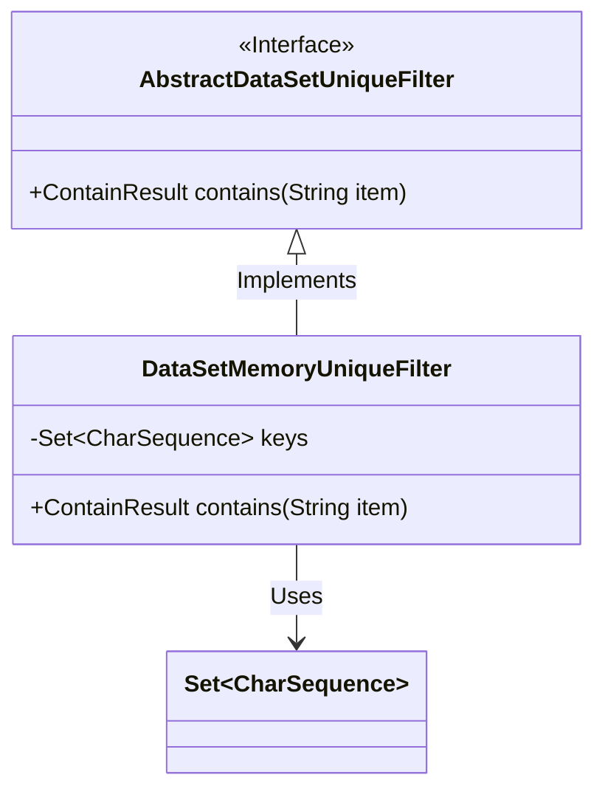
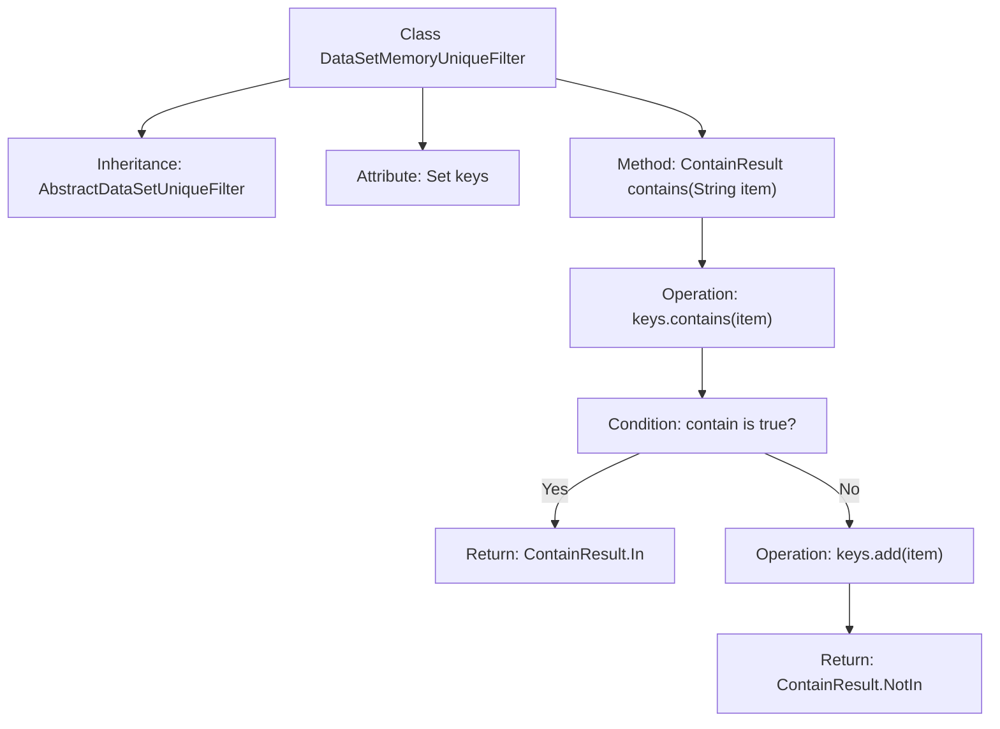

# Basic Information

|      |      |
|------|------|
| Name | DataSetMemoryUniqueFilter |
| Language | .java |
| Code Path | WeFe/board/board-service/src/main/java/com/welab/wefe/board/service/util/unique/DataSetMemoryUniqueFilter.java |
| Package Name | com.welab.wefe.board.service.util.unique |
| Dependencies | ['java.util.HashSet', 'java.util.Set'] |
| Brief Description | Dataset in-memory deduplication filter, using a HashSet to store key values, checks if a string exists. If not, adds it and returns NotIn; if exists, returns In. |

# Description

DataSetMemoryUniqueFilter is a class that inherits from AbstractDataSetUniqueFilter, designed to implement memory-based uniqueness filtering functionality. It internally uses a HashSet to store character sequence keys and checks whether an input string already exists in the set via the contains method. If the string exists, it returns the ContainResult.In enum value; otherwise, it adds the string to the set and returns ContainResult.NotIn. This implementation rapidly determines element uniqueness through in-memory data structures.

# Class Summary

| Name   | Type  | Description |
|-------|------|-------------|
| DataSetMemoryUniqueFilter | class | Dataset in-memory unique filter, which checks if a string already exists via HashSet, adds and returns NotIn if it does not exist, or returns In if it exists. |

## Class DataSetMemoryUniqueFilter

|      |      |
|------|------|
| Access Modifier | public |
| Type | class |
| Name | DataSetMemoryUniqueFilter |
| Description | Dataset in-memory unique filter, which checks if a string already exists via HashSet, adds and returns NotIn if it does not exist, or returns In if it exists. |

### UML Class Diagram

Class Diagram Description:
This diagram illustrates the class structure of an in-memory uniqueness filter. DataSetMemoryUniqueFilter implements the AbstractDataSetUniqueFilter interface to check whether a string already exists in a HashSet. If the string exists, it returns ContainResult.In; otherwise, it adds the string to the set and returns ContainResult.NotIn. The diagram clearly shows the relationship between the interface and its implementing class, as well as the class's dependency on the Set collection, demonstrating the implementation mechanism of memory-based deduplication functionality.

### Internal Method Call Graph

This flowchart describes the structure of the DataSetMemoryUniqueFilter class and the logical flow of its contains method. The class inherits from AbstractDataSetUniqueFilter, with its core functionality being deduplication implemented via a HashSet. The contains method first checks if an element exists in the set; if it does, it returns an In status, otherwise it adds the element and returns a NotIn status. The entire process demonstrates a typical implementation of memory-level data deduplication, ensuring efficient querying and uniqueness through a hash set.

### Field List

| Name  | Type  | Description |
|-------|-------|------|
| keys = new HashSet<>() | Set<CharSequence> | Declare an immutable HashSet collection for storing keys of type CharSequence. |

### Method List

| Name  | Type  | Description |
|-------|-------|------|
| contains | ContainResult | Check if the string exists in the set. Return "In" if it exists; otherwise, add it and return "NotIn". |

