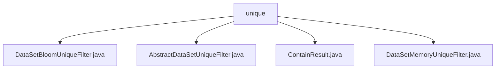

# Basic Information

|      |      |
|------|------|
| Name | unique |
| Language | .java |
| Code Path | WeFe/board/board-service/src/main/java/com/welab/wefe/board/service/util/unique |
| Package Name | docs.board.board-service.src.main.java.com.welab.wefe.board.service.util.unique |
| Brief Description | The DataSetBloomUniqueFilter efficiently deduplicates based on a Bloom filter and inherits from AbstractDataSetUniqueFilter, with a default false positive rate of 0.01. AbstractDataSetUniqueFilter is an abstract class that defines the contains method to check element existence. The ContainResult enum represents the existence state. The DataSetMemoryUniqueFilter inherits from AbstractDataSetUniqueFilter and uses a HashSet to quickly determine element uniqueness. |

# Description

## Overview  
This module provides dataset deduplication functionality, with its core responsibility being to efficiently determine string uniqueness through different strategies (Bloom filter or in-memory HashSet). The interface specification is unified as the `contains` method defined by `AbstractDataSetUniqueFilter`, which returns the `ContainResult` enum (`In`/`NotIn`/`MaybeIn`). Key data structures include the Bloom filter (initial width of 100 million, false positive rate of 0.01) and the in-memory HashSet. External dependencies are limited to Guava's Bloom filter implementation. For example, `DataSetBloomUniqueFilter` is suitable for deduplication of massive datasets, while `DataSetMemoryUniqueFilter` is designed for exact matching scenarios.  

## Primary Business Scenarios  
The module supports two deduplication modes: probabilistic (similar to cache penetration protection) and exact (similar to database primary key validation). A typical workflow involves: input strings being checked by the `contains` method, which returns an enum result and automatically updates storage. For instance, the Bloom filter may return `MaybeIn` to balance performance and accuracy, while the in-memory filter directly returns definitive results. During integration, new strategies can be extended via the abstract class, with `ContainResult` uniformly serving as the interaction contract.

### Package Internal Structure View

This flowchart illustrates the class structure relationships within the unique utility package under the board-service module of the WeFe project. The root node is the unique directory, which contains four Java class files: DataSetBloomUniqueFilter, AbstractDataSetUniqueFilter, ContainResult, and DataSetMemoryUniqueFilter. These classes are implementations of utility classes related to data deduplication functionality.

# File List

| Name   | Type  | Description |
|-------|------|-------------|
| [DataSetBloomUniqueFilter.java](DataSetBloomUniqueFilter.md) | file | The `DataSetBloomUniqueFilter` class utilizes a Bloom filter to determine the existence of a string. The constructor sets the initial capacity and creates the filter. The `contains` method checks and adds elements, returning results indicating possible existence or non-existence. |
| [AbstractDataSetUniqueFilter.java](AbstractDataSetUniqueFilter.md) | file | The abstract class AbstractDataSetUniqueFilter defines an abstract method called contains to determine whether an element exists, with a parameter of type string item and a return type of ContainResult. |
| [ContainResult.java](ContainResult.md) | file | The enumeration ContainResult defines three states: In indicates inclusion, NotIn indicates exclusion, and MaybeIn indicates possible inclusion. |
| [DataSetMemoryUniqueFilter.java](DataSetMemoryUniqueFilter.md) | file | Dataset in-memory deduplication filter, using HashSet to store key values, checks if a string exists, adds and returns NotIn if it does not exist, otherwise returns In. |

