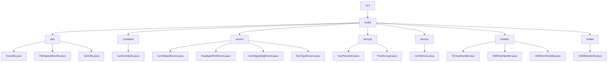

# Basic Information

|      |      |
|------|------|
| Name | cert |
| Language | .java |
| Code Path | WeFe/common/java/common-cert/src/main/java/com/webank/cert |
| Package Name | docs.common.java.common-cert.src.main.java.com.webank.cert |
| Brief Description | Cryptography toolkit, including key management, certificate operations, and file handling. Supports RSA/ECDSA/SM2 algorithms, PFX/JKS parsing, and relies on BouncyCastle. Suitable for full-cycle PKI management, such as key generation, certificate issuance, and storage. Includes static utility classes like KeyUtils and CertUtils. |

# Description

## Overview  
This module is a cryptographic security toolkit, with core responsibilities including key pair management, certificate lifecycle operations, and basic file handling, akin to a lightweight PKI system implementation. The interface specifications cover key generation (supporting RSA/ECDSA/SM2 algorithms), certificate parsing (PFX/JKS formats), format conversion (PEM/PKCS#8), and X.500 attribute encapsulation. Key data structures include SM2 elliptic curve parameters, PKCS8 private key format, CryptoKeyPair objects, and X.500 name models. External dependencies primarily include the BouncyCastle security library and Lombok utility. For example, KeyUtils implements SM2 key generation, CertService handles root certificate issuance, and X500NameInfo encapsulates DN attributes.

## Core Business Scenarios  
The module is suitable for end-to-end digital certificate management, with typical scenarios including: 1) Key pair generation → certificate issuance → storage (e.g., SSL certificate deployment); 2) Certificate status tracking (WAIT_VERIFY → VALID); 3) CRL revocation list management. Interaction patterns employ static factory methods (e.g., ECKeyHandler.generateECKeyPair()) and the builder pattern (e.g., X509CertHandler chained calls). A typical application in the national cryptographic scenario involves: SM2 key generation → SM3WITHSM2 signing → PEM-formatted storage. API types encompass cryptographic operations (ECDSA verification), enum queries (KeyAlgorithmEnums), and IO operations (atomic file writing).

### Package Internal Structure View

This flowchart illustrates the Java code structure of the common-cert module in the WeFe project. The root node is "cert", which contains the "toolkit" directory. The toolkit is further divided into submodules such as utils, constants, enums, encrypt, service, handler, and model. Each submodule contains corresponding Java files, for example, utils includes utility classes like KeyUtils.java, while enums includes enumeration classes like CertStatusEnums.java. The overall structure is clear, reflecting a modular design philosophy.

# File List

| Name   | Type  | Description |
|-------|------|-------------|
| [toolkit](toolkit/_module.md) | package | Cryptography toolkit, including key management, certificate operations, and file processing. Supports RSA/ECDSA/SM2 algorithms, PFX/JKS parsing, and relies on BouncyCastle. Suitable for full-cycle PKI management, such as key generation, certificate issuance, and storage. Includes static utility classes like KeyUtils and CertUtils. |

