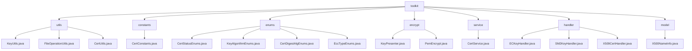

# Basic Information

|      |      |
|------|------|
| Name | toolkit |
| Language | .java |
| Code Path | WeFe/common/java/common-cert/src/main/java/com/webank/cert/toolkit |
| Package Name | docs.common.java.common-cert.src.main.java.com.webank.cert.toolkit |
| Brief Description | Cryptography toolkit, including key management, certificate operations, and file processing. Supports RSA/ECDSA/SM2 algorithms, PFX/JKS parsing, and relies on BouncyCastle. Suitable for full-cycle PKI management, such as key generation, certificate issuance, and storage. Includes static utility classes like KeyUtils and CertUtils. |

# Description

## Overview  
This module is a cryptographic security toolkit, with core responsibilities including key pair management, full lifecycle certificate operations, and basic file handling, akin to a lightweight PKI system implementation. The interface specifications cover key generation (supporting RSA/ECDSA/SM2 algorithms), certificate parsing (PFX/JKS formats), format conversion (PEM/PKCS#8), and X.500 attribute encapsulation. Key data structures include SM2 elliptic curve parameters, PKCS8 private key format, CryptoKeyPair objects, and X.500 name models. External dependencies primarily include the BouncyCastle security library and Lombok utility. For example, KeyUtils implements SM2 key generation, CertService handles root certificate issuance, and X500NameInfo encapsulates DN attributes.

## Key Business Scenarios  
The module is suitable for end-to-end digital certificate management, with typical scenarios including: 1) Key pair generation → certificate issuance → storage (e.g., SSL certificate deployment); 2) Certificate status tracking (WAIT_VERIFY → VALID); 3) CRL revocation list management. The interaction model employs static factory methods (e.g., ECKeyHandler.generateECKeyPair()) and the builder pattern (e.g., X509CertHandler chained calls). A typical application is in national cryptographic scenarios: SM2 key generation → SM3WITHSM2 signing → PEM-formatted storage. API types encompass cryptographic operations (ECDSA verification), enum queries (KeyAlgorithmEnums), and IO operations (atomic file writing).

### Package Internal Structure View

This flowchart illustrates the complete hierarchical structure under the `toolkit` directory, which includes 7 main subdirectories: utils, constants, enums, encrypt, service, handler, and model. Each subdirectory contains corresponding utility class files, such as KeyUtils.java under the utils directory, multiple enumeration class files under the enums directory, and various key handlers under the handler directory. The overall structure clearly demonstrates the functional module division of the certificate toolkit.

# File List

| Name   | Type  | Description |
|-------|------|-------------|
| [constants](constants/_module.md) | package | The CertConstants class defines two constants: the default signature algorithm is SHA256WITHRSA, and the default validity period is 10 years (expressed in milliseconds). |
| [model](model/_module.md) | package | The X500NameInfo class encapsulates X.500 name attributes, providing a builder pattern to set fields such as CN, O, and OU, supporting chained invocation and toString output. |
| [handler](handler/_module.md) | package | The ECKeyHandler class provides static methods for generating elliptic curve key pairs, supporting parameterless generation or creation based on a private key. The SM2KeyHandler class is similar, offering static methods for generating SM2 key pairs. The X509CertHandler class manages X.509 certificates and CRLs, supporting functions such as generating root/subordinate certificates, CSRs, extensions, and certificate revocation. |
| [service](service/_module.md) | package | The CertService class provides certificate management functionalities, including generating RSA key pairs and CA certificates, subordinate certificates, certificate requests, as well as certificate revocation and validation. It supports default configurations (SHA256WITHRSA algorithm, 3650-day validity period) and allows saving to specified paths. |
| [encrypt](encrypt/_module.md) | package | KeyPresenter provides key format conversion functionality, supporting mutual conversion between byte arrays, hexadecimal strings, and large integers. PemEncrypt implements elliptic curve key encryption/decryption based on BouncyCastle, supporting key pair generation, PEM format conversion, and private key restoration. |
| [enums](enums/_module.md) | package | The CertStatusEnums enumeration defines certification statuses: invalid, in progress, and valid, including code and name attributes along with lookup methods. The KeyAlgorithmEnums enumeration manages RSA, ECDSA, and SM2 key algorithms, including lookup functionality. The CertDigestAlgEnums enumeration defines three certificate digest algorithms, featuring key algorithm and algorithm name attributes as well as lookup methods. The EccTypeEnums enumeration defines two elliptic curve encryption types, including lookup methods. |
| [utils](utils/_module.md) | package | The KeyUtils class supports RSA, ECDSA, and SM2 key pair generation and conversion. The FileOperationUtils class provides file existence checks and directory creation functionality. The CertUtils class handles certificate key reading/writing and conversion, supporting PFX, JKS, and PEM formats. |

