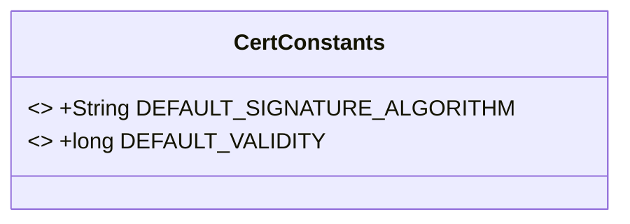
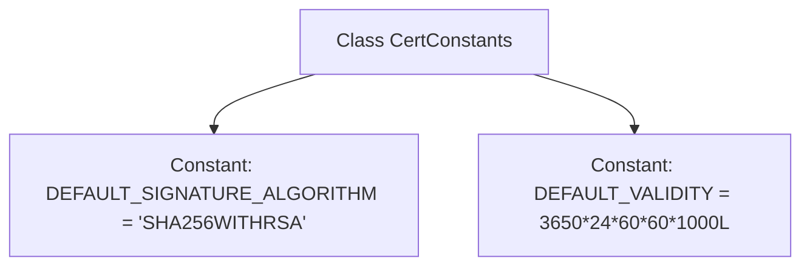

# Basic Information

|      |      |
|------|------|
| Name | CertConstants |
| Language | .java |
| Code Path | WeFe/common/java/common-cert/src/main/java/com/webank/cert/toolkit/constants/CertConstants.java |
| Package Name | com.webank.cert.toolkit.constants |
| Dependencies | [] |
| Brief Description | The CertConstants class defines two constants: the default signature algorithm is SHA256WITHRSA, and the default validity period is 10 years (expressed in milliseconds). |

# Description

The CertConstants class defines two certificate-related constants. The DEFAULT_SIGNATURE_ALGORITHM constant specifies the default signature algorithm as "SHA256WITHRSA". The DEFAULT_VALIDITY constant defines the default validity period duration, calculated as the number of milliseconds equivalent to 3650 days (approximately 10 years), obtained by multiplying 24 hours, 60 minutes, 60 seconds, and 1000 milliseconds. These constants are used for default parameter settings during certificate generation.

# Class Summary

| Name   | Type  | Description |
|-------|------|-------------|
| CertConstants | class | The CertConstants class defines two constants: the default signature algorithm is SHA256WITHRSA, and the default validity period is 3650 days (expressed in milliseconds). |

## Class CertConstants

|      |      |
|------|------|
| Access Modifier | public |
| Type | class |
| Name | CertConstants |
| Description | The CertConstants class defines two constants: the default signature algorithm is SHA256WITHRSA, and the default validity period is 3650 days (expressed in milliseconds). |

### UML Class Diagram

This code defines a public class named `CertConstants`, which contains two static constant fields: `DEFAULT_SIGNATURE_ALGORITHM` and `DEFAULT_VALIDITY`. The former is a string constant specifying the default signature algorithm as "SHA256WITHRSA"; the latter is a long integer constant that calculates and stores the default certificate validity period (in milliseconds, approximately equivalent to 10 years). This class is primarily used to centrally manage certificate-related constant configurations, making it easier to reference and maintain them uniformly in the code. Since all fields are `public static final`, the class cannot be instantiated, and all field values are immutable.

### Internal Method Call Graph

This flowchart illustrates the structure of the CertConstants class, which contains two static constant definitions. The DEFAULT_SIGNATURE_ALGORITHM constant stores the default signature algorithm name string, while the DEFAULT_VALIDITY constant calculates the default validity period in milliseconds (approximately 10 years) through long integer multiplication. The class serves solely as a constant container with no instance methods or constructors, exemplifying the typical design pattern of a utility class.

### Field List

| Name  | Type  | Description |
|-------|-------|------|
| DEFAULT_SIGNATURE_ALGORITHM = "SHA256WITHRSA" | String | Define the constant DEFAULT_SIGNATURE_ALGORITHM with the value SHA256WITHRSA, representing the default signature algorithm. |
| DEFAULT_VALIDITY =  3650 * 24L * 60L * 60L * 1000L | long | Define the default validity period constant, with a value equal to the number of milliseconds in 3650 days. |

### Method List

| Name  | Type  | Description |
|-------|-------|------|

