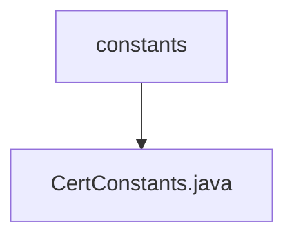

# Basic Information

|      |      |
|------|------|
| Name | constants |
| Language | .java |
| Code Path | WeFe/common/java/common-cert/src/main/java/com/webank/cert/toolkit/constants |
| Package Name | docs.common.java.common-cert.src.main.java.com.webank.cert.toolkit.constants |
| Brief Description | The CertConstants class defines two constants: the default signature algorithm is SHA256WITHRSA, and the default validity period is 10 years (expressed in milliseconds). |

# Description

The CertConstants class defines two certificate-related constants. The DEFAULT_SIGNATURE_ALGORITHM constant specifies the default signature algorithm as "SHA256WITHRSA". The DEFAULT_VALIDITY constant defines the default validity period duration, calculated as the number of milliseconds corresponding to 3650 days (approximately 10 years), obtained by multiplying 24 hours, 60 minutes, 60 seconds, and 1000 milliseconds. These constants are used for default parameter settings during certificate generation.

### Package Internal Structure View

This flowchart illustrates the hierarchical path relationship, with the root node being the constants folder, which contains a subfile CertConstants.java. This is a typical Java project structure where constants serves as a utility package directory storing constant definition files, and CertConstants.java implements specific certificate-related constant definitions.

# File List

| Name   | Type  | Description |
|-------|------|-------------|
| [CertConstants.java](CertConstants.md) | file | The CertConstants class defines two constants: the default signature algorithm is SHA256WITHRSA, and the default validity period is 10 years (expressed in milliseconds). |

