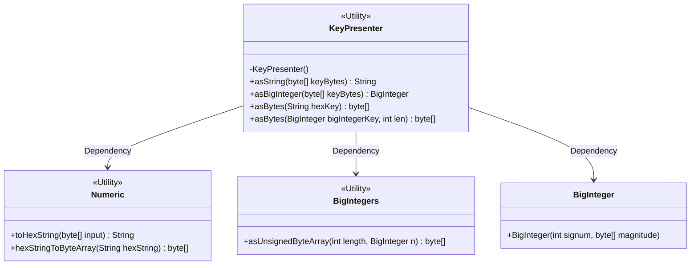
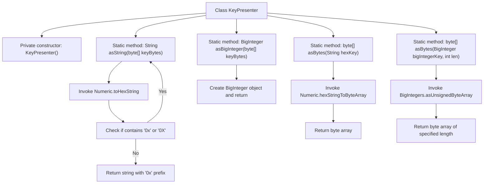

# Basic Information

|      |      |
|------|------|
| Name | KeyPresenter |
| Language | .java |
| Code Path | WeFe/common/java/common-cert/src/main/java/com/webank/cert/toolkit/encrypt/KeyPresenter.java |
| Package Name | com.webank.cert.toolkit.encrypt |
| Dependencies | ['org.bouncycastle.util.BigIntegers', 'org.web3j.utils.Numeric', 'java.math.BigInteger'] |
| Brief Description | The KeyPresenter class provides key format conversion: byte array to hexadecimal string or big integer, and hexadecimal string or big integer to byte array. Private constructor prohibits instantiation. |

# Description

KeyPresenter is a utility class that provides key format conversion functionalities. This class contains static methods: asString converts a byte array key into a hexadecimal string, automatically adding the 0x prefix; asBigInteger converts a byte array into a big integer; asBytes offers two overloads, converting either a hexadecimal string or a big integer into a byte array, with the latter allowing specification of the output byte length. All methods support both public and private key processing, and the class constructor is privatized to ensure non-instantiation.

# Class Summary

| Name   | Type  | Description |
|-------|------|-------------|
| KeyPresenter | class | KeyPresenter utility class: Provides methods for mutual conversion between key byte arrays and hexadecimal strings or BigInteger, supporting public and private key processing. |

## Class KeyPresenter

|      |      |
|------|------|
| Access Modifier | public |
| Type | class |
| Name | KeyPresenter |
| Description | KeyPresenter utility class: Provides methods for mutual conversion between key byte arrays and hexadecimal strings or BigInteger, supporting public and private key processing. |

### UML Class Diagram

This code demonstrates a key presentation utility class KeyPresenter, which provides conversion functionality between byte arrays, hexadecimal strings, and big integers for cryptographic keys. The class implements features through static methods, relying on Numeric and BigIntegers utility classes for underlying conversions, while interacting with Java's standard library BigInteger class. All methods are static utility methods, and the class is designed as a non-instantiable utility class.

### Internal Method Call Graph

This flowchart illustrates the structure and method invocation relationships of the KeyPresenter class. The class provides four static methods for key format conversion: converting byte arrays to hexadecimal strings (asString), converting byte arrays to big integers (asBigInteger), and converting hexadecimal strings or big integers back to byte arrays (asBytes). Each method has clear input-output processing logic, particularly the asString method which checks and ensures the output includes the 0x prefix. All methods are static, and the class itself prevents instantiation through a private constructor.

### Field List

| Name  | Type  | Description |
|-------|-------|------|

### Method List

| Name  | Type  | Description |
|-------|-------|------|
| asBigInteger | BigInteger | Convert a byte array to an unsigned big integer. |
| asString | String | Convert a byte array to a hexadecimal string with a 0x prefix. If the prefix already exists, return it directly. |
| asBytes | byte[] | Methods for converting a hexadecimal string to a byte array, where the input is a hexadecimal string and the output is the corresponding byte array. |
| asBytes | byte[] | Convert a BigInteger to an unsigned byte array of specified length. |

