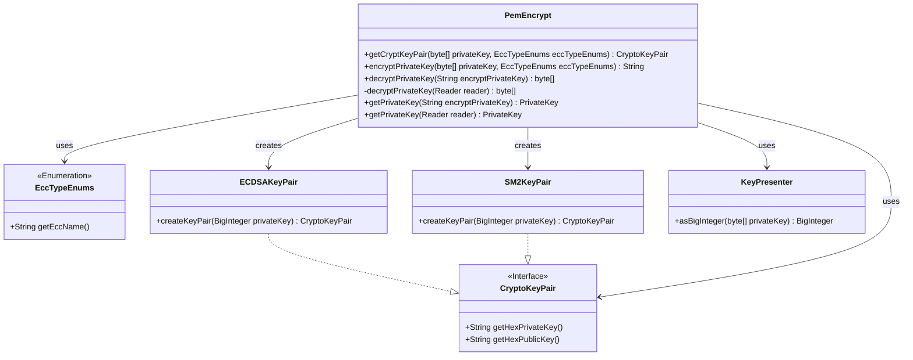
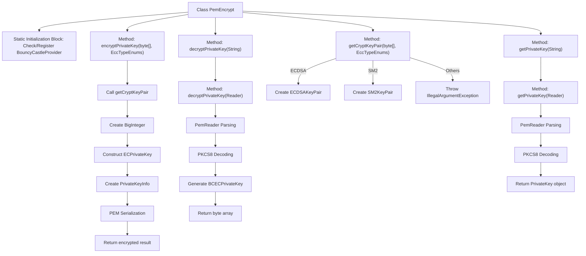

# Basic Information

|      |      |
|------|------|
| Name | PemEncrypt |
| Language | .java |
| Code Path | WeFe/common/java/common-cert/src/main/java/com/webank/cert/toolkit/encrypt/PemEncrypt.java |
| Package Name | com.webank.cert.toolkit.encrypt |
| Dependencies | ['com.webank.cert.toolkit.enums.EccTypeEnums', 'org.bouncycastle.asn1.ASN1Object', 'org.bouncycastle.asn1.ASN1ObjectIdentifier', 'org.bouncycastle.asn1.DERBitString', 'org.bouncycastle.asn1.pkcs.PrivateKeyInfo', 'org.bouncycastle.asn1.sec.ECPrivateKey', 'org.bouncycastle.asn1.x509.AlgorithmIdentifier', 'org.bouncycastle.asn1.x9.X962Parameters', 'org.bouncycastle.asn1.x9.X9ObjectIdentifiers', 'org.bouncycastle.jcajce.provider.asymmetric.ec.BCECPrivateKey', 'org.bouncycastle.jcajce.provider.asymmetric.util.ECUtil', 'org.bouncycastle.jce.provider.BouncyCastleProvider', 'org.bouncycastle.util.io.pem.PemObject', 'org.bouncycastle.util.io.pem.PemReader', 'org.bouncycastle.util.io.pem.PemWriter', 'org.fisco.bcos.sdk.crypto.keypair.CryptoKeyPair', 'org.fisco.bcos.sdk.crypto.keypair.ECDSAKeyPair', 'org.fisco.bcos.sdk.crypto.keypair.SM2KeyPair', 'org.web3j.utils.Numeric', 'java.io.ByteArrayOutputStream', 'java.io.OutputStreamWriter', 'java.io.Reader', 'java.io.StringReader', 'java.math.BigInteger', 'java.security.KeyFactory', 'java.security.PrivateKey', 'java.security.Security', 'java.security.spec.PKCS8EncodedKeySpec'] |
| Brief Description | The PemEncrypt class provides encryption and decryption functionalities for ECC private keys in PEM format, supporting ECDSA and SM2 curves. It includes methods for key pair generation, PKCS8 encapsulation, and parsing. |

# Description

The PemEncrypt class provides elliptic curve key encryption and decryption capabilities based on BouncyCastle. A static code block ensures the BouncyCastle provider is registered. Key functionalities include: generating ECDSA or SM2 key pairs via the getCryptKeyPair method based on ECC type; converting private keys into PEM strings in PKCS#8 format using the encryptPrivateKey method; restoring original private key bytes from PEM strings via the decryptPrivateKey method; and directly obtaining a PrivateKey object through the getPrivateKey method. All methods support exception handling and ensure resource release, with core processes involving ASN.1 encoding, PEM format conversion, and key factory operations.

# Class Summary

| Name   | Type  | Description |
|-------|------|-------------|
| PemEncrypt | class | The PemEncrypt class provides encryption and decryption functionalities, supporting ECDSA and SM2 algorithms, including key pair generation, private key encryption into PEM format, and private key decryption restoration. |

## Class PemEncrypt

|      |      |
|------|------|
| Access Modifier | public |
| Type | class |
| Name | PemEncrypt |
| Description | The PemEncrypt class provides encryption and decryption functionalities, supporting ECDSA and SM2 algorithms, including key pair generation, private key encryption into PEM format, and private key decryption restoration. |

### UML Class Diagram

This code implements a PEM-format key encryption/decryption utility class based on elliptic curve cryptography. The PemEncrypt class provides static methods for handling key pair generation, private key encryption (PEM format), and decryption for both ECDSA and SM2 elliptic curve algorithms. The core workflow includes: creating key pairs via getCryptKeyPair based on algorithm type, performing PKCS#8 format key encoding/decoding using the BouncyCastle library, and managing PEM format read/write operations. The class diagram clearly illustrates relationships with enumeration types, key pair interfaces and their implementation classes, along with critical helper utility classes.

### Internal Method Call Graph

This code implements a PEM format key encryption/decryption utility class based on elliptic curve cryptography. Main functionalities include: registering BouncyCastle crypto provider during static initialization; supporting key pair generation for both ECDSA and SM2 elliptic curve algorithms; providing PEM format encryption for private keys (including curve parameters and public key information); implementing PEM format private key decryption and restoration; and direct PrivateKey object retrieval. All methods incorporate robust resource cleanup mechanisms through try-finally to ensure proper closure of resources like Reader/PemWriter.

### Field List

| Name  | Type  | Description |
|-------|-------|------|

### Method List

| Name  | Type  | Description |
|-------|-------|------|
| getCryptKeyPair | CryptoKeyPair | Generate a key pair based on the private key and ECC type, supporting ECDSA and SM2. An exception will be thrown if the type does not match. |
| getPrivateKey | PrivateKey | The static method `getPrivateKey` accepts an encrypted private key string and returns a `PrivateKey` object, potentially throwing exceptions. Internally, it invokes an overloaded method of the same name that takes a `StringReader` parameter. |
| encryptPrivateKey | String | Encryption private key method: Receives a private key byte array and ECC type, generates a PKCS#8 format key pair, serializes it into DER encoding, and returns a PEM string. |
| decryptPrivateKey | byte[] | The method decrypts the private key from the PEM format reader, generates a BCECPrivateKey using PKCS8 encoding and the EC algorithm, and ultimately returns 32 bytes of private key data. The reader is closed upon completion of the process. |
| decryptPrivateKey | byte[] | Method to decrypt private key: Input the encrypted private key string, and return the decrypted byte array. |
| getPrivateKey | PrivateKey | Retrieve the EC private key from the PEM reader, generate the private key object using PKCS8 encoding and the BouncyCastle provider, and finally close the reader. |

