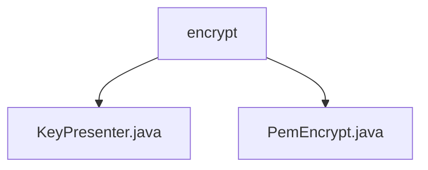

# Basic Information

|      |      |
|------|------|
| Name | encrypt |
| Language | .java |
| Code Path | WeFe/common/java/common-cert/src/main/java/com/webank/cert/toolkit/encrypt |
| Package Name | docs.common.java.common-cert.src.main.java.com.webank.cert.toolkit.encrypt |
| Brief Description | KeyPresenter provides key format conversion functionality, supporting mutual conversion between byte arrays, hexadecimal strings, and large integers. PemEncrypt implements elliptic curve key encryption/decryption based on BouncyCastle, supporting key pair generation, PEM format conversion, and private key restoration. |

# Description

## Overview  
The core responsibility of this module is to provide key format conversion and elliptic curve key encryption/decryption functionalities, supporting public/private key processing. The interface specifications include: KeyPresenter provides methods for mutual conversion between byte arrays and hexadecimal strings/large integers; PemEncrypt offers key pair generation, PEM format encryption/decryption, and PrivateKey object retrieval. Key data structures involve PKCS#8 format PEM strings, ASN.1 encoded data, and ECDSA/SM2 key pairs. External dependencies include the BouncyCastle cryptographic library. For example, asBytes supports converting hexadecimal strings to byte arrays, while encryptPrivateKey implements PEM formatting for private keys.  

## Primary Business Scenarios  
The module is suitable for key lifecycle management scenarios, functioning similarly to cryptographic middleware. The complete workflow includes: generating ECC key pairs → converting key formats (e.g., PEM strings) → securely storing or transmitting → restoring the original keys. The interaction mode involves static method calls, such as getCryptKeyPair to generate key pairs, followed by encryptPrivateKey for encrypted storage. A typical application is SM2 certificate issuance scenarios, which require combining KeyPresenter's format conversion capabilities with PemEncrypt's encryption/decryption functionalities. API types encompass key generation, format conversion, and encoding/decoding operations.

### Package Internal Structure View

This flowchart illustrates two Java files under the encrypt directory: KeyPresenter.java and PemEncrypt.java. Both files are directly located within the encrypt directory without any deeper subdirectory structure. The diagram clearly presents the hierarchical relationship between the files and their parent directory, conforming to the given path information requirements.

# File List

| Name   | Type  | Description |
|-------|------|-------------|
| [KeyPresenter.java](KeyPresenter.md) | file | The KeyPresenter class provides key format conversion: byte array to hexadecimal string or large integer, and hexadecimal string or large integer to byte array. Private constructor prohibits instantiation. |
| [PemEncrypt.java](PemEncrypt.md) | file | The PemEncrypt class provides encryption and decryption functionalities for ECC private keys in PEM format, supporting ECDSA and SM2 curves. It includes methods for key pair generation, PKCS8 encapsulation, and parsing. |

