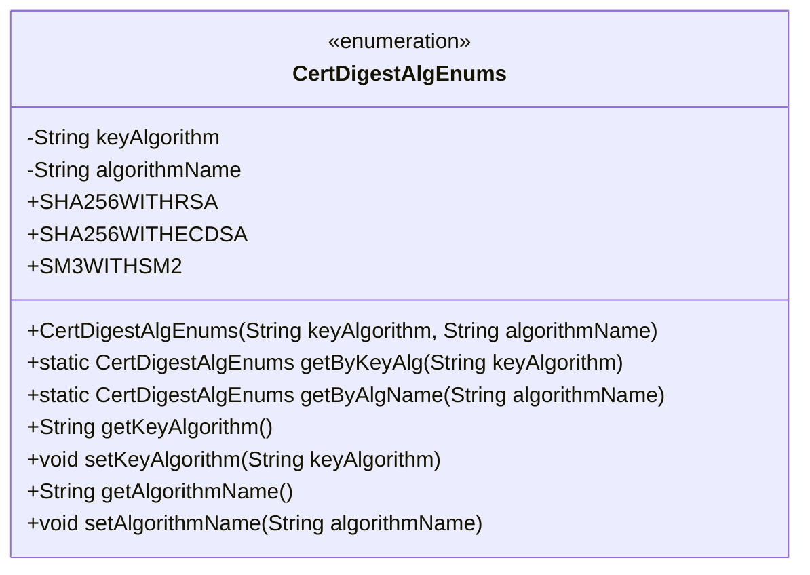
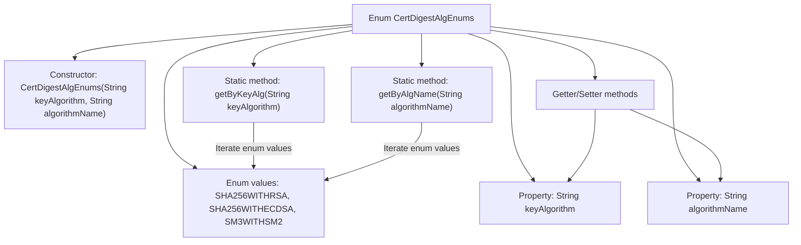

# Basic Information

|      |      |
|------|------|
| Name | CertDigestAlgEnums |
| Language | .java |
| Code Path | WeFe/common/java/common-cert/src/main/java/com/webank/cert/toolkit/enums/CertDigestAlgEnums.java |
| Package Name | com.webank.cert.toolkit.enums |
| Dependencies | ['lombok.Getter', 'lombok.ToString', 'lombok.extern.slf4j.Slf4j'] |
| Brief Description | The CertDigestAlgEnums enumeration defines three certificate digest algorithms: SHA256WITHRSA, SHA256WITHECDSA, and SM3WITHSM2, providing methods to look up the enumeration based on the key algorithm or algorithm name. |

# Description

CertDigestAlgEnums is an enumeration class that defines three certificate digest algorithms: SHA256WITHRSA, SHA256WITHECDSA, and SM3WITHSM2. Each enum value contains two attributes: keyAlgorithm (key algorithm) and algorithmName (algorithm name). The class provides methods getByKeyAlg and getByAlgName to look up the corresponding enum value by key algorithm or algorithm name, as well as getter and setter methods for the attributes. The class uses Lombok annotations @Getter, @ToString, and @Slf4j to simplify the code.

# Class Summary

| Name   | Type  | Description |
|-------|------|-------------|
| CertDigestAlgEnums | enum | The CertDigestAlgEnums enumeration class defines three certificate digest algorithms: SHA256WITHRSA, SHA256WITHECDSA, and SM3WITHSM2. It includes attributes for key algorithm and algorithm name, and provides methods to look up by key algorithm or algorithm name. |

## Class CertDigestAlgEnums

|      |      |
|------|------|
| Access Modifier | @Getter;@ToString;@Slf4j;public |
| Type | enum |
| Name | CertDigestAlgEnums |
| Description | The CertDigestAlgEnums enumeration class defines three certificate digest algorithms: SHA256WITHRSA, SHA256WITHECDSA, and SM3WITHSM2. It includes attributes for key algorithm and algorithm name, and provides methods to look up by key algorithm or algorithm name. |

### UML Class Diagram

This code defines an enumeration class `CertDigestAlgEnums`, representing certificate digest algorithm types. The enumeration includes three instances: SHA256WITHRSA, SHA256WITHECDSA, and SM3WITHSM2, each associated with two attributes: key algorithm and algorithm name. The class provides static methods to look up enumeration values by key algorithm or algorithm name, as well as getter/setter methods for the attributes. The enumeration class automatically generates getters and toString method through Lombok annotations and includes logging capabilities.

### Internal Method Call Graph

This flowchart illustrates the core structure of the CertDigestAlgEnums enum, including three predefined enum values, two string properties, a constructor, and key operational methods. The static methods getByKeyAlg and getByAlgName enable conditional lookup of enum values, while Lombok annotations automatically generate getter/setter methods. The diagram clearly presents the enum initialization process, property access paths, and method call relationships, particularly highlighting the traversal logic for finding enum instances based on property values.

### Field List

| Name  | Type  | Description |
|-------|-------|------|

### Method List

| Name  | Type  | Description |
|-------|-------|------|

