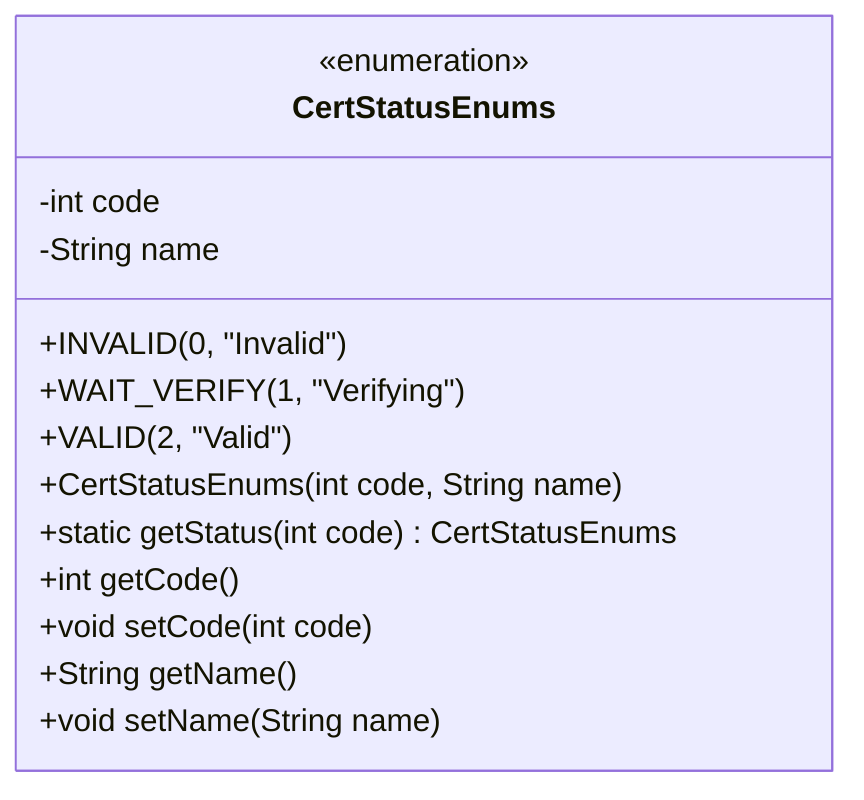
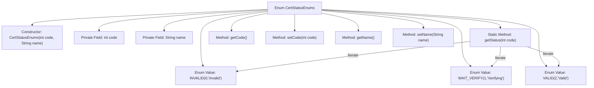

# Basic Information

|      |      |
|------|------|
| Name | CertStatusEnums |
| Language | .java |
| Code Path | WeFe/common/java/common-cert/src/main/java/com/webank/cert/toolkit/enums/CertStatusEnums.java |
| Package Name | com.webank.cert.toolkit.enums |
| Dependencies | [] |
| Brief Description | The enumeration class CertStatusEnums defines certification statuses: 0 invalid, 1 in progress, 2 valid, and provides a method to retrieve the status based on the code. |

# Description

The CertStatusEnums enumeration defines three types of certification status: INVALID (0, invalid), WAIT_VERIFY (1, verifying), and VALID (2, valid). Each enumeration item includes code and name attributes, with getter and setter methods provided. The static method getStatus can retrieve the corresponding enumeration instance based on the code value, returning null if no match is found. This enumeration is used to manage certification statuses and their descriptive information.

# Class Summary

| Name   | Type  | Description |
|-------|------|-------------|
| CertStatusEnums | enum | The enumeration class CertStatusEnums defines certification statuses: Invalid (0), In Progress (1), Valid (2), and provides a method to retrieve the status based on the code. |

## Class CertStatusEnums

|      |      |
|------|------|
| Access Modifier | public |
| Type | enum |
| Name | CertStatusEnums |
| Description | The enumeration class CertStatusEnums defines certification statuses: Invalid (0), In Progress (1), Valid (2), and provides a method to retrieve the status based on the code. |

### UML Class Diagram

This code defines an enumeration type `CertStatusEnums` to represent certification statuses. The enumeration includes three instances: `INVALID` (Invalid), `WAIT_VERIFY` (Verifying), and `VALID` (Valid), each with a corresponding status code and name. The class provides a static method `getStatus` to retrieve an enumeration instance by its status code, as well as methods to get and set the status code and name. Enumeration types are commonly used to represent a fixed set of constant values, ensuring type safety and code readability.

### Internal Method Call Graph

This flowchart illustrates the structure and functional relationships of the CertStatusEnums enum. The enum defines three states (INVALID/WAIT_VERIFY/VALID), includes a constructor and private fields (code/name), provides a static method getStatus() for status code lookup, and standard getter/setter methods. The core logic involves iterating through enum values to match status codes, demonstrating the typical usage of enum types as state containers.

### Field List

| Name  | Type  | Description |
|-------|-------|------|

### Method List

| Name  | Type  | Description |
|-------|-------|------|

