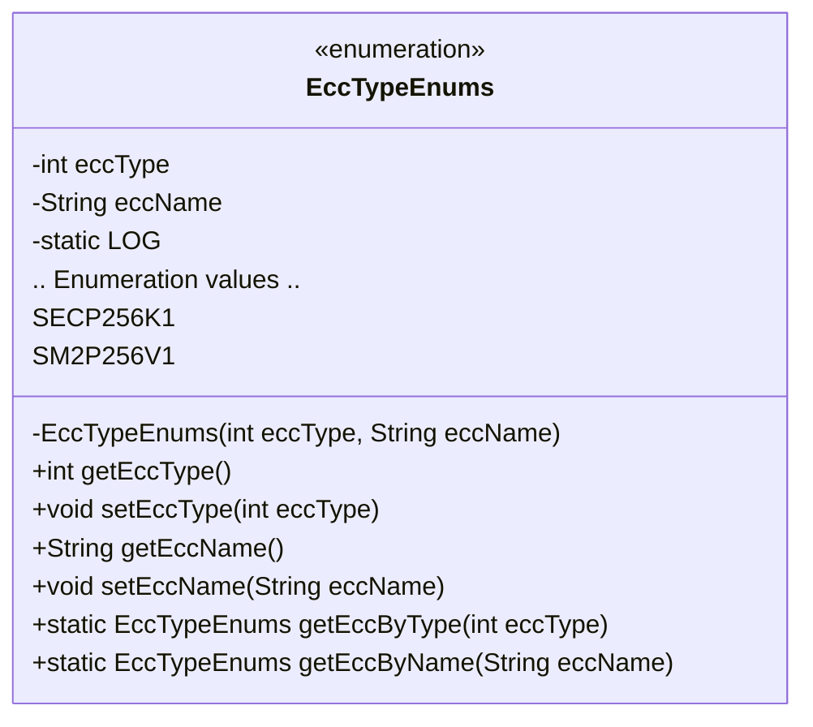
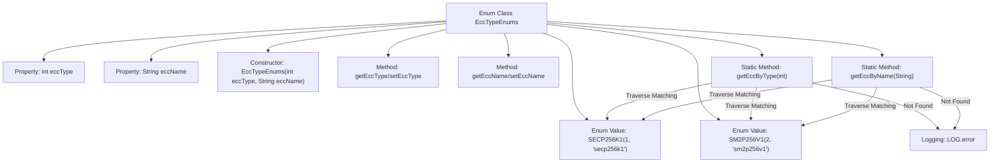

# Basic Information

|      |      |
|------|------|
| Name | EccTypeEnums |
| Language | .java |
| Code Path | WeFe/common/java/common-cert/src/main/java/com/webank/cert/toolkit/enums/EccTypeEnums.java |
| Package Name | com.webank.cert.toolkit.enums |
| Dependencies | ['java.util.Objects', 'org.slf4j.Logger', 'org.slf4j.LoggerFactory'] |
| Brief Description | The enumeration EccTypeEnums defines two ECC types: SECP256K1 and SM2P256V1, including type codes and names. It provides lookup methods by type code or name, with error logs recorded for failed lookups. |

# Description

The enumeration class EccTypeEnums defines two types of elliptic curve encryption algorithms: SECP256K1 and SM2P256V1, corresponding to values 1 and 2, respectively. The class includes private attributes eccType and eccName, initialized through a constructor, and provides corresponding getter and setter methods. Additionally, it offers two static methods: getEccByType, which looks up an enumeration instance based on the numeric value, and getEccByName, which looks up an enumeration instance based on the name. If no match is found, an error log is recorded and null is returned. The class also includes a static logger LOG for error log output.

# Class Summary

| Name   | Type  | Description |
|-------|------|-------------|
| EccTypeEnums | enum | The enumeration class EccTypeEnums defines two ECC types: SECP256K1 and SM2P256V1, including type codes and names. It provides lookup methods by code or name, with error logs recorded upon lookup failure. |

## Class EccTypeEnums

|      |      |
|------|------|
| Access Modifier | public |
| Type | enum |
| Name | EccTypeEnums |
| Description | The enumeration class EccTypeEnums defines two ECC types: SECP256K1 and SM2P256V1, including type codes and names. It provides lookup methods by code or name, with error logs recorded upon lookup failure. |

### UML Class Diagram

This code defines an enumeration class named `EccTypeEnums`, which represents different types of elliptic curve cryptography algorithms. The class includes two enumeration constants, `SECP256K1` and `SM2P256V1`, corresponding to different encryption algorithm types and names. The class provides methods to get and set the algorithm type and name, as well as static methods to look up the corresponding enumeration by type or name. Additionally, it includes a logger for error handling. This enumeration class is primarily used to identify and manage different elliptic curve cryptography algorithm types in cryptographic applications.

### Internal Method Call Graph

This flowchart illustrates the structure of the EccTypeEnums enum class, which includes two enum values (SECP256K1 and SM2P256V1), private properties (eccType and eccName), a constructor, getter/setter methods, and two core static lookup methods (getEccByType and getEccByName). The lookup methods traverse enum values for matching and log errors upon failure. The design implements bidirectional lookup functionality between ECC types and names, featuring a robust error-handling mechanism.

### Field List

| Name  | Type  | Description |
|-------|-------|------|

### Method List

| Name  | Type  | Description |
|-------|-------|------|

