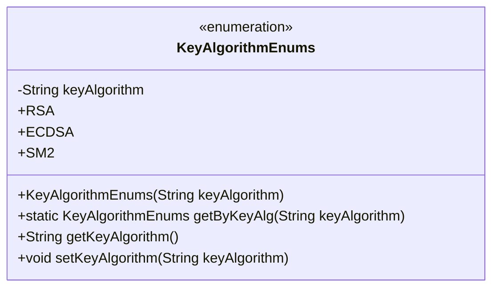
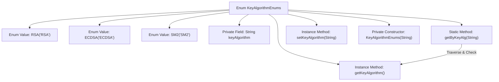

# Basic Information

|      |      |
|------|------|
| Name | KeyAlgorithmEnums |
| Language | .java |
| Code Path | WeFe/common/java/common-cert/src/main/java/com/webank/cert/toolkit/enums/KeyAlgorithmEnums.java |
| Package Name | com.webank.cert.toolkit.enums |
| Dependencies | [] |
| Brief Description | The enumeration class KeyAlgorithmEnums defines three key algorithms: RSA, ECDSA, and SM2. It provides methods to retrieve enumeration values by name and includes functionality for getting and setting algorithm names. |

# Description

The code defines an enumeration class named `KeyAlgorithmEnums`, which includes three enumeration constants: `RSA`, `ECDSA`, and `SM2`. Each enumeration constant is associated with a `keyAlgorithm` property of string type. The class provides a private constructor to initialize this property and includes getter and setter methods. Additionally, a static method `getByKeyAlg` is defined to search and return the corresponding enumeration instance based on the input `keyAlgorithm` string, returning `null` if not found. The entire enumeration class is used to manage key algorithm types and their string representations.

# Class Summary

| Name   | Type  | Description |
|-------|------|-------------|
| KeyAlgorithmEnums | enum | The enumeration class defines three key algorithms: RSA, ECDSA, and SM2, providing methods to retrieve enumeration values by name and property accessors. |

## Class KeyAlgorithmEnums

|      |      |
|------|------|
| Access Modifier | public |
| Type | enum |
| Name | KeyAlgorithmEnums |
| Description | The enumeration class defines three key algorithms: RSA, ECDSA, and SM2, providing methods to retrieve enumeration values by name and property accessors. |

### UML Class Diagram

This code defines an enumeration class named KeyAlgorithmEnums, which includes three enum constants: RSA, ECDSA, and SM2. Each constant is associated with a string-type keyAlgorithm attribute. The class provides a method getByKeyAlg to look up the corresponding enum by a string, as well as getter and setter methods to retrieve and modify the keyAlgorithm value. The enumeration class is primarily used to represent a fixed set of key algorithm types, enabling safe referencing of these algorithms in code.

### Internal Method Call Graph

This flowchart illustrates the structure of the KeyAlgorithmEnums enum, which includes three predefined enum values (RSA/ECDSA/SM2), a private String field keyAlgorithm, and related constructor and access methods. The core logic involves the static method getByKeyAlg traversing enum values and comparing the keyAlgorithm field to match the corresponding enum instance. The flowchart clearly presents the enum definition and the calling relationships between its methods.

### Field List

| Name  | Type  | Description |
|-------|-------|------|

### Method List

| Name  | Type  | Description |
|-------|-------|------|

