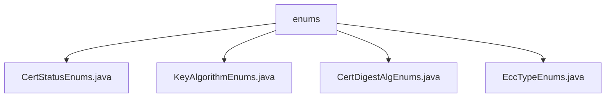

# Basic Information

|      |      |
|------|------|
| Name | enums |
| Language | .java |
| Code Path | WeFe/common/java/common-cert/src/main/java/com/webank/cert/toolkit/enums |
| Package Name | docs.common.java.common-cert.src.main.java.com.webank.cert.toolkit.enums |
| Brief Description | The CertStatusEnums enumeration defines certification statuses: invalid, in progress, and valid, including code and name attributes along with lookup methods. The KeyAlgorithmEnums enumeration manages RSA, ECDSA, and SM2 key algorithms, including lookup functionality. The CertDigestAlgEnums enumeration defines three certificate digest algorithms, featuring key algorithm and algorithm name attributes as well as lookup methods. The EccTypeEnums enumeration defines two elliptic curve encryption types, including lookup methods. |

# Description

## Overview  
The core responsibility of this module is to provide standardized enum definitions related to certificate management, including authentication status, key algorithms, digest algorithms, and elliptic curve types. The interface specification uniformly adopts static factory methods (e.g., `getByKeyAlg`/`getStatus`) to look up enum instances by key-value pairs, returning null if no match is found. Key data structures include `CertStatusEnums` (status codes), `KeyAlgorithmEnums` (algorithm types), `CertDigestAlgEnums` (digest algorithms), and `EccTypeEnums` (elliptic curves). External dependencies are limited to Lombok annotations (e.g., `@Getter`). For example, the SM2P256V1 curve type is identified by `eccType=2`.

## Primary Business Scenarios  
The module supports full lifecycle certificate management, such as `CertStatusEnums` tracking authentication status (e.g., `WAIT_VERIFY` → `VALID`). The interaction pattern resembles dictionary lookup, where enum items are retrieved by algorithm names/codes, e.g., `KeyAlgorithmEnums.getByKeyAlg("RSA")`. Typical applications include certificate issuance (selecting the SM3WITHSM2 digest algorithm) and key agreement (specifying the SECP256K1 curve). The API types are all static query methods, with integration cases covering both domestic cryptographic standards (SM2/SM3) and international standards (RSA/ECDSA).

### Package Internal Structure View

This flowchart illustrates the hierarchical structure of the enums directory under the common-cert module in the WeFe project. The root node is the enums folder, which contains four enumeration class files: CertStatusEnums.java, KeyAlgorithmEnums.java, CertDigestAlgEnums.java, and EccTypeEnums.java. These enumeration classes are used to handle relevant enum definitions such as certificate status, key algorithms, certificate digest algorithms, and ECC types.

# File List

| Name   | Type  | Description |
|-------|------|-------------|
| [CertStatusEnums.java](CertStatusEnums.md) | file | The enumeration class CertStatusEnums defines certification statuses: 0 invalid, 1 in progress, 2 valid, and provides a method to retrieve the status based on the code. |
| [KeyAlgorithmEnums.java](KeyAlgorithmEnums.md) | file | The enumeration class KeyAlgorithmEnums defines three key algorithms: RSA, ECDSA, and SM2. It provides methods to retrieve enumeration values by name and includes functionality for getting and setting algorithm names. |
| [CertDigestAlgEnums.java](CertDigestAlgEnums.md) | file | The CertDigestAlgEnums enumeration defines three certificate digest algorithms: SHA256WITHRSA, SHA256WITHECDSA, and SM3WITHSM2, providing methods to look up the enumeration based on the key algorithm or algorithm name. |
| [EccTypeEnums.java](EccTypeEnums.md) | file | The enumeration EccTypeEnums defines two ECC types: SECP256K1 and SM2P256V1, including type codes and names. It provides lookup methods by type code or name, and logs an error if the lookup fails. |

