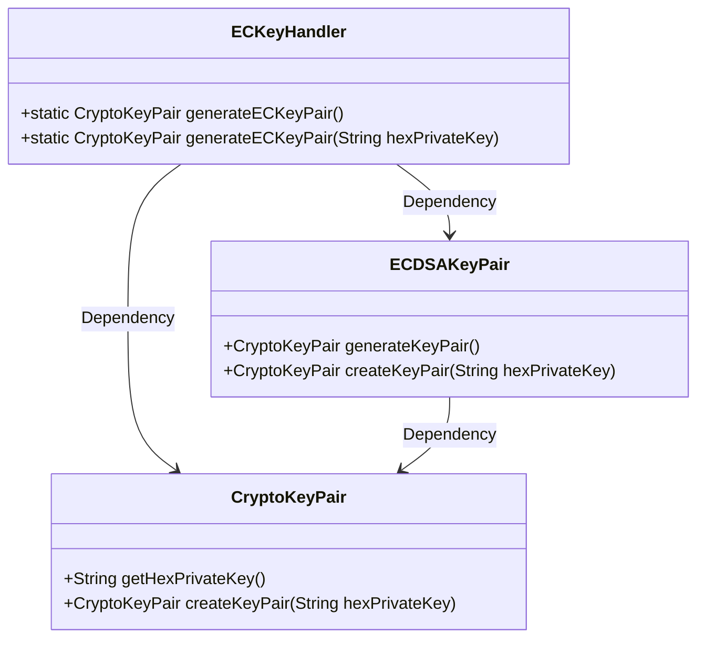
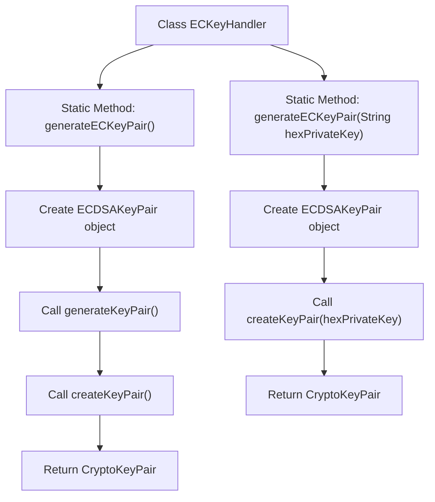

# Basic Information

|      |      |
|------|------|
| Name | ECKeyHandler |
| Language | .java |
| Code Path | WeFe/common/java/common-cert/src/main/java/com/webank/cert/toolkit/handler/ECKeyHandler.java |
| Package Name | com.webank.cert.toolkit.handler |
| Dependencies | ['org.fisco.bcos.sdk.crypto.keypair.CryptoKeyPair', 'org.fisco.bcos.sdk.crypto.keypair.ECDSAKeyPair'] |
| Brief Description | The ECKeyHandler class provides two static methods: generateECKeyPair generates elliptic curve key pairs, supporting parameterless generation or creation based on a hexadecimal private key. |

# Description

The ECKeyHandler class provides two static methods for generating elliptic curve key pairs. The first method, generateECKeyPair, takes no parameters and generates a new key pair via ECDSAKeyPair, returning a CryptoKeyPair object containing the hexadecimal private key. The second method, generateECKeyPair, accepts a hexadecimal private key string parameter and directly creates and returns the corresponding key pair based on this private key. Both methods utilize the createKeyPair method of ECDSAKeyPair to accomplish their core functionality.

# Class Summary

| Name   | Type  | Description |
|-------|------|-------------|
| ECKeyHandler | class | The ECKeyHandler class provides two static methods: generateECKeyPair generates an elliptic curve key pair, supporting parameterless generation or creation based on a hexadecimal private key. |

## Class ECKeyHandler

|      |      |
|------|------|
| Access Modifier | public |
| Type | class |
| Name | ECKeyHandler |
| Description | The ECKeyHandler class provides two static methods: generateECKeyPair generates an elliptic curve key pair, supporting parameterless generation or creation based on a hexadecimal private key. |

### UML Class Diagram

This code demonstrates an Elliptic Curve Key Handler (ECKeyHandler) that provides two methods for generating key pairs: randomly or based on an existing private key. The core classes include ECKeyHandler (entry class), ECDSAKeyPair (key pair generator), and CryptoKeyPair (key pair container). ECKeyHandler generates or reconstructs key pairs by invoking methods of ECDSAKeyPair, ultimately returning a CryptoKeyPair object containing public and private keys. The entire design employs static methods to offer a concise API, supporting both key generation and import functionality.

### Internal Method Call Graph

This flowchart illustrates the logic of two static methods in the ECKeyHandler class. The parameterless method generateECKeyPair() generates a key pair via ECDSAKeyPair, then recreates the key pair using a private key hexadecimal string. The parameterized method generateECKeyPair(String) directly creates a key pair using the input private key string. Both methods ultimately return a CryptoKeyPair object, fully demonstrating the generation and reconstruction process of elliptic curve key pairs.

### Field List

| Name  | Type  | Description |
|-------|-------|------|

### Method List

| Name  | Type  | Description |
|-------|-------|------|
| generateECKeyPair | CryptoKeyPair | Generate an ECDSA key pair with the input being a hexadecimal private key string. |
| generateECKeyPair | CryptoKeyPair | Generate an ECDSA key pair and return the key pair in hexadecimal private key format. |

