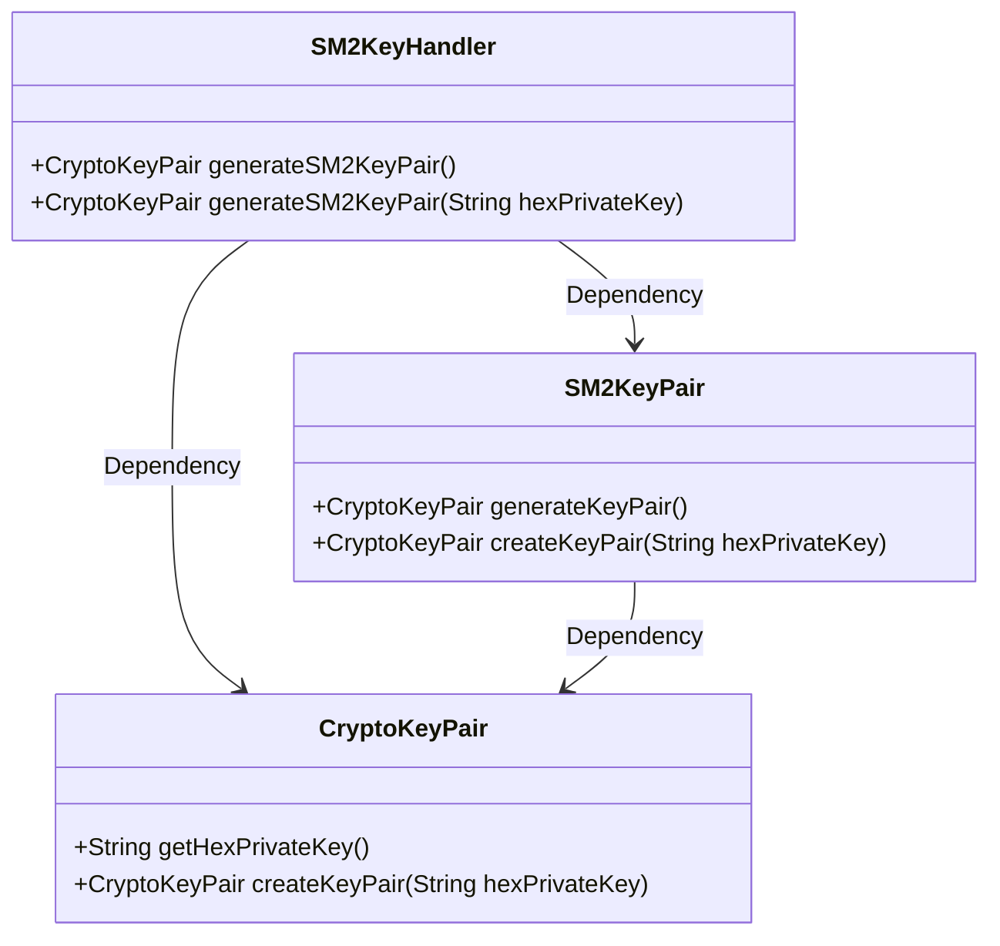
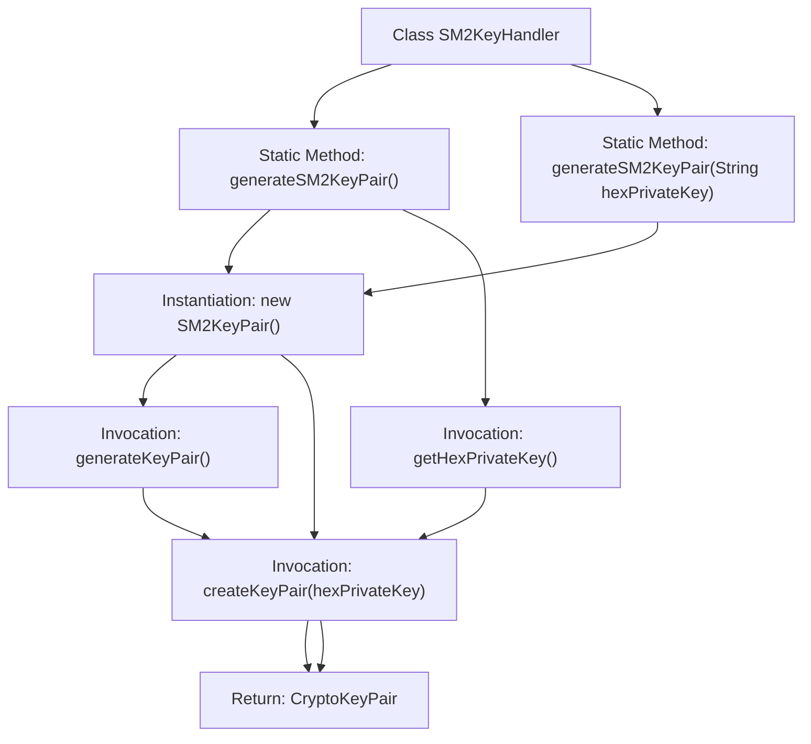

# Basic Information

|      |      |
|------|------|
| Name | SM2KeyHandler |
| Language | .java |
| Code Path | WeFe/common/java/common-cert/src/main/java/com/webank/cert/toolkit/handler/SM2KeyHandler.java |
| Package Name | com.webank.cert.toolkit.handler |
| Dependencies | ['org.fisco.bcos.sdk.crypto.keypair.CryptoKeyPair', 'org.fisco.bcos.sdk.crypto.keypair.SM2KeyPair'] |
| Brief Description | The SM2KeyHandler class provides the functionality to generate SM2 key pairs, supporting both random generation and generation with a specified private key. |

# Description

The SM2KeyHandler class provides two static methods for generating SM2 key pairs. The first method, generateSM2KeyPair, takes no parameters and generates a new key pair via SM2KeyPair before returning it. The second method, generateSM2KeyPair, accepts a hexadecimal private key string parameter, uses this private key to create and return the corresponding key pair. Both methods return an object of type CryptoKeyPair.

# Class Summary

| Name   | Type  | Description |
|-------|------|-------------|
| SM2KeyHandler | class | The SM2KeyHandler class provides two static methods: generateSM2KeyPair generates an SM2 key pair, or generates a key pair based on a specified private key. |

## Class SM2KeyHandler

|      |      |
|------|------|
| Access Modifier | public |
| Type | class |
| Name | SM2KeyHandler |
| Description | The SM2KeyHandler class provides two static methods: generateSM2KeyPair generates an SM2 key pair, or generates a key pair based on a specified private key. |

### UML Class Diagram

This class diagram illustrates the dependency relationships between the SM2KeyHandler class and CryptoKeyPair, SM2KeyPair. SM2KeyHandler provides two static methods for generating SM2 key pairs: one based on random generation and the other on a specified hexadecimal private key. The CryptoKeyPair class is responsible for key pair creation and management, while the SM2KeyPair class implements the specific SM2 key generation logic. The overall design reflects the encapsulation and flexibility of key generation.

### Internal Method Call Graph

This flowchart illustrates the logical flow of two static methods in the SM2KeyHandler class for generating SM2 key pairs. The parameterless method generates a new key pair via an SM2KeyPair instance, extracts the private key's hexadecimal string, and creates the final key pair. The parameterized method directly uses the input private key string to create the key pair. Both methods ultimately return a CryptoKeyPair object, demonstrating the core paths of key generation and conversion.

### Field List

| Name  | Type  | Description |
|-------|-------|------|

### Method List

| Name  | Type  | Description |
|-------|-------|------|
| generateSM2KeyPair | CryptoKeyPair | Generate an SM2 key pair, supporting the input of a hexadecimal private key. |
| generateSM2KeyPair | CryptoKeyPair | Generate SM2 key pair: Create an SM2KeyPair instance and return the key pair with a hexadecimal private key. |

