# Basic Information

|      |      |
|------|------|
| Name | X509CertHandler |
| Language | .java |
| Code Path | WeFe/common/java/common-cert/src/main/java/com/webank/cert/toolkit/handler/X509CertHandler.java |
| Package Name | com.webank.cert.toolkit.handler |
| Dependencies | ['java.math.BigInteger', 'java.security.PrivateKey', 'java.security.PublicKey', 'java.security.Security', 'java.security.cert.CRLException', 'java.security.cert.X509CRL', 'java.security.cert.X509Certificate', 'java.util.ArrayList', 'java.util.Date', 'java.util.List', 'java.util.Random', 'org.bouncycastle.asn1.x500.X500Name', 'org.bouncycastle.asn1.x509.BasicConstraints', 'org.bouncycastle.asn1.x509.Extension', 'org.bouncycastle.asn1.x509.GeneralName', 'org.bouncycastle.asn1.x509.GeneralNames', 'org.bouncycastle.asn1.x509.KeyUsage', 'org.bouncycastle.cert.CertIOException', 'org.bouncycastle.cert.X509CRLHolder', 'org.bouncycastle.cert.X509v2CRLBuilder', 'org.bouncycastle.cert.X509v3CertificateBuilder', 'org.bouncycastle.cert.jcajce.JcaX509CRLConverter', 'org.bouncycastle.cert.jcajce.JcaX509CertificateConverter', 'org.bouncycastle.cert.jcajce.JcaX509v3CertificateBuilder', 'org.bouncycastle.jce.provider.BouncyCastleProvider', 'org.bouncycastle.operator.ContentSigner', 'org.bouncycastle.operator.OperatorCreationException', 'org.bouncycastle.operator.jcajce.JcaContentSignerBuilder', 'org.bouncycastle.pkcs.PKCS10CertificationRequest', 'org.bouncycastle.pkcs.PKCS10CertificationRequestBuilder', 'org.bouncycastle.pkcs.jcajce.JcaPKCS10CertificationRequest', 'org.bouncycastle.pkcs.jcajce.JcaPKCS10CertificationRequestBuilder'] |
| Brief Description | The X509CertHandler class provides X509 certificate operations, including creating root certificates, subordinate certificates, CSR requests, and revoking certificates. It utilizes the BouncyCastle library for key extension and signing. |

# Description

The X509CertHandler class provides generation and management functionalities for X.509 certificates and CRLs. The static initialization block ensures the BouncyCastle security provider is registered. Key features include: creating root and subordinate certificates with configurable attributes such as CA flag, key usage, and validity period; generating certificate signing requests (CSRs); constructing certificate extensions like basic constraints, key usage, and subject alternative names; as well as revoking certificates and generating CRLs. All operations are implemented based on the BouncyCastle library, supporting custom signature algorithms and key pairs.

# Class Summary

| Name   | Type  | Description |
|-------|------|-------------|
| X509CertHandler | class | The X509CertHandler class provides X509 certificate operations, including creating root certificates, subordinate certificates, CSR requests, and certificate revocation lists. Implemented using the BouncyCastle library, it supports customizable parameters such as signature algorithms, validity periods, and key usage. |

## Class X509CertHandler

|      |      |
|------|------|
| Access Modifier | public |
| Type | class |
| Name | X509CertHandler |
| Description | The X509CertHandler class provides X509 certificate operations, including creating root certificates, subordinate certificates, CSR requests, and certificate revocation lists. Implemented using the BouncyCastle library, it supports customizable parameters such as signature algorithms, validity periods, and key usage. |

### UML Class Diagram

```mermaid
classDiagram
    class X509CertHandler {
        <<static>>
        +createRootCert(String signAlg, X500Name subject, KeyUsage keyUsage, Date startDate, Date endDate, PublicKey publicKey, PrivateKey privateKey) X509Certificate
        +createChildCert(boolean isCaCert, String signAlg, X509Certificate parentCertificate, PKCS10CertificationRequest request, KeyUsage keyUsage, Date startDate, Date endDate, PrivateKey privateKey) X509Certificate
        +createCert(boolean isCaCert, String signAlg, X500Name subject, X500Name issuer, KeyUsage keyUsage, PublicKey publicKey, PrivateKey privateKey, Date startDate, Date endDate) X509Certificate
        +createCSR(X500Name subject, PublicKey pubKey, PrivateKey priKey, String signAlg) PKCS10CertificationRequest
        +revokeCert(X509Certificate caCertificate, PrivateKey caPrivateKey, List~X509Certificate~ revokeCertificates, String signAlg, int reason, Date period) X509CRL
        -buildCertExtension(X509v3CertificateBuilder v3CertGen, boolean isCaCert, KeyUsage keyUsage) void
        -makeContentSignerBuilder(String signAlg) JcaContentSignerBuilder
    }

    class BouncyCastleProvider {
        <<static>> +PROVIDER_NAME: String
    }

    class X509v3CertificateBuilder {
        +addExtension(Extension extension, boolean critical, ASN1Encodable value) void
        +build(ContentSigner signer) X509CertificateHolder
    }

    class JcaX509CertificateConverter {
        +setProvider(String provider) JcaX509CertificateConverter
        +getCertificate(X509CertificateHolder holder) X509Certificate
    }

    class JcaContentSignerBuilder {
        +setProvider(String provider) JcaContentSignerBuilder
        +build(PrivateKey privateKey) ContentSigner
    }

    class PKCS10CertificationRequest {
        +getSubject() X500Name
    }

    class X509v2CRLBuilder {
        +addCRLEntry(BigInteger serialNumber, Date revocationDate, int reason) void
        +setNextUpdate(Date nextUpdate) void
        +build(ContentSigner signer) X509CRLHolder
    }

    class JcaX509CRLConverter {
        +setProvider(String provider) JcaX509CRLConverter
        +getCRL(X509CRLHolder holder) X509CRL
    }

    X509CertHandler --> BouncyCastleProvider : Dependency
    X509CertHandler --> X509v3CertificateBuilder : Uses
    X509CertHandler --> JcaX509CertificateConverter : Uses
    X509CertHandler --> JcaContentSignerBuilder : Uses
    X509CertHandler --> PKCS10CertificationRequest : Uses
    X509CertHandler --> X509v2CRLBuilder : Uses
    X509CertHandler --> JcaX509CRLConverter : Uses
```

This code represents an X509 certificate handling utility class, with core functionalities including root certificate creation, child certificate generation, Certificate Signing Request (CSR) generation, and Certificate Revocation List (CRL) management. The class diagram illustrates the dependency relationships between X509CertHandler and key classes such as BouncyCastleProvider and X509v3CertificateBuilder. The X509CertHandler provides core certificate generation and revocation functions through static methods, while implicitly relying on BouncyCastleProvider as the cryptographic service provider. The diagram clearly demonstrates the collaboration patterns among components during certificate generation, including key roles such as certificate builders, signature generators, and format converters.

### Internal Method Call Graph

```mermaid
graph TD
    A["Class X509CertHandler"]
    B["Static Block: Register BouncyCastleProvider"]
    C["Method: createRootCert"]
    D["Method: createChildCert"]
    E["Method: createCert"]
    F["Method: buildCertExtension"]
    G["Method: createCSR"]
    H["Method: makeContentSignerBuilder"]
    I["Method: revokeCert"]
    J["Call: Security.getProvider('BC')"]
    K["Call: Security.addProvider"]
    L["Call: createCert"]
    M["Call: JcaPKCS10CertificationRequest"]
    N["Call: getPublicKey"]
    O["Call: X500Name.getInstance"]
    P["Call: JcaX509v3CertificateBuilder"]
    Q["Call: buildCertExtension"]
    R["Call: makeContentSignerBuilder"]
    S["Call: JcaX509CertificateConverter"]
    T["Call: addExtension"]
    U["Call: new JcaContentSignerBuilder"]
    V["Call: PKCS10CertificationRequestBuilder"]
    W["Call: X509v2CRLBuilder"]
    X["Call: addCRLEntry"]
    Y["Call: JcaX509CRLConverter"]

    A --> B
    B --> J
    J -->|null| K
    A --> C
    C --> L
    A --> D
    D --> M
    M --> N
    D --> O
    D --> L
    A --> E
    E --> P
    E --> Q
    E --> R
    E --> S
    A --> F
    F --> T
    A --> G
    G --> U
    G --> V
    A --> H
    A --> I
    I --> W
    I --> X
    I --> Y
```

This code represents the X509CertHandler class, primarily used for handling the creation, signing, extension attribute configuration, and Certificate Revocation List (CRL) generation of X.509 certificates. The static block ensures the BouncyCastleProvider is registered. Core methods include creating root certificates (createRootCert), child certificates (createChildCert), and generic certificates (createCert), where the createCert method completes certificate generation by constructing X509v3 certificates and adding extensions (such as key usage, subject alternative names, etc.). Additionally, it provides functionality for creating Certificate Signing Requests (createCSR) and revoking certificates (revokeCert). The overall process involves multiple BouncyCastle library API calls and certificate parameter handling.

### Field List

| Name  | Type  | Description |
|-------|-------|------|

### Method List

| Name  | Type  | Description |
|-------|-------|------|
| createCert | X509Certificate | This method is used to create X509 certificates, supporting both CA certificates and regular certificates. It allows specifying the signature algorithm, subject, issuer, key usage, public key, private key, and validity period, implemented using the BouncyCastle library. |
| createChildCert | X509Certificate | This method is used to create a sub-certificate, accepting parameters such as the CA flag, signature algorithm, parent certificate, request, key usage, date, and private key, and returns an X509 certificate. |
| buildCertExtension | void | Construct certificate extension methods to set basic constraints, key usage, and subject alternative names. Add corresponding constraints for CA certificates, with key usage defaulting to digital signature and customizable. Subject alternative names are designated domain names. |
| makeContentSignerBuilder | JcaContentSignerBuilder | Create a JcaContentSignerBuilder instance, set the signature algorithm and BouncyCastle provider, then return it. |
| revokeCert | X509CRL | This method is used to revoke X509 certificates and generate a CRL list. It takes inputs including the CA certificate, private key, list of certificates to be revoked, signature algorithm, reason code, and validity period, and returns an X509CRL object. The core steps involve constructing the CRL, adding revoked entries, signing, and converting the format. |
| createCSR | PKCS10CertificationRequest | Method for creating a CSR: Pass in the subject, public key, private key, and signature algorithm, then use BouncyCastle to generate a signature request. |
| createRootCert | X509Certificate | Method for creating root certificate: Accepts signature algorithm, subject, key usage, validity period, and public/private key pair, then calls internal method to generate a self-signed root certificate. |

