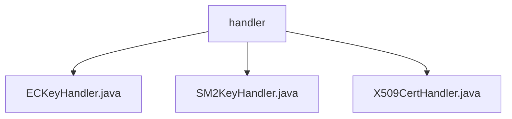

# Basic Information

|      |      |
|------|------|
| Name | handler |
| Language | .java |
| Code Path | WeFe/common/java/common-cert/src/main/java/com/webank/cert/toolkit/handler |
| Package Name | docs.common.java.common-cert.src.main.java.com.webank.cert.toolkit.handler |
| Brief Description | The ECKeyHandler class provides static methods for generating elliptic curve key pairs, supporting parameterless generation or creation based on a private key. The SM2KeyHandler class is similar, offering static methods for generating SM2 key pairs. The X509CertHandler class manages X.509 certificates and CRLs, supporting functions such as generating root/subordinate certificates, CSRs, extensions, and certificate revocation. |

# Description

## Overview  
The core responsibility of this module is to provide cryptographic key and certificate management functionalities, including Elliptic Curve (ECDSA/SM2) key pair generation and full lifecycle management of X.509 certificates. The interface specification uniformly adopts a static method design. For instance, ECKeyHandler.generateECKeyPair() supports passing in a private key or auto-generation, SM2KeyHandler follows the same pattern, while X509CertHandler employs a fluent interface to set certificate attributes. The key data structure is CryptoKeyPair, which contains a key pair in hexadecimal format. The only external dependency is the BouncyCastle security library for underlying algorithm implementation.  

## Key Business Scenarios  
Typical applications include: 1) Rapid generation of SM2 (China's cryptographic standard) or internationally standardized ECDSA key pairs, such as recovering a key pair based on an existing private key; 2) Building a complete PKI system, such as creating a root certificate with a CA flag or issuing subordinate certificates with extensions; 3) Certificate revocation management, similar to the CRL issuance process. The interaction pattern utilizes the factory method (for key generation) and the builder pattern (for certificate customization), supporting pluggable algorithms. For example, X509CertHandler can be configured with signature algorithms like SHA256WithECDSA.

### Package Internal Structure View

This flowchart illustrates three Java files under the handler directory in the common-cert project: ECKeyHandler.java, SM2KeyHandler.java, and X509CertHandler.java. These files belong to the handler module of the cryptographic certificate toolkit, designed to process different types of key and certificate operations, including functionalities for handling EC keys, SM2 keys, and X509 certificates.

# File List

| Name   | Type  | Description |
|-------|------|-------------|
| [ECKeyHandler.java](ECKeyHandler.md) | file | The ECKeyHandler class provides two static methods: generateECKeyPair generates elliptic curve key pairs, supporting parameterless generation or creation based on a hexadecimal private key. |
| [SM2KeyHandler.java](SM2KeyHandler.md) | file | The SM2KeyHandler class provides the functionality to generate SM2 key pairs, supporting both random generation and generation based on a specified private key. |
| [X509CertHandler.java](X509CertHandler.md) | file | The X509CertHandler class provides X509 certificate operation functionalities, including creating root certificates, subordinate certificates, CSR requests, and revoking certificates. It utilizes the BouncyCastle library for key extension and signing implementation. |

