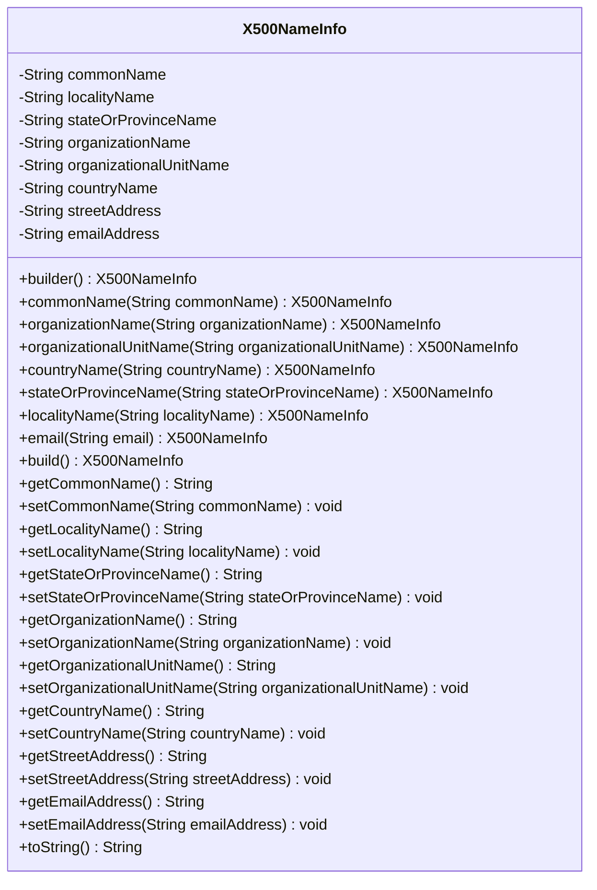
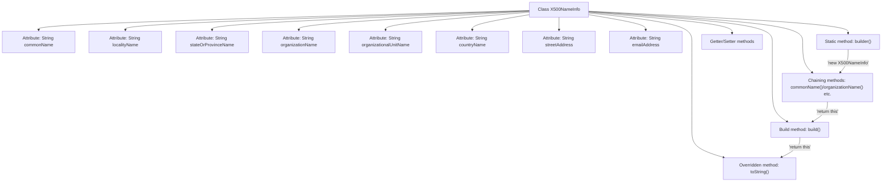

# Basic Information

|      |      |
|------|------|
| Name | X500NameInfo |
| Language | .java |
| Code Path | WeFe/common/java/common-cert/src/main/java/com/webank/cert/toolkit/model/X500NameInfo.java |
| Package Name | com.webank.cert.toolkit.model |
| Dependencies | [] |
| Brief Description | The X500NameInfo class encapsulates X.500 name attributes, provides a builder pattern to set fields such as CN, O, OU, and supports chained invocation and toString output. |

# Description

The X500NameInfo class is used to encapsulate name information conforming to the X.500 standard, including attributes such as common name, locality name, state or province name, organization name, organizational unit name, country name, street address, and email address. It provides a builder pattern for object construction, supporting chained calls to set various attribute values. The class includes getter and setter methods for each attribute, as well as a toString method to convert the object into a string representation compliant with the X.500 format.

# Class Summary

| Name   | Type  | Description |
|-------|------|-------------|
| X500NameInfo | class | The X500NameInfo class is used to construct and store X.500 name information, including attributes such as common name, organization name, organizational unit, country, state/province, locality, street, and email. It provides chainable setter methods and toString formatted output. |

## Class X500NameInfo

|      |      |
|------|------|
| Access Modifier | public |
| Type | class |
| Name | X500NameInfo |
| Description | The X500NameInfo class is used to construct and store X.500 name information, including attributes such as common name, organization name, organizational unit, country, state/province, locality, street, and email. It provides chainable setter methods and toString formatted output. |

### UML Class Diagram

This code defines an X500NameInfo class for constructing and representing name information conforming to the X.500 standard, containing common fields such as Common Name (CN), Organization Name (O), Organizational Unit Name (OU), etc. The class adopts the Builder pattern design, provides chainable setter methods, and implements the toString() method to generate an X.500 compliant string representation. All fields have corresponding getter and setter methods, allowing flexible construction and modification of X.500 name objects.

### Internal Method Call Graph

This flowchart illustrates the complete structure of the X500NameInfo class, which is an X.500 name information builder class employing the Builder pattern. The core consists of 8 string attributes, 1 static construction entry point (builder), 7 chaining configuration methods, 1 final build method (build), and standard Getter/Setter methods. It specifically demonstrates the complete chaining invocation flow starting from builder(), passing through various configuration methods, and finally reaching build() and toString(). Each configuration method returns 'this' to enable method chaining. The toString() method concatenates all non-null attributes in X.500 standard format.

### Field List

| Name  | Type  | Description |
|-------|-------|------|
| streetAddress | String | Define a private string variable streetAddress to store street address information. |
| localityName | String | The private string variable localityName is used to store the name of a region. |
| stateOrProvinceName | String | Private string variable for storing state or province name. |
| emailAddress | String | Private string type variable for storing email addresses. |
| organizationName | String | Private string variable storing the organization name. |
| countryName | String | Private string variable storing the country name. |
| organizationalUnitName | String | Organizational unit name string variable |
| commonName | String | The private string variable commonName. |

### Method List

| Name  | Type  | Description |
|-------|-------|------|
| getCommonName | String | Methods to obtain the common name, returns a string-type commonName. |
| getStateOrProvinceName | String | Methods to obtain the name of a state or province, returning the state or province name as a string type. |
| setCommonName | void | This is a Java method used to set the value of the commonName property of an object. The method takes a string parameter commonName and assigns it to the member variable of the same name in the current object. |
| getOrganizationName | String | Methods to obtain the organization name, returns the organizationName of string type. |
| setStateOrProvinceName | void | Method for setting the state or province name, which assigns the input parameter to the corresponding member variable of the class. |
| commonName | X500NameInfo | The method sets a common name and returns the current object instance. |
| organizationName | X500NameInfo | This is a Java method used to set the organizationName property of the X500NameInfo class and return the current object instance, supporting method chaining. |
| builder | X500NameInfo | The static method builder() returns a new instance of X500NameInfo. |
| organizationalUnitName | X500NameInfo | Set the organizational unit name and return the current object instance. |
| email | X500NameInfo | Method sets the email address and returns the current object instance. |
| setOrganizationalUnitName | void | The method to set the organizational unit name assigns the input parameter to the class variable organizationalUnitName. |
| stateOrProvinceName | X500NameInfo | Set the province name and return the current object instance. |
| setLocalityName | void | Method for setting the location name: Assign the parameter localityName to the class member variable with the same name. |
| countryName | X500NameInfo | Set the country name and return the current object instance. |
| getOrganizationalUnitName | String | Methods for obtaining the name of an organizational unit, returning the value of the `organizationalUnitName` field as a string. |
| build | X500NameInfo | The construction method directly returns the current X500NameInfo instance. |
| getLocalityName | String | Method to obtain the locality name, returns a string-type localityName. |
| setOrganizationName | void | The method to set the organization name assigns the input parameter to the class variable organizationName. |
| localityName | X500NameInfo | Sets and returns the localityName attribute of the X500NameInfo object. |
| getCountryName | String | Methods to obtain the country name, returning a string-type variable `countryName`. |
| setCountryName | void | The method to set the country name assigns the input parameter to the class's countryName variable. |
| getStreetAddress | String | Methods to obtain the street address, returning a string-type streetAddress. |
| setStreetAddress | void | Methods for setting street address, assigning input parameters to the member variables of the class. |
| getEmailAddress | String | Methods to obtain the emailAddress string. |
| toString | String | Override the toString method to concatenate non-null fields such as CN, O, OU, L, ST, C, STREET, and emailAddress, separated by commas. |
| setEmailAddress | void | This is a Java method used to set the value of the class's emailAddress property. The method takes a string parameter emailAddress and assigns it to the class's member variable of the same name. |

