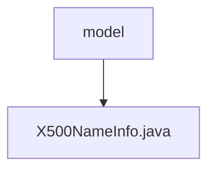

# Basic Information

|      |      |
|------|------|
| Name | model |
| Language | .java |
| Code Path | WeFe/common/java/common-cert/src/main/java/com/webank/cert/toolkit/model |
| Package Name | docs.common.java.common-cert.src.main.java.com.webank.cert.toolkit.model |
| Brief Description | The X500NameInfo class encapsulates X.500 name attributes, providing a builder pattern to set fields such as CN, O, and OU, supporting chained invocation and toString output. |

# Description

The X500NameInfo class is used to encapsulate name information compliant with the X.500 standard, including attributes such as common name, locality name, state or province name, organization name, organizational unit name, country name, street address, and email address. It provides a builder pattern for object construction, supporting chained calls to set each attribute value. The class includes getter and setter methods for all attributes, as well as a toString method to convert the object into an X.500-compliant string representation.

### Package Internal Structure View

This flowchart illustrates the hierarchical relationship between the model directory and the X500NameInfo.java file. As the parent directory, model contains a specific Java class file, X500NameInfo.java, reflecting the typical package structure and class file dependency in a Java project. The entire structure is concise and clear, adhering to the standard directory layout of a Maven project.

# File List

| Name   | Type  | Description |
|-------|------|-------------|
| [X500NameInfo.java](X500NameInfo.md) | file | The X500NameInfo class encapsulates X.500 name attributes, providing a builder pattern to set fields such as CN, O, OU, etc., and supports chained invocation and toString output. |

