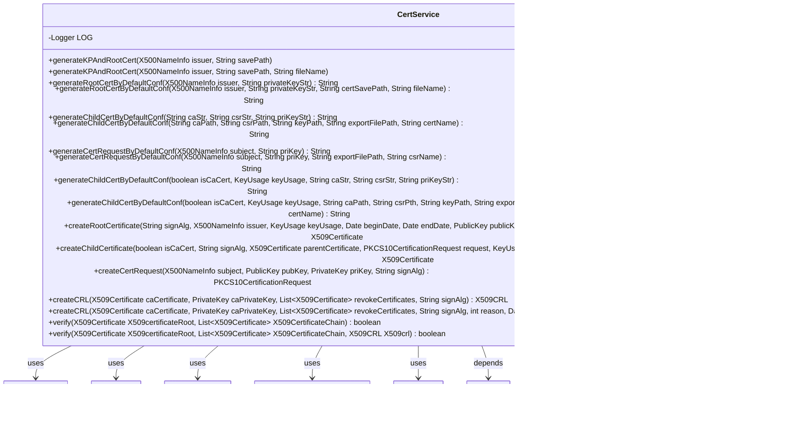

# Basic Information

|      |      |
|------|------|
| Name | CertService |
| Language | .java |
| Code Path | WeFe/common/java/common-cert/src/main/java/com/webank/cert/toolkit/service/CertService.java |
| Package Name | com.webank.cert.toolkit.service |
| Dependencies | ['java.io.FileNotFoundException', 'java.math.BigInteger', 'java.security.KeyPair', 'java.security.Principal', 'java.security.PrivateKey', 'java.security.PublicKey', 'java.security.cert.CRLException', 'java.security.cert.X509CRL', 'java.security.cert.X509CRLEntry', 'java.security.cert.X509Certificate', 'java.util.ArrayList', 'java.util.Date', 'java.util.List', 'java.util.Set', 'org.bouncycastle.asn1.x500.X500Name', 'org.bouncycastle.asn1.x509.KeyUsage', 'org.bouncycastle.operator.OperatorCreationException', 'org.bouncycastle.pkcs.PKCS10CertificationRequest', 'org.slf4j.Logger', 'org.slf4j.LoggerFactory', 'com.webank.cert.toolkit.constants.CertConstants', 'com.webank.cert.toolkit.handler.X509CertHandler', 'com.webank.cert.toolkit.model.X500NameInfo', 'com.webank.cert.toolkit.utils.CertUtils', 'com.webank.cert.toolkit.utils.FileOperationUtils', 'com.webank.cert.toolkit.utils.KeyUtils'] |
| Brief Description | The CertService class provides certificate management functionalities, including generating RSA key pairs and CA certificates, subordinate certificates, certificate requests, as well as certificate revocation and validation. It supports default configurations (SHA256WITHRSA algorithm, 3650-day validity period) and allows saving to specified paths. |

# Description

The CertService class provides certificate management functionalities, including generating key pairs, root certificates, child certificates, certificate requests, and certificate revocation lists. Key methods include: `generateKPAndRootCert` generates an RSA key pair and root certificate, defaulting to the SHA256WITHRSA signature algorithm with a validity period of 3650 days; `generateRootCertByDefaultConf` generates a root certificate based on a private key; `generateChildCertByDefaultConf` generates a child certificate; `generateCertRequestByDefaultConf` generates a certificate request; `createCRL` creates a certificate revocation list; and `verify` validates the effectiveness of a certificate chain. All operations support file paths or string parameters and include error handling and logging.

# Class Summary

| Name   | Type  | Description |
|-------|------|-------------|
| CertService | class | The CertService class provides certificate management functionalities, including generating RSA key pairs, root certificates, subordinate certificates, certificate requests, and revoking certificates. It supports default configurations (SHA256WITHRSA algorithm, validity period of 3650 days) and incorporates certificate validation logic. |

## Class CertService

|      |      |
|------|------|
| Access Modifier | public |
| Type | class |
| Name | CertService |
| Description | The CertService class provides certificate management functionalities, including generating RSA key pairs, root certificates, subordinate certificates, certificate requests, and revoking certificates. It supports default configurations (SHA256WITHRSA algorithm, validity period of 3650 days) and incorporates certificate validation logic. |

### UML Class Diagram

This code implements a certificate service class CertService, whose main functions include generating key pairs and root certificates, generating child certificates, generating certificate signing requests (CSRs), creating certificate revocation lists (CRLs), and verifying certificate chains. The class diagram illustrates CertService's dependencies with multiple interfaces (such as X500NameInfo, KeyUsage, etc.) and utility classes (such as CertUtils, KeyUtils, etc.). CertService provides comprehensive certificate operations including file saving, default configuration generation, and certificate chain verification, making it a complete PKI certificate management service implementation.

### Internal Method Call Graph

This flowchart illustrates the core structure and key method invocation relationships of the CertService class. The class encompasses functionalities including certificate generation, key pair creation, Certificate Signing Request (CSR) processing, Certificate Revocation List (CRL) generation, and certificate verification. Critical methods implement underlying certificate operations by invoking the X509CertHandler class, including core functions such as createRootCert and createChildCert. The workflow demonstrates method overloading relationships and key dependencies, such as the two versions of generateKPAndRootCert achieving different functionalities through parameter overloading. The verification process includes critical steps like certificate chain validation and CRL checks.

### Field List

| Name  | Type  | Description |
|-------|-------|------|
| LOG = LoggerFactory.getLogger(CertService.class) | Logger | A protected static final log object LOG is defined in the CertService class. |

### Method List

| Name  | Type  | Description |
|-------|-------|------|
| createCertRequest | PKCS10CertificationRequest | This method is used to create a PKCS10 certificate request. It takes subject information, a public key, a private key, and signature algorithm parameters as input, invokes X509CertHandler.createCSR to generate the request, logs an error message in case of exceptions, and returns null. |
| generateChildCertByDefaultConf | String | Method for generating a sub-certificate: Check input parameters, convert the certificate, request, and key, verify the conversion result, create the sub-certificate, and return the PEM string. |
| generateChildCertByDefaultConf | String | This method generates a sub-certificate through default configuration, receives the CA certificate, CSR, and private key strings, calls internal methods for processing, and returns the result. |
| generateRootCertByDefaultConf | String | The default configuration method for generating a root certificate accepts issuer information and a private key string as parameters, calls the overloaded method, and passes null values. |
| createChildCertificate | X509Certificate | Method for creating a subordinate certificate with parameters including CA identifier, signing algorithm, parent certificate, request, key usage, start/end dates, and private key. Logs errors and returns the certificate upon exception. |
| generateChildCertByDefaultConf | String | Method for generating a subordinate certificate: Check the CA, CSR, and key paths, create a subordinate certificate within the validity period and export it, then return a PEM format string. Log errors and return null if an exception occurs. |
| generateRootCertByDefaultConf | String | Method for generating root certificate: Check that the private key is not empty, create a directory, set the validity period, generate an RSA key pair, create and save an X509 certificate, and return a PEM-formatted string. Returns null if an error occurs. |
| generateKPAndRootCert | void | Generate key pairs and root certificates, save them to the specified path, with the default prefix as "ca". |
| generateKPAndRootCert | void | Generate key pairs and root certificates, save the private key, public key, and certificate files to the specified path, and log the process. Capture and log exceptions in case of errors. |
| createRootCertificate | X509Certificate | Method to create an X509 root certificate using the specified signature algorithm, issuer, key usage, validity period, and public/private key pair, logging error messages and returning the certificate in case of exceptions. |
| generateCertRequestByDefaultConf | String | This method generates a certificate request based on default configurations: validates and creates the export path, generates a PKCS10 request using an RSA key pair, optionally exports it as a .csr file or returns a PEM string, logs errors and returns null if an exception occurs. |
| generateCertRequestByDefaultConf | String | The default configuration method for generating a certificate request accepts subject and private key parameters and calls the overloaded method for processing. |
| generateChildCertByDefaultConf | String | Default configuration method for generating sub-certificates, with parameters including CA path, CSR path, key path, export file path, and certificate name. |
| createCRL | X509CRL | Method to create X509CRL with parameters including CA certificate, private key, list of revoked certificates, and signature algorithm, which calls the overloaded method and sets the default version and extensions. |
| createCRL | X509CRL | This method is used to create an X509 Certificate Revocation List (CRL). It requires the CA certificate, private key, list of certificates to be revoked, signature algorithm, revocation reason, and validity period. It invokes X509CertHandler.revokeCert for processing, logs exceptions, and returns null in case of errors. |
| verify | boolean | Verify the X509 certificate chain, call the overloaded method and pass in null parameters. |
| verify | boolean | Verify the X509 certificate chain and CRL, checking chain integrity, revocation status, and validity period. |

