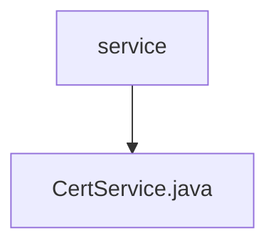

# Basic Information

|      |      |
|------|------|
| Name | service |
| Language | .java |
| Code Path | WeFe/common/java/common-cert/src/main/java/com/webank/cert/toolkit/service |
| Package Name | docs.common.java.common-cert.src.main.java.com.webank.cert.toolkit.service |
| Brief Description | The CertService class provides certificate management functionalities, including generating RSA key pairs and CA certificates, subordinate certificates, certificate requests, as well as certificate revocation and validation. It supports default configurations (SHA256WITHRSA algorithm, 3650-day validity period) and allows saving to specified paths. |

# Description

The CertService class provides certificate management functionalities, including generating key pairs, root certificates, child certificates, certificate requests, and certificate revocation lists. Key methods include: `generateKPAndRootCert` generates an RSA key pair and root certificate, defaulting to the SHA256WITHRSA signature algorithm with a validity period of 3650 days; `generateRootCertByDefaultConf` generates a root certificate based on a private key; `generateChildCertByDefaultConf` generates a child certificate; `generateCertRequestByDefaultConf` generates a certificate request; `createCRL` creates a certificate revocation list; and `verify` validates the effectiveness of a certificate chain. All operations support file paths or string parameters and include error handling and logging.

### Package Internal Structure View

This flowchart illustrates the hierarchical relationship between the service directory and the CertService.java file. The service acts as the parent node, with CertService.java as its child node, indicating that this Java file resides under the service directory. This is a simple single-layer file structure containing only one service interface file.

# File List

| Name   | Type  | Description |
|-------|------|-------------|
| [CertService.java](CertService.md) | file | The CertService class provides certificate management functionalities, including generating RSA key pairs, CA certificates, subordinate certificates, certificate requests, as well as certificate revocation and validation. It supports default configurations (SHA256WITHRSA algorithm, 3650-day validity period) and allows saving to specified paths. |

